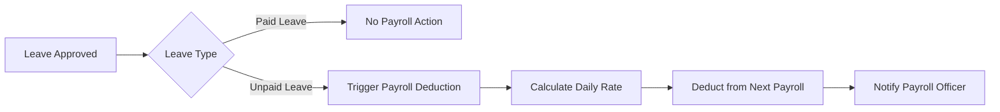
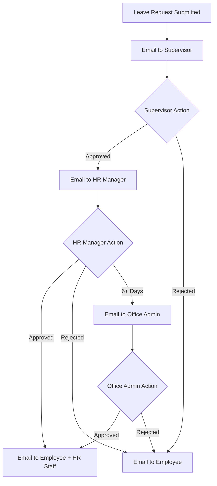

# Leave Management Module - Integration Analysis Report

**Report Date:** February 5, 2026  
**Module:** Leave Management System  
**Status:** ⚠️ **PARTIALLY INTEGRATED** - Critical gaps identified  
**Overall Integration Score:** 40% Complete

---

## Executive Summary

The Leave Management module is **functionally isolated** from other system modules, creating data silos and manual workflow gaps. While the core leave request workflow exists, it lacks integration with Timekeeping, Payroll, Workforce Management, and Notification systems.

### Critical Issues Identified
1. ❌ **Self-Approval Bug:** HR Manager can approve their own leave requests (circular workflow)
2. ❌ **No Auto-Approval:** All leaves require manual approval, even 1-2 day requests
3. ❌ **Missing Event System:** No event-driven architecture for cross-module communication
4. ❌ **No Timekeeping Integration:** Approved leaves don't automatically update attendance records
5. ❌ **No Payroll Integration:** Unpaid leave doesn't trigger payroll deductions
6. ❌ **No Workforce Coverage Check:** Leave approvals don't verify department coverage impact
7. ❌ **No Notification System:** No email/in-app notifications for approval requests

### Integration Status by Module

| Module | Integration Level | Status | Priority |
|--------|------------------|--------|----------|
| **Employee Management** | 100% | ✅ Complete | - |
| **Workforce Management** | 60% | ⚠️ Partial | HIGH |
| **Timekeeping** | 30% | ⚠️ Partial | HIGH |
| **Payroll** | 0% | ❌ None | MEDIUM |
| **Notifications** | 0% | ❌ None | HIGH |

---

## 1. Employee Management Integration

### Status: ✅ **100% Complete**

#### What Works
- ✅ Leave requests linked to employee records via `employee_id`
- ✅ Employee profile data accessible in leave request views
- ✅ Leave balance tracking per employee
- ✅ Employee department and position data available

#### Database Relationships
```php
// app/Models/LeaveRequest.php
public function employee()
{
    return $this->belongsTo(Employee::class);
}

public function supervisor()
{
    return $this->belongsTo(Employee::class, 'supervisor_id');
}
```

#### Frontend Integration
- Employee selector in leave request form
- Employee profile display in request details
- Leave balance display per employee

### Recommendation: ✅ No action needed

---

## 2. Workforce Management Integration

### Status: ⚠️ **60% Partial** - Service exists but not integrated

#### What Works
- ✅ `WorkforceCoverageService` exists and is functional
- ✅ Methods available for coverage calculation:
  - `analyzeCoverage($fromDate, $toDate, $departmentId)`
  - `getCoverageForDate($date, $departmentId)`
  - `getCoverageByDepartment($date)`

#### What's Missing
- ❌ Coverage check NOT called during leave approval workflow
- ❌ No coverage impact display in leave request form
- ❌ No automatic rejection if coverage falls below threshold (e.g., <75%)
- ❌ No alternative date suggestions when coverage is low
- ❌ No critical position coverage validation

#### Code Location
**Service exists:** `app/Services/HR/Workforce/WorkforceCoverageService.php` (469 lines)

**Should be called from:** `LeaveRequestController@update()` (approval method)

#### Integration Gap Example
```php
// Current: No coverage check in LeaveRequestController@update()
if ($validated['action'] === 'approve') {
    $leaveRequest->manager_id = auth()->id();
    $leaveRequest->manager_approved_at = now();
    $leaveRequest->status = 'approved';
    // ❌ NO COVERAGE CHECK HERE
}

// Should be:
if ($validated['action'] === 'approve') {
    // ✅ Check workforce coverage impact
    $coverageService = app(WorkforceCoverageService::class);
    $coverage = $coverageService->analyzeCoverage(
        Carbon::parse($leaveRequest->start_date),
        Carbon::parse($leaveRequest->end_date),
        $leaveRequest->employee->department_id
    );
    
    if ($coverage['average_percentage'] < 75) {
        return back()->withErrors([
            'approval' => 'Cannot approve: Department coverage would fall below 75%'
        ]);
    }
    
    $leaveRequest->manager_id = auth()->id();
    $leaveRequest->manager_approved_at = now();
    $leaveRequest->status = 'approved';
}
```

### Recommendation: 🔴 HIGH Priority
**Integrate `WorkforceCoverageService` into leave approval workflow**
- Add coverage check in `LeaveRequestController@update()`
- Display coverage impact in leave request creation form
- Block approval if coverage below configurable threshold
- Show alternative dates with better coverage

---

## 3. Timekeeping Integration

### Status: ⚠️ **30% Partial** - Database links exist but no automation

#### What Works
- ✅ Database schema supports integration:
  - `daily_attendance_summary.leave_request_id` (nullable foreign key)
  - `attendance_events` table has `event_type` field for leave tracking
- ✅ Leave request dates can be cross-referenced with attendance dates

#### What's Missing
- ❌ Approved leaves don't automatically create attendance records
- ❌ No event-driven update when leave is approved/rejected/cancelled
- ❌ Timekeeping module doesn't consume leave data automatically
- ❌ No automatic "Approved Leave" attendance status
- ❌ Manual entry required to mark leave days in timekeeping system

#### Database Schema Evidence
```sql
-- Migration: 2025_12_29_000002_create_daily_attendance_summary_table.php
leave_request_id BIGINT UNSIGNED NULL,
FOREIGN KEY (leave_request_id) REFERENCES leave_requests(id) ON DELETE SET NULL
```

#### Integration Gap Example
```php
// Current: LeaveRequestController@update() - Approval doesn't trigger timekeeping update
if ($validated['action'] === 'approve') {
    $leaveRequest->status = 'approved';
    $leaveRequest->save();
    // ❌ NO AUTOMATIC ATTENDANCE UPDATE
}

// Should trigger event:
if ($validated['action'] === 'approve') {
    $leaveRequest->status = 'approved';
    $leaveRequest->save();
    
    // ✅ Dispatch event for timekeeping to consume
    event(new LeaveApproved($leaveRequest));
}

// Event listener should:
// 1. Create daily_attendance_summary records for leave dates
// 2. Set status = 'approved_leave'
// 3. Link leave_request_id to attendance records
// 4. Mark as excused absence (no violations)
```

#### Missing Event System
**Critical Gap:** `app/Events/` and `app/Listeners/` directories don't exist (except Timekeeping subdirectory)

**Required Events:**
- `LeaveApproved` - Fired when leave request is approved
- `LeaveRejected` - Fired when leave request is rejected
- `LeaveCancelled` - Fired when approved leave is cancelled
- `LeaveCompleted` - Fired when employee returns from leave

**Required Listeners:**
- `UpdateAttendanceForApprovedLeave` - Creates attendance records
- `NotifyEmployeeOfApproval` - Sends email notification
- `UpdateWorkforceCoverage` - Recalculates coverage
- `UpdatePayrollForLeave` - Triggers payroll deduction (if unpaid)

### Recommendation: 🔴 HIGH Priority
**Implement event-driven integration with Timekeeping**
1. Create `app/Events/` directory and leave management events
2. Create `app/Listeners/` directory and attendance update listeners
3. Register events in `EventServiceProvider`
4. Dispatch events after leave approval/rejection/cancellation
5. Update `DailyAttendanceSummary` automatically when leave approved

---

## 4. Payroll Integration

### Status: ❌ **0% None** - No integration exists

#### What's Missing
- ❌ Approved unpaid leave doesn't trigger payroll deductions
- ❌ No event/notification to payroll module when leave is approved
- ❌ Payroll officer must manually check leave records for salary calculations
- ❌ No automatic salary deduction for unpaid leave days
- ❌ No leave pay calculation for paid leaves requiring special rates

#### Expected Integration Flow


#### Required Database Links
**Currently Missing:**
- `payroll_deductions.leave_request_id` (link deduction to leave)
- `payroll_adjustments.leave_request_id` (track leave-related adjustments)

#### Code Integration Needed
```php
// After leave approval
if ($leaveRequest->status === 'approved' && $leaveRequest->is_unpaid) {
    // ✅ Dispatch event for payroll to consume
    event(new LeaveApprovedForPayroll($leaveRequest));
}

// Payroll listener should:
// 1. Calculate total unpaid days
// 2. Calculate daily salary rate
// 3. Create payroll deduction record
// 4. Flag employee record in next payroll run
// 5. Notify payroll officer
```

### Recommendation: 🟡 MEDIUM Priority
**Implement payroll integration after event system is in place**
1. Add `leave_request_id` to payroll deductions/adjustments tables
2. Create `LeaveApprovedForPayroll` event
3. Create `CreatePayrollDeductionForUnpaidLeave` listener
4. Update payroll calculation logic to consume leave data
5. Add leave deduction display in payslip

---

## 5. Notification System Integration

### Status: ❌ **0% None** - No notifications implemented

#### What's Missing
- ❌ No email notifications when leave is approved/rejected
- ❌ No in-app notifications for pending approvals
- ❌ No supervisor notification when leave request submitted
- ❌ No HR Manager notification for approval required
- ❌ No Office Admin notification for 6+ day leaves
- ❌ No employee notification when request status changes

#### Expected Notification Flow


#### Required Implementation
```php
// In LeaveRequestController@update()
if ($validated['action'] === 'approve') {
    $leaveRequest->status = 'approved';
    $leaveRequest->save();
    
    // ✅ Send notifications
    $leaveRequest->employee->notify(new LeaveRequestApproved($leaveRequest));
    
    // Notify HR staff
    User::role('HR Staff')->each(function($user) use ($leaveRequest) {
        $user->notify(new LeaveApprovedForProcessing($leaveRequest));
    });
    
    // If 6+ days, notify Office Admin
    if ($leaveRequest->days_requested >= 6) {
        User::role('Office Admin')->each(function($user) use ($leaveRequest) {
            $user->notify(new LeaveRequiresFinalApproval($leaveRequest));
        });
    }
}
```

#### Database Requirements
**Currently Missing:**
- `notifications` table (Laravel default)
- `notification_preferences` table (user email/in-app preferences)

### Recommendation: 🔴 HIGH Priority
**Implement notification system after event-driven architecture**
1. Run `php artisan notifications:table` migration
2. Create notification classes (LeaveRequestApproved, LeaveRequestRejected, etc.)
3. Integrate with Laravel Mail for email notifications
4. Add in-app notification display in user menu
5. Allow users to configure notification preferences

---

## 6. Self-Approval Bug Analysis

### Critical Bug: HR Manager Can Approve Own Leave Requests

#### Current Behavior
```php
// LeaveRequestController@update() - Line ~430
public function update(UpdateLeaveRequestRequest $request, int $id): RedirectResponse
{
    $validated = $request->validated();
    $leaveRequest = LeaveRequest::findOrFail($id);
    
    // ❌ BUG: No check if current user is approving their own request
    if ($validated['action'] === 'approve') {
        $leaveRequest->manager_id = auth()->id();
        $leaveRequest->manager_approved_at = now();
        $leaveRequest->status = 'approved';
        // ... balance deduction
    }
}
```

#### Expected Behavior
```php
public function update(UpdateLeaveRequestRequest $request, int $id): RedirectResponse
{
    $validated = $request->validated();
    $leaveRequest = LeaveRequest::findOrFail($id);
    
    // ✅ CHECK: Prevent self-approval
    if ($validated['action'] === 'approve') {
        $currentUserEmployeeId = auth()->user()->employee?->id;
        
        if ($leaveRequest->employee_id === $currentUserEmployeeId) {
            return back()->withErrors([
                'approval' => 'You cannot approve your own leave request. It will be escalated to Office Admin.'
            ]);
        }
        
        $leaveRequest->manager_id = auth()->id();
        $leaveRequest->manager_approved_at = now();
        $leaveRequest->status = 'approved';
    }
}
```

#### Escalation Logic for HR Manager's Own Leaves
```php
// When HR Manager creates their own leave request
if ($employee->user?->hasRole('HR Manager')) {
    // 1-2 days: Auto-approve (if balance + coverage OK)
    if ($days <= 2) {
        $leaveRequest->status = 'auto_approved';
    }
    // 3-5 days: Escalate to Office Admin (bypass HR Manager approval)
    elseif ($days <= 5) {
        $leaveRequest->status = 'pending_office_admin';
    }
    // 6+ days: Escalate to Office Admin
    else {
        $leaveRequest->status = 'pending_office_admin';
    }
} else {
    // Normal approval workflow for non-HR Manager employees
}
```

### Root Causes
1. No self-approval check in controller
2. No auto-approval logic for short leaves (1-2 days)
3. No duration-based routing (hardcoded supervisor → manager flow)
4. No role-based escalation logic

### Fix Priority: 🔴 CRITICAL
See [.aiplans/LEAVE-MANAGEMENT-FIX.md](.aiplans/LEAVE-MANAGEMENT-FIX.md) for detailed implementation plan

---

## 7. Missing Components Summary

### Database Migrations Needed
```sql
-- Add approval routing fields to leave_requests
ALTER TABLE leave_requests ADD COLUMN approval_route_type VARCHAR(50) DEFAULT 'standard';
ALTER TABLE leave_requests ADD COLUMN approval_route_reason TEXT NULL;
ALTER TABLE leave_requests ADD COLUMN office_admin_id BIGINT UNSIGNED NULL;
ALTER TABLE leave_requests ADD COLUMN office_admin_approved_at TIMESTAMP NULL;
ALTER TABLE leave_requests ADD COLUMN office_admin_comments TEXT NULL;
ALTER TABLE leave_requests ADD FOREIGN KEY (office_admin_id) REFERENCES users(id);

-- Add payroll integration fields
ALTER TABLE payroll_deductions ADD COLUMN leave_request_id BIGINT UNSIGNED NULL;
ALTER TABLE payroll_deductions ADD FOREIGN KEY (leave_request_id) REFERENCES leave_requests(id);

-- Create notifications table (Laravel default)
php artisan notifications:table
php artisan migrate
```

### Services to Create
1. **`app/Services/HR/LeaveApprovalService.php`** - Centralized approval routing logic
2. **`app/Services/HR/LeaveWorkflowService.php`** - Workflow orchestration
3. **`app/Services/HR/LeaveCoverageValidator.php`** - Workforce coverage validation

### Events to Create
1. **`app/Events/LeaveApproved.php`**
2. **`app/Events/LeaveRejected.php`**
3. **`app/Events/LeaveCancelled.php`**
4. **`app/Events/LeaveCompleted.php`**
5. **`app/Events/LeaveApprovedForPayroll.php`**

### Listeners to Create
1. **`app/Listeners/UpdateAttendanceForApprovedLeave.php`** - Timekeeping integration
2. **`app/Listeners/NotifyEmployeeOfApproval.php`** - Notification integration
3. **`app/Listeners/UpdateWorkforceCoverage.php`** - Workforce integration
4. **`app/Listeners/CreatePayrollDeductionForUnpaidLeave.php`** - Payroll integration

### Frontend Components Needed
1. **Coverage Impact Widget** - Show coverage percentage when creating leave request
2. **Approval Timeline Component** - Show multi-level approval flow with statuses
3. **Alternative Dates Suggestion** - Suggest dates with better coverage
4. **Notification Bell** - In-app notification display

---

## 8. Integration Roadmap

### Phase 1: Foundation (Week 1-2)
**Priority:** 🔴 CRITICAL
- [ ] Fix self-approval bug in `LeaveRequestController`
- [ ] Implement auto-approval logic for 1-2 day leaves
- [ ] Add duration-based routing (1-2, 3-5, 6+ days)
- [ ] Create `LeaveApprovalService` with routing logic
- [ ] Add approval route tracking fields to database

### Phase 2: Event-Driven Architecture (Week 3)
**Priority:** 🔴 HIGH
- [ ] Create `app/Events/` directory and leave management events
- [ ] Create `app/Listeners/` directory and integration listeners
- [ ] Register events in `EventServiceProvider`
- [ ] Dispatch events in `LeaveRequestController`
- [ ] Test event flow end-to-end

### Phase 3: Timekeeping Integration (Week 4)
**Priority:** 🔴 HIGH
- [ ] Create `UpdateAttendanceForApprovedLeave` listener
- [ ] Automatically create `daily_attendance_summary` records on leave approval
- [ ] Link attendance records to leave requests via `leave_request_id`
- [ ] Mark leave days as "Approved Leave" in timekeeping UI
- [ ] Test attendance updates when leave approved/rejected/cancelled

### Phase 4: Workforce Coverage Integration (Week 5)
**Priority:** 🔴 HIGH
- [ ] Integrate `WorkforceCoverageService` into leave approval workflow
- [ ] Add coverage impact display in leave request form
- [ ] Block approval if coverage below configurable threshold (e.g., 75%)
- [ ] Show alternative dates with better coverage
- [ ] Add coverage validation to auto-approval logic

### Phase 5: Notification System (Week 6)
**Priority:** 🔴 HIGH
- [ ] Create `notifications` table migration
- [ ] Create notification classes (Approved, Rejected, Pending, etc.)
- [ ] Integrate Laravel Mail for email notifications
- [ ] Add in-app notification display (bell icon + dropdown)
- [ ] Allow users to configure notification preferences

### Phase 6: Payroll Integration (Week 7)
**Priority:** 🟡 MEDIUM
- [ ] Add `leave_request_id` to payroll deductions table
- [ ] Create `LeaveApprovedForPayroll` event
- [ ] Create `CreatePayrollDeductionForUnpaidLeave` listener
- [ ] Update payroll calculation to deduct unpaid leave days
- [ ] Display leave deductions in payslip

### Phase 7: Testing & Validation (Week 8)
**Priority:** 🟢 STANDARD
- [ ] Unit tests for `LeaveApprovalService`
- [ ] Integration tests for event-driven workflow
- [ ] End-to-end tests for full leave request lifecycle
- [ ] Manual QA testing with different user roles
- [ ] Performance testing with concurrent leave requests

---

## 9. Acceptance Criteria

### Core Workflow
- [ ] HR Manager cannot approve their own leave requests (self-approval blocked)
- [ ] 1-2 day leaves auto-approved if balance sufficient and coverage OK
- [ ] 3-5 day leaves require HR Manager approval (or Office Admin if HR Manager's own)
- [ ] 6+ day leaves require HR Manager conditional approval + Office Admin final approval
- [ ] HR Manager's own 6+ day leaves go directly to Office Admin (bypass HR Manager)

### Timekeeping Integration
- [ ] Approved leaves automatically create attendance records
- [ ] Timekeeping shows "Approved Leave" status for leave days
- [ ] Cancelled leaves remove attendance records
- [ ] Leave days don't count as absences or violations

### Workforce Coverage
- [ ] System checks department coverage before auto-approval
- [ ] Approval blocked if coverage below 75% (configurable)
- [ ] Coverage impact displayed in leave request form
- [ ] Alternative dates suggested when coverage low

### Payroll Integration
- [ ] Unpaid leaves trigger payroll deductions
- [ ] Payroll officer notified of unpaid leave approvals
- [ ] Deductions displayed in employee payslip
- [ ] Leave deduction audit trail maintained

### Notifications
- [ ] Email sent to employee when leave approved/rejected
- [ ] Email sent to supervisor when leave submitted
- [ ] Email sent to HR Manager when supervisor approves
- [ ] Email sent to Office Admin for 6+ day leaves
- [ ] In-app notifications displayed in user menu

---

## 10. Conclusion

The Leave Management module is **functionally isolated** with critical integration gaps. While the core workflow exists, it operates in a silo without consuming or providing data to related modules.

### Immediate Actions Required (This Sprint)
1. 🔴 Fix self-approval bug (HR Manager approving own requests)
2. 🔴 Implement auto-approval for short leaves (1-2 days)
3. 🔴 Create event-driven architecture (Events + Listeners)
4. 🔴 Integrate workforce coverage service into approval workflow

### Short-Term Actions (Next 2-3 Sprints)
1. 🔴 Integrate with Timekeeping (automatic attendance updates)
2. 🔴 Implement notification system (email + in-app)
3. 🟡 Integrate with Payroll (unpaid leave deductions)

### Long-Term Enhancements (Future)
1. 🟢 Alternative date suggestions based on coverage
2. 🟢 Critical position replacement coverage requirements
3. 🟢 Overlapping leave detection and blocking
4. 🟢 Machine learning for leave approval patterns

**Estimated Total Integration Work:** 8-10 weeks (with parallel development)

**Priority Order:** Self-approval fix → Event system → Timekeeping → Coverage → Notifications → Payroll

---

**Report Prepared By:** GitHub Copilot AI  
**Next Review:** After Phase 1 completion (2 weeks)
