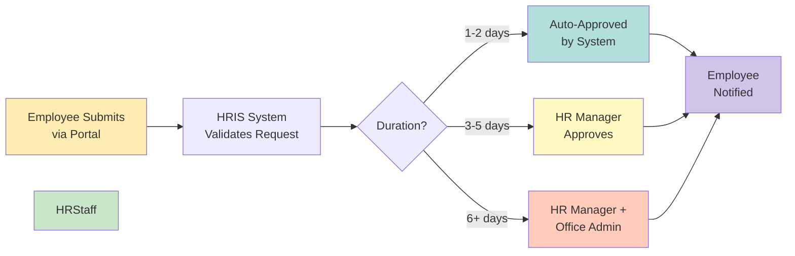
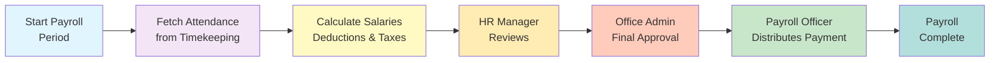
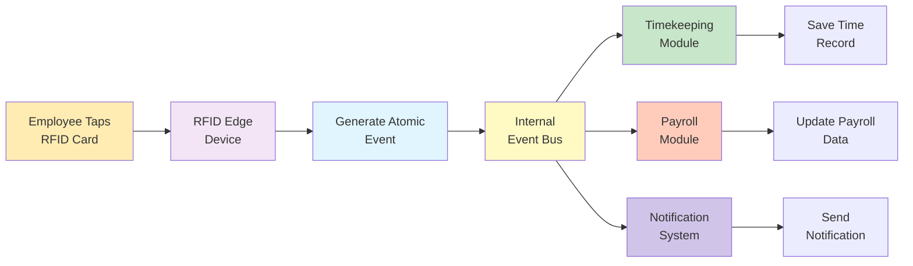
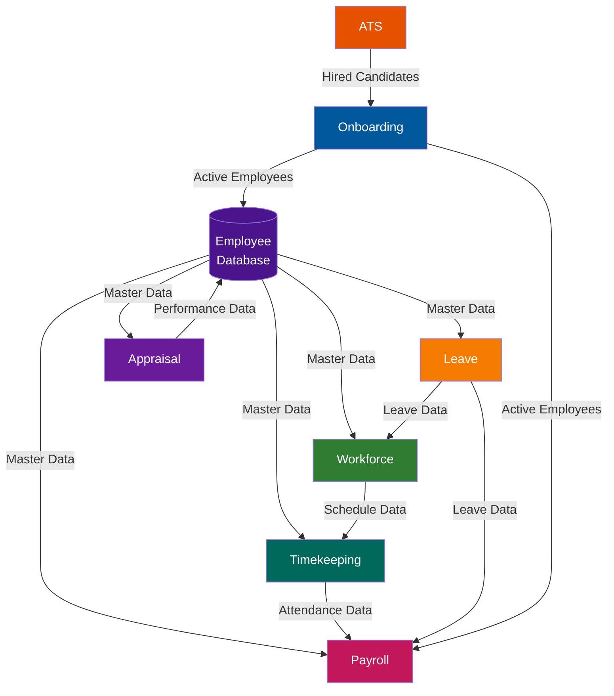
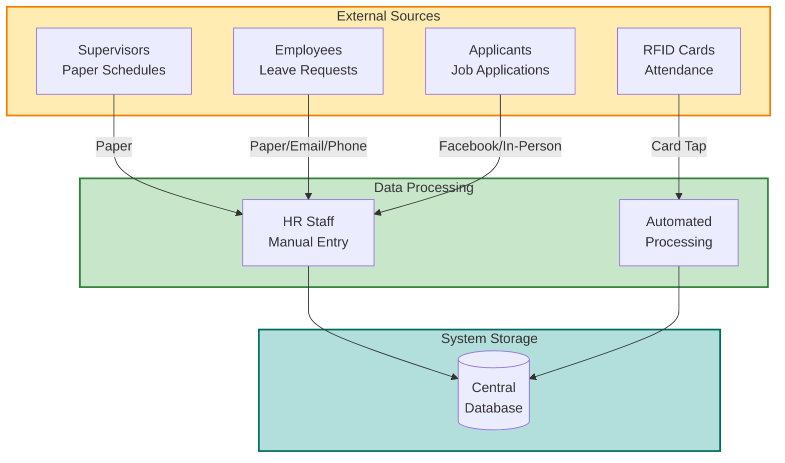
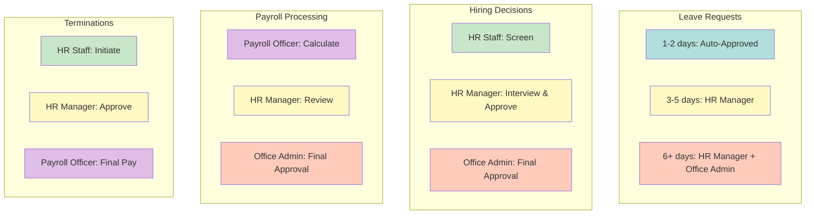
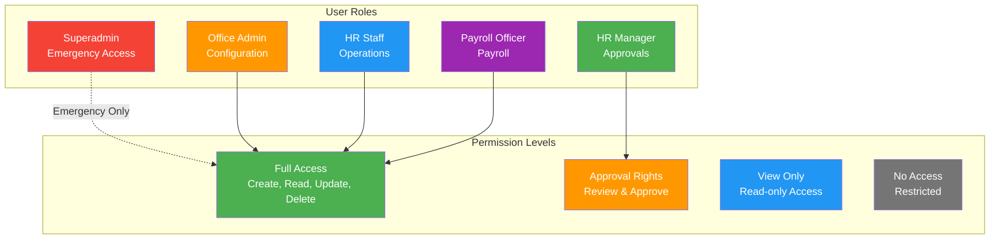

# System Overview - SyncingSteel HRIS

## High-Level System Architecture

```mermaid
graph TB
    subgraph External["External Sources"]
        Supervisors[Supervisors<br/>Submit Paper Schedules]
        Applicants[Job Applicants<br/>Facebook/In-Person]
        RFID[RFID Card Taps<br/>Timekeeping]
    end
    
    subgraph EmployeeAccess["Employee Self-Service"]
        EmployeePortal[Employee Portal<br/>View & Submit Requests]
    end
    
    subgraph System["SyncingSteel HRIS - On-Premise System"]
        subgraph Admin["Administration Layer"]
            Superadmin[Superadmin<br/>System Monitoring]
            OfficeAdmin[Office Admin<br/>Company Setup]
        end
        
        subgraph HRLayer["HR Operations Layer"]
            HRManager[HR Manager<br/>Approvals]
            HRStaff[HR Staff<br/>Data Entry & Operations]
        end
        
        subgraph PayrollLayer["Payroll Layer"]
            PayrollOfficer[Payroll Officer<br/>Payroll Processing]
        end
        
        subgraph Modules["Core Modules"]
            EmployeeDB[(Employee<br/>Database)]
            Timekeeping[Timekeeping<br/>Module]
            PayrollModule[Payroll<br/>Module]
            WorkforceModule[Workforce<br/>Management]
            ATSModule[ATS<br/>Module]
            OnboardingModule[Onboarding<br/>Module]
            AppraisalModule[Appraisal<br/>Module]
        end
        
        subgraph Integration["Integration Layer"]
            EventBus[Event Bus]
            Notifications[Notification<br/>System]
        end
    end
    
    subgraph External2["External Systems (Future)"]
        Banks[Bank Transfer<br/>Integration]
        Ewallets[E-wallet<br/>Integration]
        JobBoard[Public Job<br/>Board]
    end
    
    %% External to System
    Supervisors -->|Paper Records| HRStaff
    Applicants -->|Applications| HRStaff
    RFID -->|Card Tap Events| EventBus
    
    %% Employee Portal to System
    EmployeePortal -->|Leave Requests| Modules
    EmployeePortal -->|View Data| Modules
    
    %% Admin Layer
    Superadmin -.->|Emergency Access| Modules
    Superadmin -->|Monitors| System
    OfficeAdmin -->|Configures| Modules
    
    %% HR Layer
    HRManager -->|Approves| HRStaff
    HRStaff -->|Inputs Data| Modules
    
    %% Payroll Layer
    PayrollOfficer -->|Processes| PayrollModule
    
    %% Module Connections
    EmployeeDB <-->|Master Data| Modules
    Timekeeping -->|Attendance Data| PayrollModule
    WorkforceModule -->|Schedule Data| Timekeeping
    ATSModule -->|Hired Candidates| OnboardingModule
    OnboardingModule -->|Active Employees| PayrollModule
    AppraisalModule -->|Performance Data| EmployeeDB
    
    %% Integration
    EventBus -->|Distributes Events| Timekeeping
    EventBus -->|Distributes Events| PayrollModule
    EventBus -->|Triggers| Notifications
    
    %% Future Integrations
    PayrollModule -.->|Future| Banks
    PayrollModule -.->|Future| Ewallets
    ATSModule -.->|Future| JobBoard
    
    style External fill:#f9f,stroke:#333,stroke-width:2px
    style External2 fill:#f9f,stroke:#333,stroke-width:2px,stroke-dasharray: 5 5
    style System fill:#e1f5ff,stroke:#01579b,stroke-width:3px
    style Admin fill:#fff3e0,stroke:#e65100,stroke-width:2px
    style HRLayer fill:#e8f5e9,stroke:#2e7d32,stroke-width:2px
    style PayrollLayer fill:#fce4ec,stroke:#c2185b,stroke-width:2px
    style Modules fill:#f3e5f5,stroke:#4a148c,stroke-width:2px
    style Integration fill:#e0f2f1,stroke:#00695c,stroke-width:2px
```

## User Roles & Responsibilities Summary

### 1. 👤 Superadmin
**Focus**: System health and infrastructure

- 🔧 System health monitoring (CPU, memory, database)
- 🖥️ Server management and security
- ⚙️ Application configuration
- 👥 User account management
- 🚨 Emergency module access

**[View Detailed Workflow →](./01-superadmin-workflow.md)**

---

### 2. 👤 Office Admin
**Focus**: Company setup and business rules

- 🏢 Company onboarding and setup
- 📋 Business rules configuration
- 🏛️ Department and position management
- 📅 Leave policies and approval workflows
- 💰 Payroll rules and salary structures
- 🔔 System-wide configurations

**[View Detailed Workflow →](./02-office-admin-workflow.md)**

---

### 3. 👤 HR Manager
**Focus**: Oversight and approvals

- ✅ Approve leave requests (3-5 days: manager, 6+ days: + office admin)
- ✅ Approve hiring decisions and job offers
- ✅ Approve performance appraisals
- ✅ Approve terminations and transfers
- 📊 Review workforce schedules
- 👀 Oversee HR staff operations

**[View Detailed Workflow →](./03-hr-manager-workflow.md)**

---

### 4. 👤 HR Staff
**Focus**: Day-to-day operations and data entry

- 📝 Input leave requests from employees (paper/email/phone)
- 📋 Input workforce schedules from supervisors (paper)
- 🎯 Manage ATS (job postings, applications, interviews)
- 🎓 Process employee onboarding
- 👥 Manage employee records and documents
- ⏰ Coordinate timekeeping and attendance
- 🌟 Create performance appraisals
- 📊 Generate HR reports

**[View Detailed Workflow →](./04-hr-staff-workflow.md)**

---

### 5. 👤 Payroll Officer
**Focus**: Payroll processing and compliance

- 💵 Process payroll periods and calculations
- 💰 Manage salary components and deductions
- 🏦 Handle employee advances and loans
- 🏛️ Process government remittances (SSS, PhilHealth, Pag-IBIG, BIR)
- 📄 Generate payslips and payment files
- 💵 Manage cash distribution (current method)
- 📊 Generate payroll reports and analytics

**[View Detailed Workflow →](./05-payroll-officer-workflow.md)**

---

### 6. 👤 Employee (Self-Service Portal)
**Focus**: Personal information access and leave management

- 📊 View personal information and employment details
- ⏰ View time logs and attendance records
- 💰 View and download payslips
- 📅 Check leave balances and history
- ✉️ Submit leave requests directly
- 📄 Track request status and approvals
- 🔔 Receive notifications and alerts

**[View Employee Portal Guide →](./06-employee-portal.md)**

---

## Key Processes

### 🔄 Leave Request Flow

**[View Detailed Process →](./processes/leave-request-approval.md)**

---

### 💰 Payroll Processing Flow

**[View Detailed Process →](./processes/payroll-processing.md)**

---

### 📋 RFID Timekeeping Integration

**[View Detailed Integration →](./integrations/rfid-integration.md)**

---

## Module Overview

### 📊 Core Modules

| Module | Primary Users | Purpose |
|--------|--------------|---------|
| **Employee Management** | HR Staff, HR Manager | Employee master data and lifecycle |
| **Timekeeping** | HR Staff | Attendance tracking and RFID integration |
| **Payroll** | Payroll Officer | Salary calculation and payment distribution |
| **Workforce Management** | HR Staff, HR Manager | Shift scheduling and rotations |
| **ATS (Recruitment)** | HR Staff, HR Manager | Job postings and applicant tracking |
| **Onboarding** | HR Staff | New hire document collection and setup |
| **Appraisal** | HR Staff, HR Manager | Performance reviews and ratings |
| **Leave Management** | HR Staff, HR Manager, Office Admin | Leave requests and approvals |

### 🔗 Module Dependencies

---

## Data Flow Architecture

### 📥 Input Sources

---

## Approval Workflows

### ✅ Multi-Level Approvals

---

## System Configuration

### 🎛️ Configurable Features (Office Admin)

- **Working Hours**: Regular schedule, shift patterns
- **Holiday Calendar**: National holidays, company holidays, pay multipliers
- **Overtime Rules**: Threshold, rates, approval requirements
- **Attendance Rules**: Late policy, undertime policy, grace periods
- **Leave Policies**: Types, accrual methods, approval rules
- **Salary Structure**: Basic salary, allowances, bonuses
- **Deduction Rules**: Mandatory (SSS, PhilHealth, Pag-IBIG), optional (loans, advances)
- **Government Rates**: SSS, PhilHealth, Pag-IBIG, BIR tax tables
- **Payment Methods**: Cash (current), bank transfer (future), e-wallet (future)
- **Approval Workflows**: Leave, hiring, payroll, expenses

---

## Security & Access Control

### 🔐 Role-Based Access Control (RBAC)

---

## Technology Stack

### 💻 System Architecture

- **Backend**: Laravel 11 + Jetstream (MVCSR Pattern)
- **Frontend**: React + Inertia.js (No API Mode)
- **Database**: PostgreSQL/SQLite
- **Authentication**: Role-based access control with approval workflow
- **Deployment**: On-premise company server
- **Integration**: Event-driven architecture (RFID → Event Bus)

### 🔮 Future Enhancements

- 🌐 Public job board website
- 📱 Mobile app for employees
- 🏦 Bank transfer integration
- 💳 E-wallet payment support
- 👤 Biometric attendance (facial recognition/fingerprint)
- 🖥️ Supervisor portal for direct schedule submission

---

## Quick Links

### 📖 Documentation
- [Superadmin Workflow](./01-superadmin-workflow.md)
- [Office Admin Workflow](./02-office-admin-workflow.md)
- [HR Manager Workflow](./03-hr-manager-workflow.md)
- [HR Staff Workflow](./04-hr-staff-workflow.md)
- [Payroll Officer Workflow](./05-payroll-officer-workflow.md)

### 🔄 Processes
- [Leave Request Approval](./processes/leave-request-approval.md)
- [Payroll Processing](./processes/payroll-processing.md)
- [Employee Onboarding](./processes/employee-onboarding.md)
- [Performance Appraisal](./processes/performance-appraisal.md)

### 🔗 Integrations
- [RFID Integration](./integrations/rfid-integration.md)
- [ATS Integration](./integrations/ats-integration.md)

## Immutable Ledger & Replay Monitoring

- All RFID/timekeeping events feeding these workflows persist first in the PostgreSQL ledger (`rfid_ledger`) governed by the Replayable Event-Log Verification Layer.
- That layer owns dedicated alerting and metrics (ledger commit latency, sequence gaps, hash verification failures, replay backlog) that platform owners must monitor before approving downstream actions.

---

**Document Version**: 2.0  
**Last Updated**: November 29, 2025  
**System Type**: On-Premise HRIS for Office Staff Use
