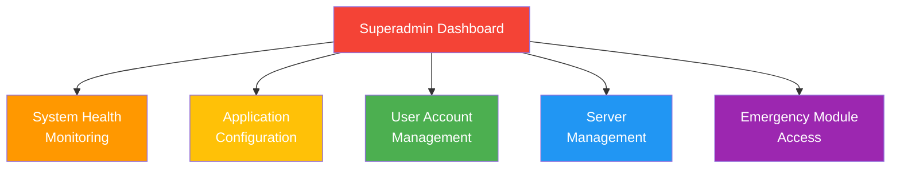
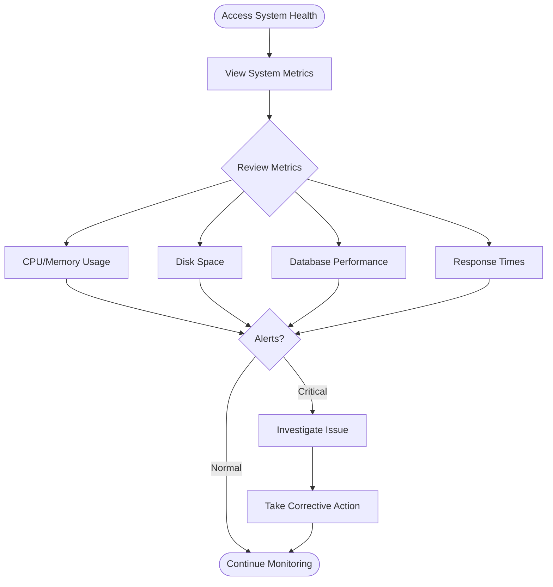
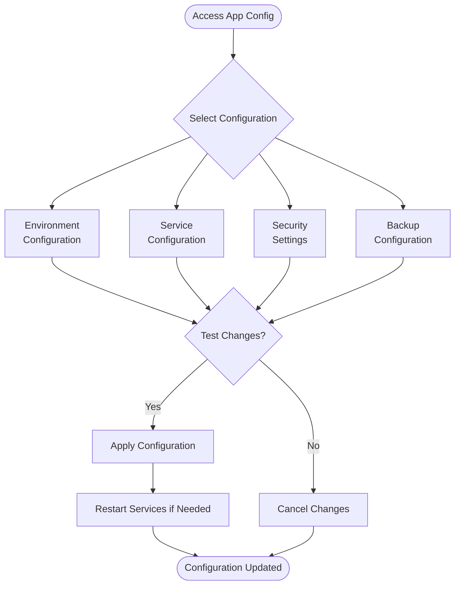
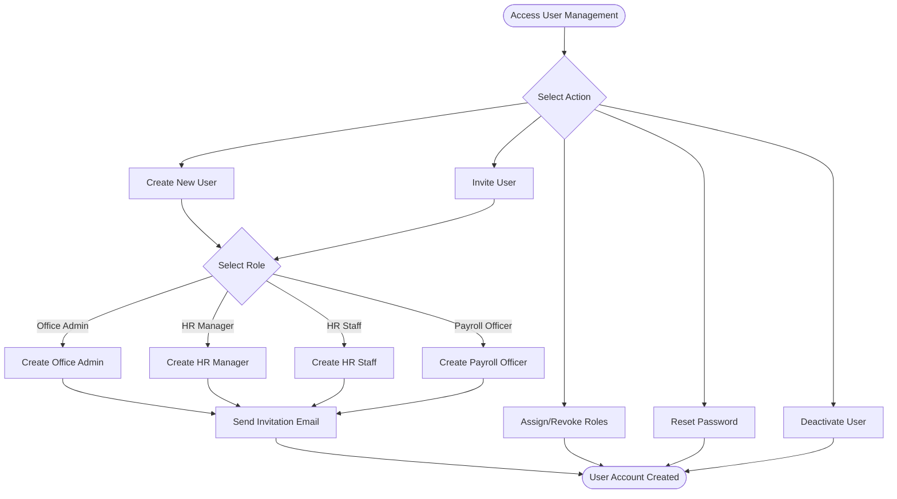
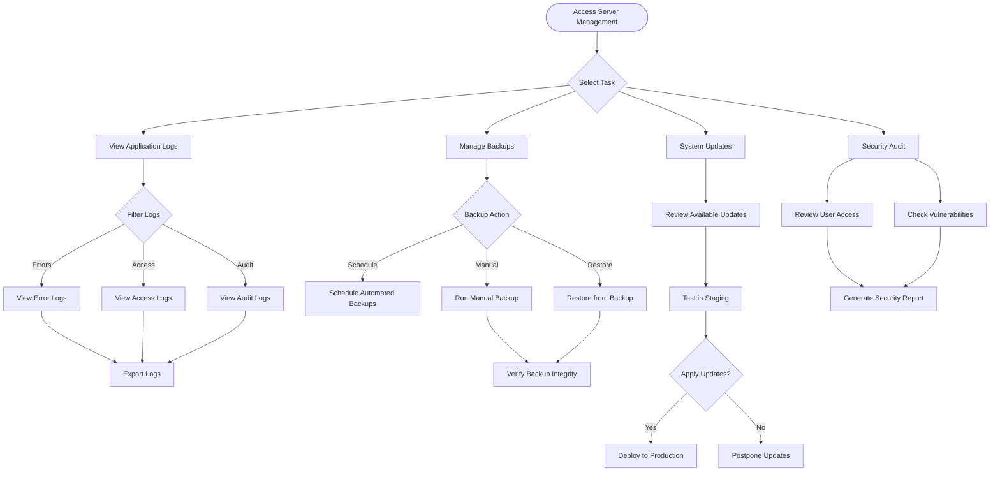
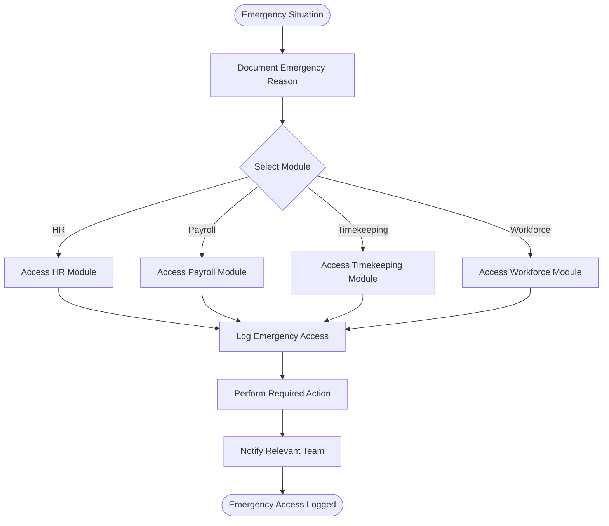

# Superadmin Workflow

## Role Overview
**Focus**: System and application monitoring, setup, and maintenance

### Core Responsibilities
- 🔧 System health monitoring and observability
- 🖥️ Application configuration and deployment
- 💾 Server management and security
- 📊 System-level logs and metrics
- 👥 User account management (create/invite users)
- 🚨 Full access to all modules for emergency operations

---

## Dashboard Overview

---

## 1. System Health Monitoring

### Purpose
Monitor system performance, detect issues, and ensure optimal operation.

### Workflow

### Actions
- ✅ View real-time system metrics
- ✅ Monitor CPU and memory usage
- ✅ Check disk space availability
- ✅ Review database performance
- ✅ Analyze response times
- ✅ Investigate critical alerts
- ✅ Take corrective actions

---

## 2. Application Configuration

### Purpose
Configure environment settings, services, security, and backups.

### Workflow

### Configuration Areas
- **Environment**: Database connections, API keys, debug settings
- **Services**: Mail, queue, cache, session configurations
- **Security**: Encryption, CORS, CSRF protection
- **Backups**: Automated backup schedules, retention policies

---

## 3. User Account Management

### Purpose
Create, invite, and manage user accounts for all system roles.

### Workflow

### Available Roles
- **Office Admin**: Company setup and business rules
- **HR Manager**: Approval authority for HR processes
- **HR Staff**: Day-to-day HR operations
- **Payroll Officer**: Payroll processing and compliance

---

## 4. Server Management

### Purpose
Manage server operations, logs, backups, updates, and security.

### Workflow

### Key Tasks
- **Logs**: Monitor errors, access, and audit trails
- **Backups**: Schedule, execute, and verify backups
- **Updates**: Review, test, and deploy system updates
- **Security**: Audit access and check for vulnerabilities

---

## 5. Emergency Module Access

### Purpose
Access any module in emergency situations with full audit logging.

### Workflow

### Emergency Access Rules
- ⚠️ **Document reason** before accessing
- ⚠️ **All actions logged** with full audit trail
- ⚠️ **Notify relevant teams** after action taken
- ⚠️ **Review access logs** regularly
- ⚠️ **Use sparingly** - only for genuine emergencies

---

## Common Tasks

### Creating a New User Account

**Steps:**
1. Navigate to User Management
2. Click "Create New User" or "Invite User"
3. Select user role (Office Admin, HR Manager, HR Staff, Payroll Officer)
4. Fill in user details (name, email, employee record if exists)
5. Send invitation email
6. User receives email with activation link
7. User sets password and accesses system

### Monitoring System Health

**Daily Checks:**
- ✅ CPU usage < 80%
- ✅ Memory usage < 85%
- ✅ Disk space > 20% free
- ✅ Database response time < 100ms
- ✅ Application response time < 500ms
- ✅ No critical error logs

### Managing Backups

**Backup Schedule:**
- **Daily**: Incremental backups at 2:00 AM
- **Weekly**: Full backups every Sunday at 1:00 AM
- **Monthly**: Archive backups on 1st of month
- **Retention**: 30 days for daily, 90 days for weekly, 1 year for monthly

---

## Key Performance Indicators (KPIs)

| Metric | Target | Warning | Critical |
|--------|--------|---------|----------|
| CPU Usage | < 60% | 60-80% | > 80% |
| Memory Usage | < 70% | 70-85% | > 85% |
| Disk Space Free | > 30% | 20-30% | < 20% |
| DB Response Time | < 50ms | 50-100ms | > 100ms |
| App Response Time | < 300ms | 300-500ms | > 500ms |
| Uptime | > 99.9% | 99-99.9% | < 99% |

---

## Troubleshooting Guide

### High CPU Usage
1. Check running processes
2. Review recent deployments
3. Check for infinite loops or heavy queries
4. Restart services if necessary
5. Scale resources if needed

### Database Performance Issues
1. Review slow query logs
2. Check index usage
3. Analyze query execution plans
4. Optimize problematic queries
5. Consider database maintenance

### Backup Failures
1. Check disk space availability
2. Review backup logs for errors
3. Verify backup service status
4. Test backup integrity
5. Adjust backup schedule if needed

---

## Security Best Practices

### Access Control
- ✅ Use strong passwords (min 12 characters)
- ✅ Enable two-factor authentication
- ✅ Regularly review user access
- ✅ Deactivate unused accounts
- ✅ Log all administrative actions

### Server Security
- ✅ Keep system updated
- ✅ Use firewall rules
- ✅ Restrict SSH access
- ✅ Monitor failed login attempts
- ✅ Regular security audits

### Data Protection
- ✅ Encrypt sensitive data
- ✅ Regular backups
- ✅ Test backup restoration
- ✅ Secure backup storage
- ✅ Compliance with data regulations

---

## Related Documentation
- [System Overview](./00-system-overview.md)
- [Office Admin Workflow](./02-office-admin-workflow.md)
- [RBAC Matrix](../RBAC_MATRIX.md)
- [System Architecture](../SYNCINGSTEEL_ARCHITECTURE_PLAN.md)

---

**Last Updated**: November 29, 2025  
**Role**: Superadmin  
**Access Level**: Full System Access + Emergency Module Access
