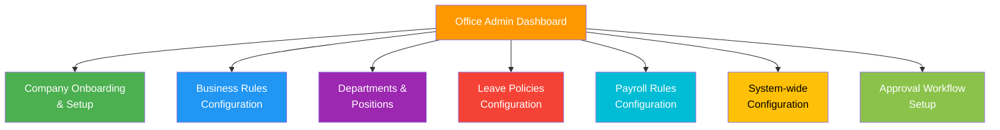
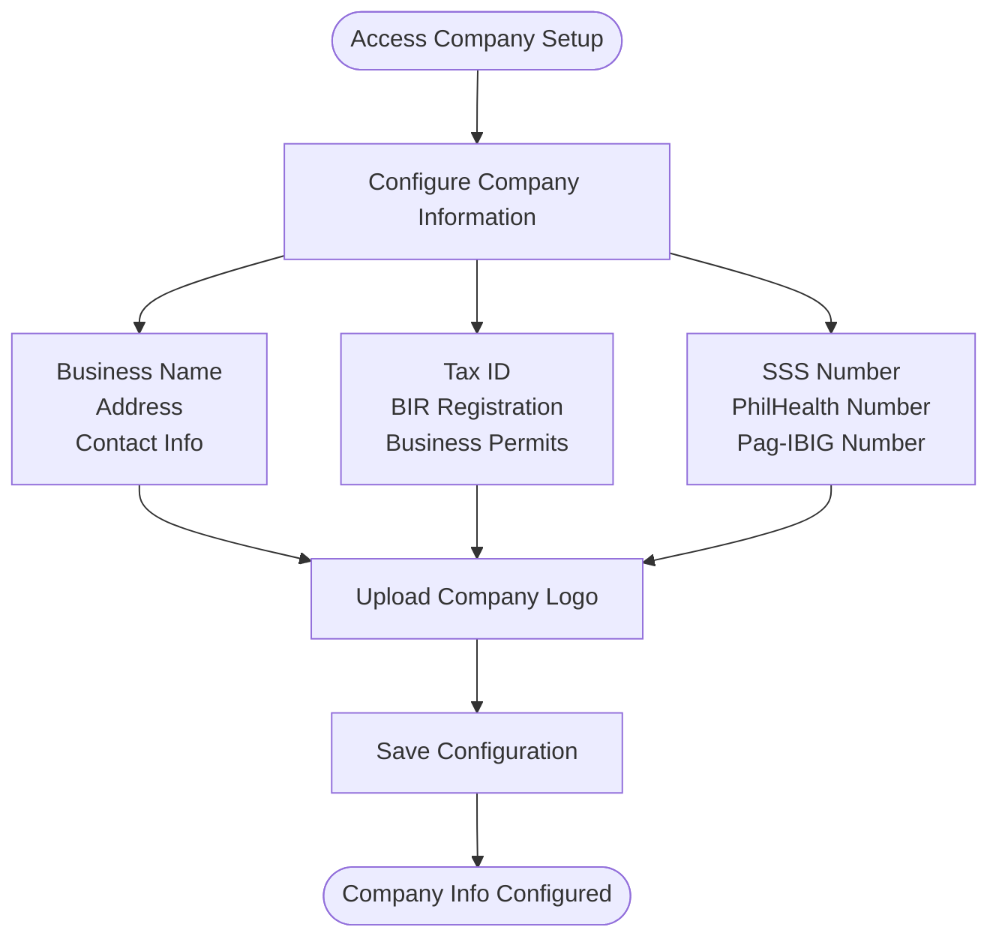
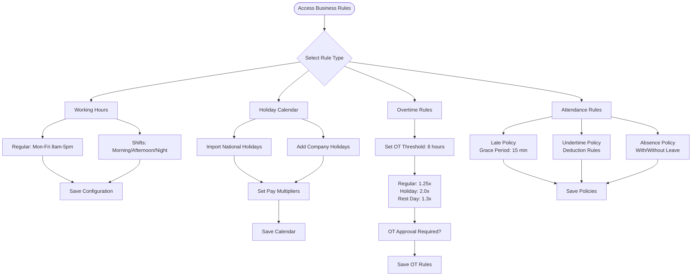
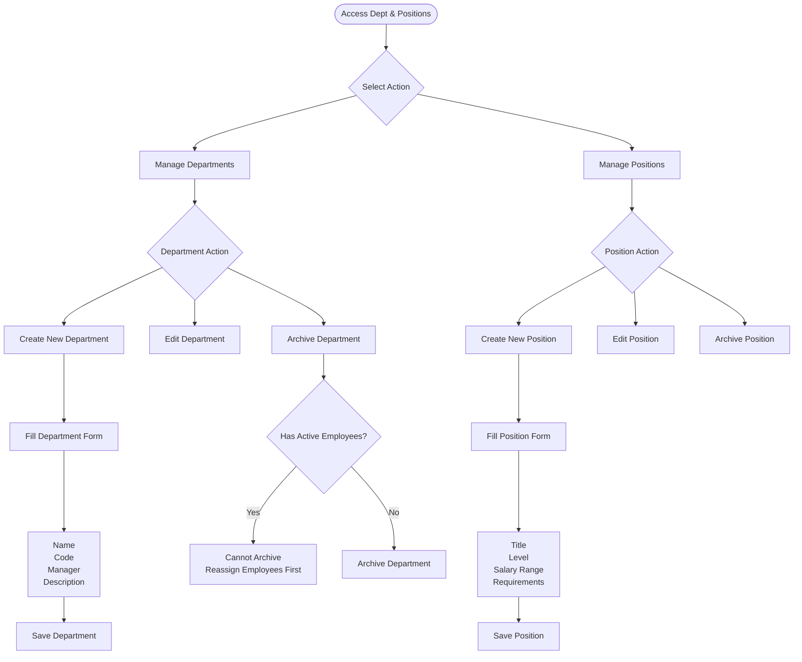
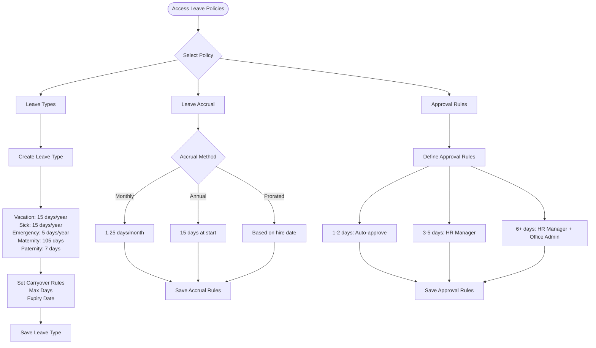
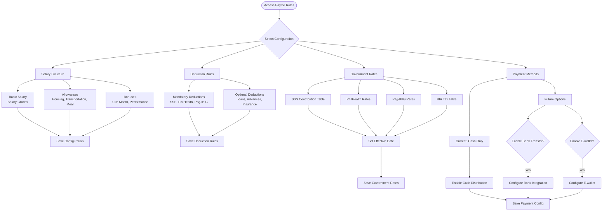
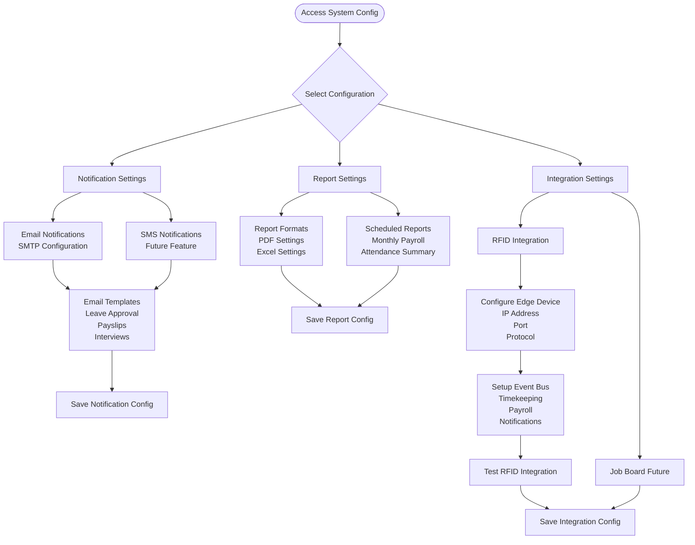
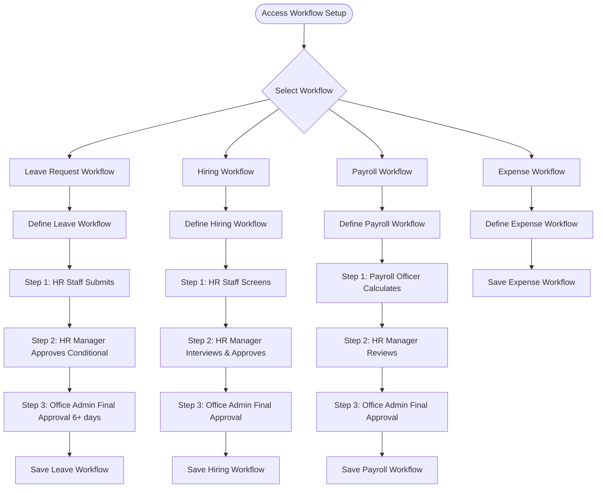

# Office Admin Workflow

## Role Overview
**Focus**: Company setup, business rules, and process configuration

### Core Responsibilities
- 🏢 Company onboarding and initial setup
- 📋 Business rules and process configuration
- 🏛️ Department and position management
- 📅 Leave policies and approval workflows
- 💰 Salary structures and payroll rules
- 🔔 System-wide configurations (payment methods, government rates)
- ✅ Approval authority for major employee requests (based on configuration)

---

## Dashboard Overview

---

## 1. Company Onboarding & Setup

### Purpose
Configure company information, tax details, and government registration numbers.

### Workflow

### Configuration Fields

**Basic Information:**
- Company legal name
- Business address
- Contact phone/email
- Website (optional)
- Company logo

**Tax & Registration:**
- Tax Identification Number (TIN)
- BIR registration details
- Business permit numbers
- SEC registration (if applicable)

**Government Numbers:**
- SSS employer number
- PhilHealth employer number
- Pag-IBIG employer number

---

## 2. Business Rules Configuration

### Purpose
Define working hours, holidays, overtime rules, and attendance policies.

### Workflow

### Key Configurations

**Working Hours:**
- Regular schedule (8am-5pm, Mon-Fri)
- Shift patterns (3 shifts: 6am-2pm, 2pm-10pm, 10pm-6am)
- Break times and durations
- Flexible work arrangements

**Holiday Calendar:**
- National holidays (auto-import from government list)
- Company-specific holidays
- Holiday pay multipliers (regular: 2.0x, special: 1.3x)
- Holiday work compensation rules

**Overtime Rules:**
- OT threshold (usually 8 hours/day)
- OT rates (regular: 1.25x, holiday: 2.0x, rest day: 1.3x)
- Maximum OT hours per day/week
- Approval requirements (auto-approve < 2 hours, requires approval ≥ 2 hours)

**Attendance Policies:**
- Grace period (15 minutes standard)
- Late deduction rules (per minute or per bracket)
- Undertime policy (proportional deduction)
- Absence handling (with/without approved leave)

---

## 3. Department & Position Management

### Purpose
Create and manage organizational structure, departments, and positions.

### Workflow

### Department Management

**Creating a Department:**
1. Department name (e.g., "Human Resources")
2. Department code (e.g., "HR")
3. Assign department head/manager
4. Add description and responsibilities

**Department Hierarchy:**
- Top-level departments
- Sub-departments (optional)
- Cross-functional teams

### Position Management

**Creating a Position:**
1. Position title (e.g., "Senior Software Engineer")
2. Job level (Junior, Mid, Senior, Manager, etc.)
3. Salary range (min-max)
4. Required qualifications
5. Job description
6. Reporting structure

---

## 4. Leave Policies Configuration

### Purpose
Configure leave types, accrual methods, and approval workflows.

### Workflow

### Leave Type Configuration

**Standard Leave Types:**
- **Vacation Leave**: 15 days/year (convertible to cash)
- **Sick Leave**: 15 days/year (requires medical certificate for 3+ days)
- **Emergency Leave**: 5 days/year
- **Maternity Leave**: 105 days (60 days paid, 45 days unpaid)
- **Paternity Leave**: 7 days (paid)
- **Solo Parent Leave**: 7 days/year (with certificate)
- **Bereavement Leave**: 3-5 days (immediate family)

**Carryover Rules:**
- Maximum carryover days (e.g., 5 days)
- Expiry period (e.g., March 31 next year)
- Conversion to cash option

### Accrual Methods

**Monthly Accrual:**
- 1.25 days per month worked
- Prorated for partial months
- Available balance updates monthly

**Annual Accrual:**
- Full allocation on January 1 or hire date anniversary
- Prorated for new hires mid-year

**Prorated Accrual:**
- Based on actual hire date
- Calculated proportionally for first year

### Approval Workflows

**Auto-Approval (1-2 days):**
- Sufficient leave balance
- No schedule conflicts
- Advance notice (minimum 3 days)

**HR Manager Approval (3-5 days):**
- Reviews leave balance
- Checks workforce schedule
- Approves or rejects with reason

**HR Manager + Office Admin (6+ days):**
- HR Manager reviews first
- Forwards to Office Admin for final approval
- Both must approve for leave to be granted

---

## 5. Payroll Rules Configuration

### Purpose
Configure salary structure, deductions, government rates, and payment methods.

### Workflow

### Salary Structure

**Basic Salary:**
- Salary grades (1-15 or custom)
- Minimum-maximum per grade
- Step increments within grade
- Annual salary review dates

**Allowances (De Minimis/Taxable):**
- Housing allowance
- Transportation allowance
- Meal allowance
- Communication allowance
- Clothing allowance
- Medical/dental allowance

**Bonuses:**
- 13th month pay (mandatory)
- Performance bonus
- Signing bonus
- Retention bonus
- Project completion bonus

### Deduction Rules

**Mandatory Deductions:**
- **SSS**: Based on contribution table
- **PhilHealth**: Based on monthly salary
- **Pag-IBIG**: Fixed rate (1-2% of salary)
- **Withholding Tax**: Based on BIR tax table

**Optional Deductions:**
- Company loans
- SSS/Pag-IBIG loans
- Cash advances
- Insurance premiums
- Uniform deductions
- Other authorized deductions

### Government Rates

**SSS Contribution Table** (Updated annually):
- Salary brackets
- Employee and employer shares
- Maximum contribution cap

**PhilHealth Rates** (Updated annually):
- Premium rate (current: 5% of monthly salary)
- Employee: 2.5%, Employer: 2.5%
- Minimum and maximum contributions

**Pag-IBIG Rates**:
- Employee: 1-2% (member choice)
- Employer: 2%
- Maximum salary base: ₱5,000

**BIR Tax Table**:
- Progressive tax rates
- Tax exemptions
- Deductions (SSS, PhilHealth, Pag-IBIG)
- TRAIN law compliance

### Payment Methods

**Current: Cash Distribution**
- Salary envelopes
- Employee signature required
- Accountability report
- Security protocols

**Future: Bank Transfer** (Configurable)
- Bank file generation
- Auto-transfer scheduling
- Transfer confirmation
- Bank reconciliation

**Future: E-wallet** (Configurable)
- GCash, PayMaya, etc.
- Instant transfer
- Transaction notifications
- E-wallet reconciliation

---

## 6. System-wide Configuration

### Purpose
Configure notifications, reports, and system integrations.

### Workflow

### Notification Configuration

**Email Settings:**
- SMTP server configuration
- Sender email and name
- Email templates for:
  - Leave approval/rejection
  - Payslip distribution
  - Interview scheduling
  - Performance review reminders
  - System alerts

**SMS Settings (Future):**
- SMS gateway integration
- SMS templates
- Priority notifications

### Report Configuration

**PDF Settings:**
- Company logo on reports
- Header/footer templates
- Page size and margins
- Font and styling

**Excel Settings:**
- Column formatting
- Auto-width columns
- Freeze panes
- Summary sheets

**Scheduled Reports:**
- Monthly payroll register
- Attendance summary
- Leave utilization
- Government remittance reports
- Auto-email to recipients

### Integration Settings

**RFID Timekeeping:**
1. Configure edge device (IP, port)
2. Setup event bus routing
3. Map events to modules:
   - Timekeeping: Record attendance
   - Payroll: Update work hours
   - Notifications: Send confirmation
4. Test card tap and event flow

**Job Board (Future):**
- Public website integration
- Application form mapping
- Auto-import to ATS
- Applicant notifications

---

## 7. Approval Workflow Setup

### Purpose
Configure multi-level approval workflows for various processes.

### Workflow

### Approval Workflow Types

**Leave Request Workflow:**
- **1-2 days**: Auto-approved (if balance sufficient)
- **3-5 days**: HR Manager approval required
- **6+ days**: HR Manager + Office Admin approval required

**Hiring Approval Workflow:**
1. HR Staff screens applications
2. HR Manager conducts interview and recommends
3. Office Admin provides final hiring approval
4. HR Staff processes onboarding

**Payroll Approval Workflow:**
1. Payroll Officer calculates payroll
2. HR Manager reviews calculations and exceptions
3. Office Admin provides final approval before payment
4. Payroll Officer distributes payment

**Expense Approval Workflow:**
1. Employee submits expense (via HR Staff)
2. Department head approves
3. Accounting reviews
4. Office Admin approves (if above threshold)

---

## Common Tasks

### Initial System Setup Checklist

**Day 1: Company Information**
- ✅ Configure company basic details
- ✅ Upload company logo
- ✅ Input tax and government numbers
- ✅ Save company configuration

**Day 2: Business Rules**
- ✅ Setup working hours and shifts
- ✅ Import holiday calendar
- ✅ Configure overtime rules
- ✅ Setup attendance policies

**Day 3: Organizational Structure**
- ✅ Create all departments
- ✅ Define positions and job levels
- ✅ Assign department heads
- ✅ Setup reporting structure

**Day 4: Leave Policies**
- ✅ Create all leave types
- ✅ Configure accrual methods
- ✅ Setup approval workflows
- ✅ Define carryover rules

**Day 5: Payroll Configuration**
- ✅ Setup salary structure
- ✅ Configure allowances and bonuses
- ✅ Input government rates
- ✅ Enable payment methods

**Day 6: System Configuration**
- ✅ Configure email notifications
- ✅ Setup report templates
- ✅ Configure RFID integration
- ✅ Test all integrations

**Day 7: Approval Workflows**
- ✅ Define leave approval workflow
- ✅ Define hiring workflow
- ✅ Define payroll workflow
- ✅ Train users on workflows

### Updating Government Rates (Annual Task)

**When to Update:**
- SSS: January (when announced)
- PhilHealth: January (when announced)
- Pag-IBIG: As announced (rare)
- BIR Tax: January (TRAIN law updates)

**Update Process:**
1. Review official government announcement
2. Navigate to Payroll Rules > Government Rates
3. Select rate type (SSS/PhilHealth/Pag-IBIG/Tax)
4. Input new rates and brackets
5. Set effective date (usually January 1)
6. Save and notify Payroll Officer
7. Generate test payroll to verify

### Managing Holiday Calendar

**Annual Update (December):**
1. Import next year's national holidays
2. Add company-specific holidays
3. Set holiday pay multipliers
4. Review special working day classifications
5. Save and publish calendar
6. Notify all users of holiday schedule

---

## Best Practices

### Configuration Management
- ✅ Document all configuration changes
- ✅ Test changes in staging first (if available)
- ✅ Notify affected users before major changes
- ✅ Keep backup of previous configurations
- ✅ Review configurations quarterly

### Data Accuracy
- ✅ Verify government rates from official sources
- ✅ Cross-check salary structures with HR policy
- ✅ Validate leave policies against labor law
- ✅ Test approval workflows before rollout
- ✅ Audit system configurations annually

### Security & Compliance
- ✅ Restrict configuration access to Office Admin only
- ✅ Log all configuration changes
- ✅ Ensure compliance with labor laws
- ✅ Keep government rates updated
- ✅ Regular security audits

---

## Troubleshooting

### Common Issues

**Issue: Government rates not applying to payroll**
- Check effective date of rate configuration
- Verify payroll period date range
- Re-calculate payroll after rate update
- Contact Payroll Officer to verify

**Issue: Leave auto-approval not working**
- Check leave type configuration
- Verify approval workflow rules
- Check employee leave balance
- Review advance notice requirements

**Issue: RFID events not captured**
- Check edge device connectivity
- Verify event bus configuration
- Test RFID card registration
- Review integration logs

---

## Related Documentation
- [System Overview](./00-system-overview.md)
- [Superadmin Workflow](./01-superadmin-workflow.md)
- [HR Manager Workflow](./03-hr-manager-workflow.md)
- [Payroll Officer Workflow](./05-payroll-officer-workflow.md)
- [RBAC Matrix](../RBAC_MATRIX.md)

---

**Last Updated**: November 29, 2025  
**Role**: Office Admin  
**Access Level**: Full Configuration Access (No Emergency Module Access)
