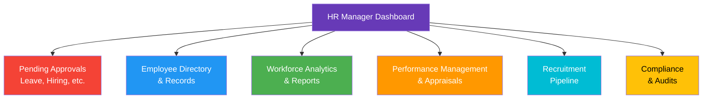
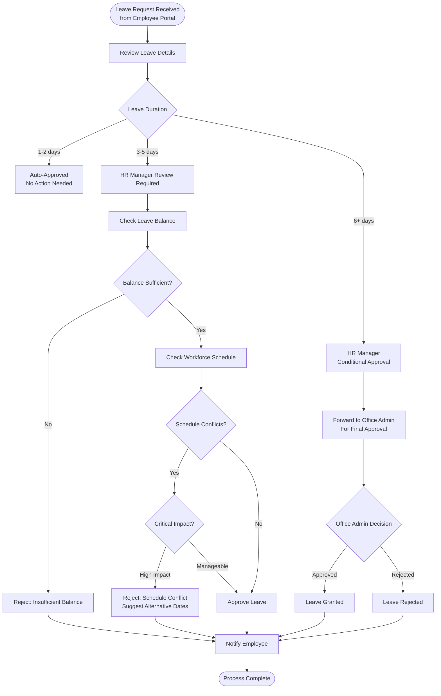
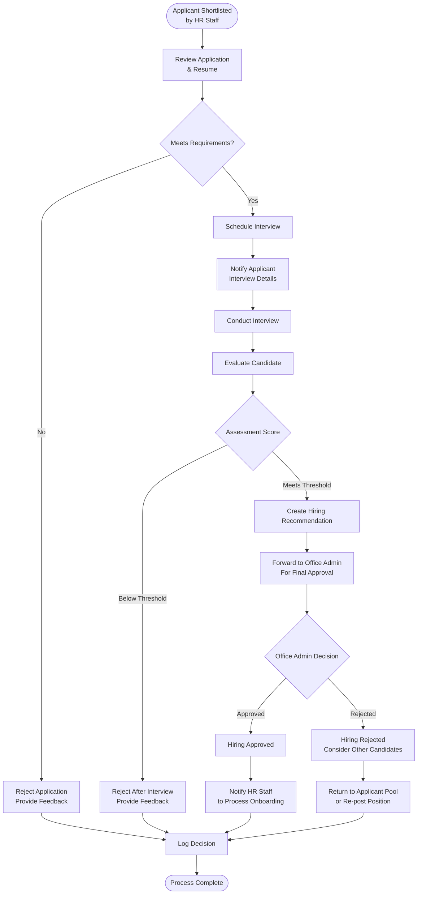
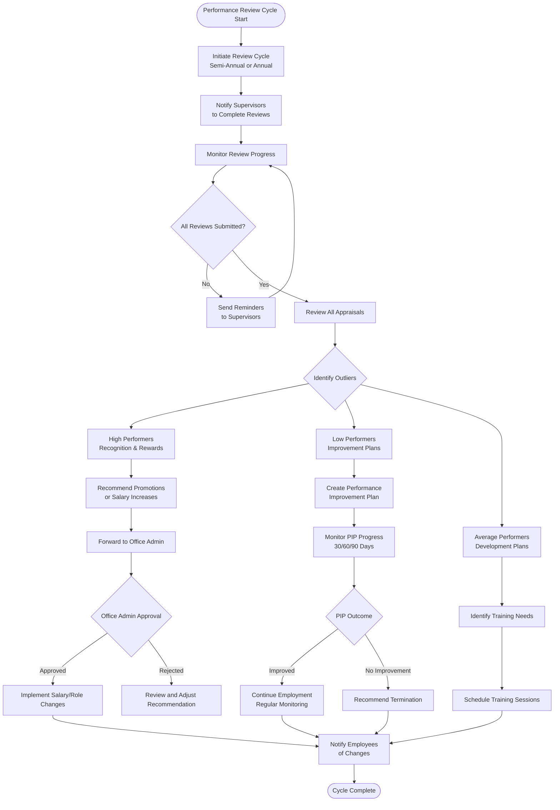
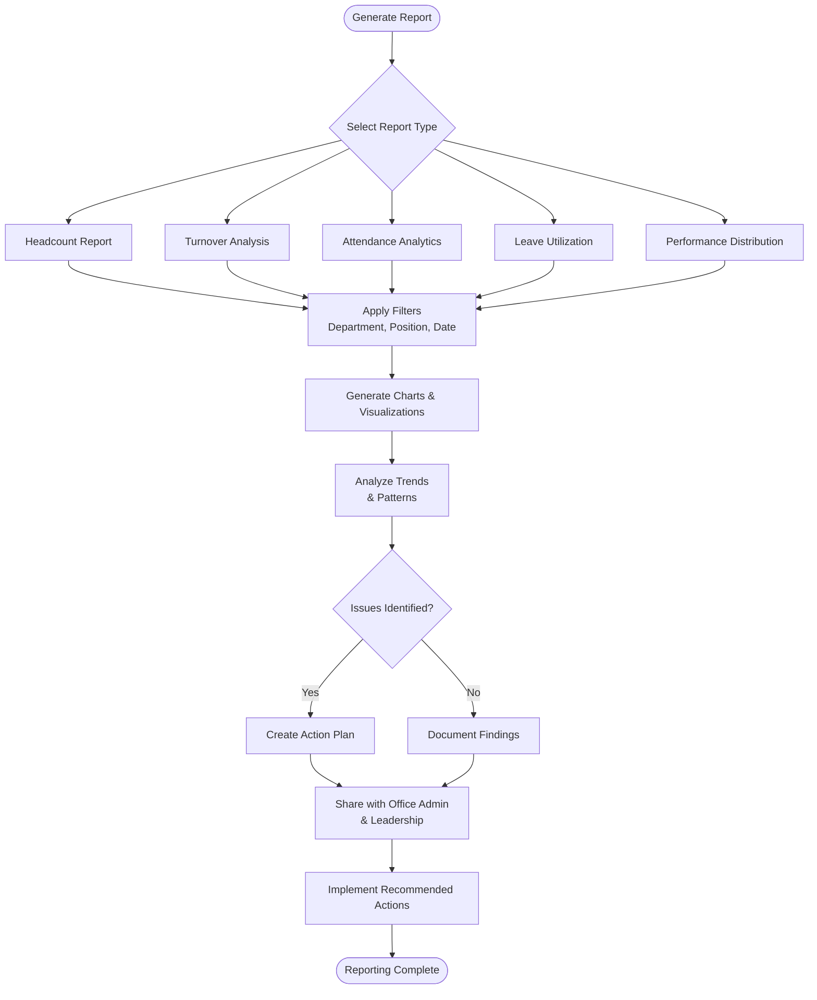
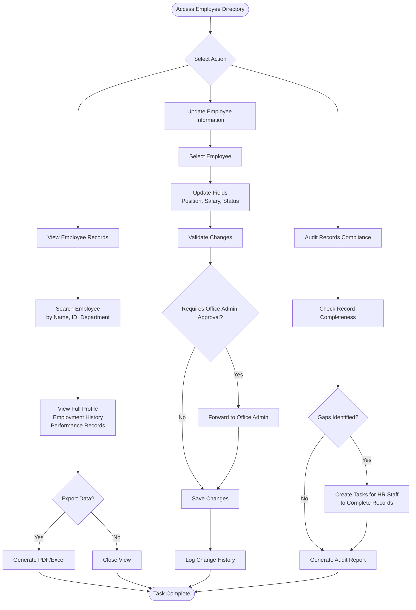
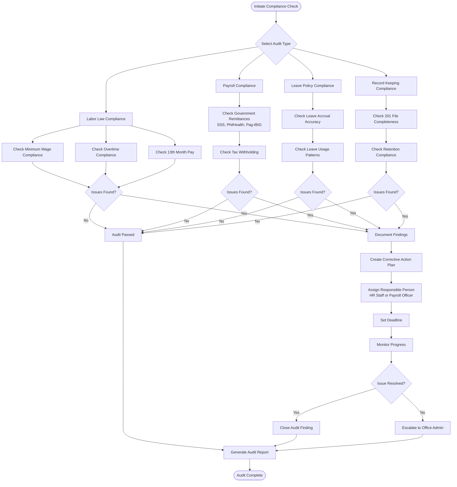

# HR Manager Workflow

## Role Overview
**Focus**: Strategic HR oversight, high-level approvals, and workforce planning

### Core Responsibilities
- 👥 Employee lifecycle management oversight
- ✅ Leave approval (conditional approval authority)
- 🎯 Performance management and appraisal oversight
- 📊 Workforce analytics and reporting
- 🔍 Hiring approval and interview coordination
- 📈 HR strategy and policy implementation
- 🔔 Employee relations and conflict resolution

---

## Dashboard Overview

---

## 1. Leave Approval Workflow

### Purpose
Review and approve leave requests based on workforce availability and policies.

### Workflow

### Approval Authority

**Auto-Approved (1-2 days):**
- System automatically approves if:
  - Sufficient leave balance
  - No schedule conflicts
  - Minimum 3 days advance notice
- HR Manager receives notification only

**HR Manager Approval Required (3-5 days):**
- Full approval authority
- Reviews:
  - Leave balance
  - Workforce schedule
  - Department coverage
  - Historical leave patterns
- Can approve or reject with reason

**Conditional Approval (6+ days):**
- HR Manager provides conditional approval
- Forwards to Office Admin for final decision
- Office Admin has final authority
- Both approvals required for leave to be granted

### Decision Factors

**Approve if:**
- ✅ Sufficient leave balance
- ✅ No critical schedule conflicts
- ✅ Adequate department coverage
- ✅ Proper advance notice
- ✅ Valid reason provided

**Reject if:**
- ❌ Insufficient leave balance
- ❌ Critical schedule conflict (busy period, insufficient coverage)
- ❌ Inadequate advance notice (< 3 days for planned leave)
- ❌ Concurrent leave requests from same department
- ❌ Previous unresolved leave issues

---

## 2. Hiring Approval & Interview Coordination

### Purpose
Review applicant shortlist, conduct interviews, and approve hiring recommendations.

### Workflow

### Interview Process

**Pre-Interview:**
1. Review applicant resume and portfolio
2. Check qualifications against job requirements
3. Review HR Staff screening notes
4. Prepare interview questions
5. Schedule interview (coordinate with applicant and panel)

**During Interview:**
1. Conduct competency-based interview
2. Assess technical skills
3. Evaluate cultural fit
4. Ask behavioral questions
5. Allow candidate questions
6. Provide role overview and expectations

**Post-Interview:**
1. Complete evaluation form
2. Score candidate against criteria
3. Document interview notes
4. Make hiring recommendation
5. Forward to Office Admin for final approval

### Hiring Decision Matrix

| Criteria | Weight | Scoring |
|----------|--------|---------|
| Technical Skills | 30% | 1-5 scale |
| Experience | 25% | Years + relevance |
| Cultural Fit | 20% | Interview assessment |
| Communication | 15% | Interview performance |
| Problem Solving | 10% | Scenario-based questions |

**Pass Threshold**: 70% overall score

**Decision:**
- **80%+ score**: Strong recommendation
- **70-79% score**: Conditional recommendation
- **Below 70%**: Reject

---

## 3. Performance Management & Appraisals

### Purpose
Oversee performance review cycles, appraisal approvals, and employee development.

### Workflow

### Performance Review Cycle

**Semi-Annual Cycle:**
- Mid-year review (June)
- Year-end review (December)

**Review Components:**
1. Self-assessment by employee
2. Supervisor rating and comments
3. HR Manager review and validation
4. Performance discussion meeting
5. Goal setting for next period

### Appraisal Rating Scale

| Rating | Description | % Expected |
|--------|-------------|------------|
| 5 - Outstanding | Consistently exceeds expectations | 5-10% |
| 4 - Exceeds Expectations | Frequently exceeds expectations | 15-20% |
| 3 - Meets Expectations | Solid, reliable performance | 60-70% |
| 2 - Needs Improvement | Below expectations, requires support | 5-10% |
| 1 - Unsatisfactory | Significantly below expectations | 0-5% |

### HR Manager Oversight

**Review Responsibilities:**
1. Validate rating distributions (avoid all 3s or all 5s)
2. Check for rating inflation or deflation
3. Ensure consistency across departments
4. Review comments for completeness
5. Identify high potential employees
6. Flag performance concerns
7. Recommend salary adjustments
8. Approve promotion recommendations

**Performance Improvement Plans (PIP):**
- Create PIP for ratings below 2.5
- Define specific improvement goals
- Set measurable milestones (30/60/90 days)
- Assign mentor or coach
- Monitor progress weekly
- Document all interactions
- Make final recommendation

---

## 4. Workforce Analytics & Reporting

### Purpose
Generate insights on workforce metrics, trends, and strategic planning.

### Workflow

### Key Reports

**1. Headcount Report**
- Total employee count
- Breakdown by department, position, employment type
- New hires vs. separations
- Trend analysis (month-over-month, year-over-year)

**2. Turnover Analysis**
- Voluntary vs. involuntary turnover
- Turnover rate by department
- Exit reasons analysis
- Retention strategies effectiveness

**3. Attendance Analytics**
- Overall attendance rate
- Late arrivals and early departures
- Absence patterns (by day, employee, department)
- RFID timekeeping accuracy

**4. Leave Utilization**
- Leave balances by employee
- Leave taken vs. available
- Leave patterns (seasonal, departmental)
- Carryover and forfeited leaves

**5. Performance Distribution**
- Rating distribution across company
- Department comparison
- Correlation with tenure, position, department
- Training effectiveness

### Strategic Insights

**Workforce Planning:**
- Identify hiring needs based on turnover
- Forecast headcount growth
- Budget planning for salaries and benefits
- Succession planning for key positions

**Risk Identification:**
- High turnover departments (investigate causes)
- Attendance issues (potential engagement problems)
- Performance clusters (training needs)
- Leave abuse patterns

---

## 5. Employee Directory & Records Management

### Purpose
Maintain accurate employee records and ensure data compliance.

### Workflow

### Record Management Responsibilities

**Employee Records Access:**
- View all employee information
- Access employment history
- Review performance records
- View compensation details
- Check leave balances and history

**Update Authority:**
- Update position changes (with Office Admin approval)
- Update employment status (active, on leave, resigned)
- Update department assignments
- Add notes and comments
- Update contact information

**Data Compliance:**
- Ensure all employee records are complete
- Verify document authenticity
- Maintain data privacy and confidentiality
- Conduct quarterly compliance audits
- Archive records per retention policy

---

## 6. Compliance & Audits

### Purpose
Ensure HR processes comply with labor laws and company policies.

### Workflow

### Compliance Checklist

**Labor Law Compliance:**
- ✅ Minimum wage compliance (per region)
- ✅ Overtime rate compliance (1.25x regular, 2.0x holiday)
- ✅ Rest day compliance (1 day per week minimum)
- ✅ 13th month pay computation and timing
- ✅ Maternity/paternity leave compliance
- ✅ Safe working conditions

**Payroll Compliance:**
- ✅ SSS remittance (monthly, on time)
- ✅ PhilHealth remittance (monthly, on time)
- ✅ Pag-IBIG remittance (monthly, on time)
- ✅ BIR tax withholding and remittance
- ✅ Payslip distribution (every payday)
- ✅ Government rate updates (annually)

**Leave Compliance:**
- ✅ Service Incentive Leave (5 days minimum)
- ✅ Leave accrual accuracy
- ✅ Leave balance tracking
- ✅ Leave conversion (if applicable)
- ✅ Maternity/paternity leave entitlement

**Record Compliance:**
- ✅ 201 files (complete employee records)
- ✅ Daily Time Records (DTR)
- ✅ Payroll registers
- ✅ Leave applications
- ✅ Performance appraisals
- ✅ Retention period compliance (varies by document)

---

## Common Tasks

### Daily Tasks
- ✅ Review and approve pending leave requests (3-5 days duration)
- ✅ Monitor recruitment pipeline
- ✅ Respond to employee inquiries
- ✅ Review timekeeping exceptions
- ✅ Check dashboard metrics

### Weekly Tasks
- ✅ Review workforce analytics reports
- ✅ Conduct candidate interviews
- ✅ Hold HR staff meetings
- ✅ Review and approve employee record updates
- ✅ Monitor performance improvement plans

### Monthly Tasks
- ✅ Generate monthly HR reports (headcount, turnover, attendance)
- ✅ Review payroll calculations (before Office Admin approval)
- ✅ Conduct compliance checks
- ✅ Update workforce forecasts
- ✅ Review training needs

### Quarterly Tasks
- ✅ Conduct HR compliance audit
- ✅ Review compensation structures
- ✅ Analyze turnover trends
- ✅ Update succession plans
- ✅ Strategic workforce planning meeting

### Annual Tasks
- ✅ Initiate performance review cycles (2x per year)
- ✅ Update HR policies
- ✅ Annual salary review and recommendations
- ✅ Government compliance reporting (BIR, DOLE)
- ✅ HR budget planning

---

## Key Performance Indicators (KPIs)

| KPI | Target | Measurement |
|-----|--------|-------------|
| Leave Approval Time | < 24 hours | Time from submission to approval |
| Employee Turnover Rate | < 15% annually | (Separations / Avg Headcount) x 100 |
| Time to Fill (Hiring) | < 30 days | Days from req opening to hire |
| Attendance Rate | > 95% | (Days Present / Total Days) x 100 |
| Performance Review Completion | 100% | % of employees reviewed on time |
| Compliance Audit Pass Rate | 100% | % of audits with no findings |

---

## Best Practices

### Leave Approval
- ✅ Review within 24 hours
- ✅ Consider workforce impact, not just balance
- ✅ Communicate rejection reasons clearly
- ✅ Suggest alternative dates when rejecting
- ✅ Check historical leave patterns

### Hiring Decisions
- ✅ Use structured interview questions
- ✅ Score candidates objectively
- ✅ Document interview notes thoroughly
- ✅ Check references before final recommendation
- ✅ Consider cultural fit and team dynamics

### Performance Management
- ✅ Ensure rating consistency across departments
- ✅ Provide specific feedback, not generic
- ✅ Address performance issues early
- ✅ Recognize and reward high performers
- ✅ Create actionable development plans

### Compliance
- ✅ Stay updated on labor law changes
- ✅ Conduct regular compliance audits
- ✅ Document all HR decisions
- ✅ Maintain confidentiality
- ✅ Escalate issues promptly

---

## Troubleshooting

### Common Issues

**Issue: Leave request stuck in pending**
- Check if request requires Office Admin approval (6+ days)
- Verify no system errors in approval workflow
- Check if employee has sufficient balance
- Contact Office Admin if escalated

**Issue: Interview no-show**
- Review notification sent to applicant
- Check if interview details were clear
- Reschedule if legitimate reason
- Mark as "Failed to Appear" in ATS

**Issue: Performance rating distribution unrealistic (all 3s or all 5s)**
- Meet with supervisor to discuss ratings
- Explain forced distribution concept
- Request justification for outlier ratings
- Provide coaching on effective performance reviews

**Issue: Compliance audit finding**
- Document the issue thoroughly
- Create corrective action plan immediately
- Assign responsible person with deadline
- Escalate to Office Admin if critical
- Follow up until resolved

## Immutable Ledger & Replay Monitoring

- Attendance, overtime, and MDTR comparisons used in HR approvals must align with the PostgreSQL ledger (`rfid_ledger`) captured by the Replayable Event-Log Verification Layer.
- HR Managers should review the replay layer's alerting/metrics (ledger commit latency, sequence gaps, hash mismatches, replay backlog) before granting approvals tied to attendance or payroll-impacting actions.

---

## Related Documentation
- [System Overview](./00-system-overview.md)
- [Office Admin Workflow](./02-office-admin-workflow.md)
- [HR Staff Workflow](./04-hr-staff-workflow.md)
- [Payroll Officer Workflow](./05-payroll-officer-workflow.md)
- [RBAC Matrix](../RBAC_MATRIX.md)
- [Performance Appraisal Module](../APPRAISAL_MODULE.md)

---

**Last Updated**: November 29, 2025  
**Role**: HR Manager  
**Access Level**: Conditional Approval Authority (Requires Office Admin for final approval on major decisions)
