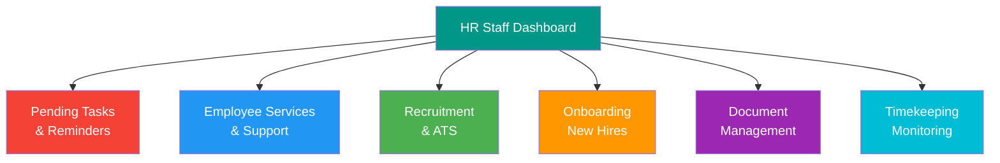
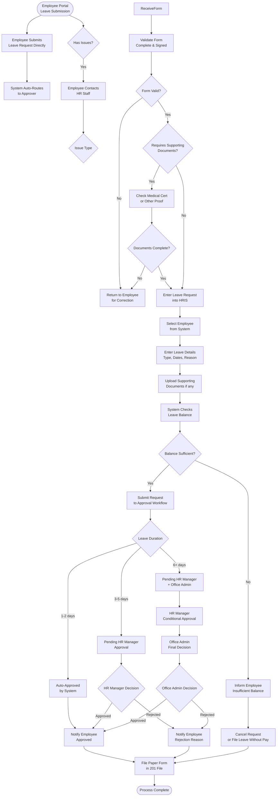
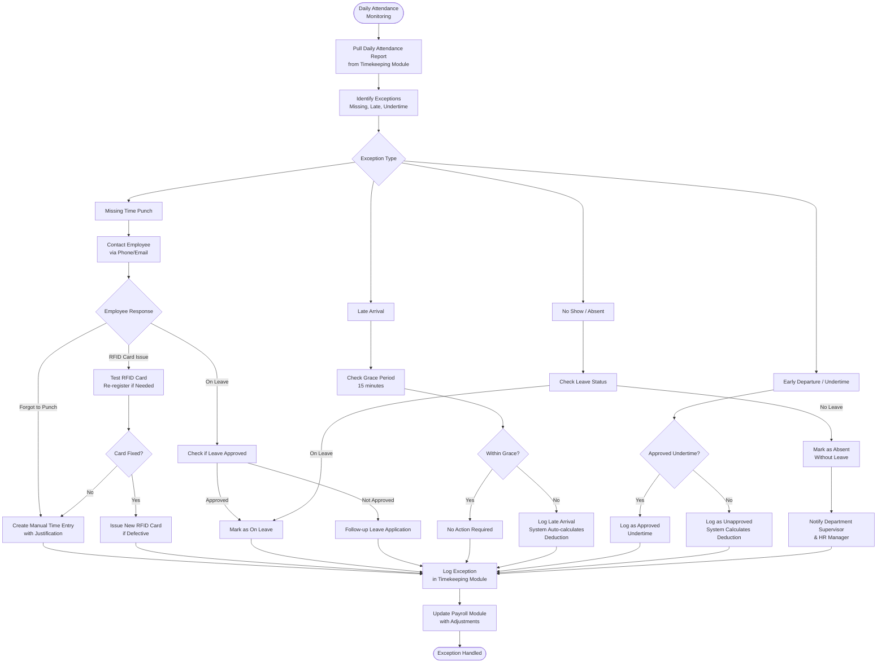
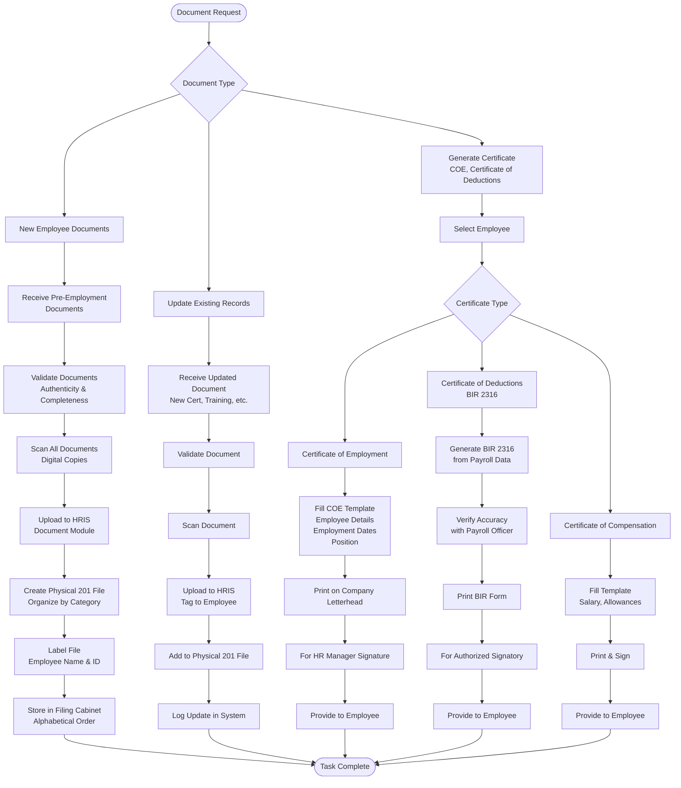
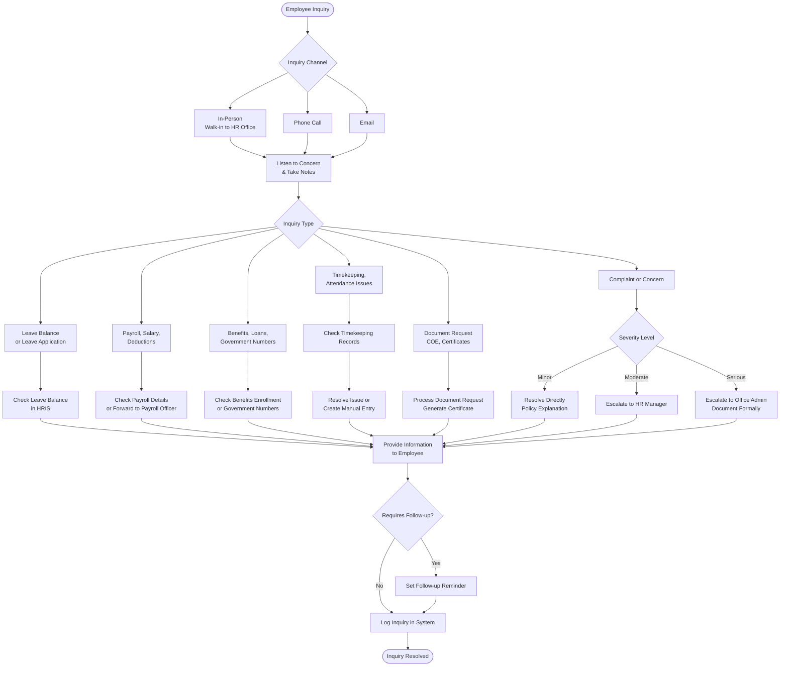

# HR Staff Workflow

## Role Overview
**Focus**: Day-to-day HR operations, employee services, and administrative tasks

### Core Responsibilities
- 📝 Employee onboarding and offboarding
- 🔍 Applicant screening and ATS management
- 📄 Document processing and 201 file management
- 📅 Leave request support (employees submit via portal, HR Staff assists with issues)
- 📊 Timekeeping monitoring and exception handling
- 👥 Employee inquiries and support
- 📋 HR administrative tasks and data entry

---

## Dashboard Overview



---

## 1. Employee Onboarding

### Purpose
Process new hire paperwork, setup accounts, and facilitate smooth onboarding experience.

### Workflow



```mermaid
graph TD
    Start([New Hire Approved<br/>by Office Admin]) --> ReceiveDocuments[Receive Pre-Employment<br/>Documents from Applicant]
    
    ReceiveDocuments --> ValidateDocuments[Validate Documents<br/>Completeness & Authenticity]
    ValidateDocuments --> Complete{All Documents Complete?}
    
    Complete -->|No| RequestMissing[Request Missing Documents<br/>from New Hire]
    RequestMissing --> ReceiveDocuments
    Complete -->|Yes| Create201File[Create 201 File]
    
    Create201File --> EnterHRIS[Enter Employee Data<br/>into HRIS]
    EnterHRIS --> AssignEmployeeID[Assign Employee ID]
    AssignEmployeeID --> CreateUserAccount[Create System User Account]
    CreateUserAccount --> AssignRole[Assign User Role<br/>Based on Position]
    
    AssignRole --> IssueRFID[Issue RFID Card<br/>Register in System]
    IssueRFID --> SetupPayroll[Setup in Payroll Module<br/>Salary, Deductions, Bank]
    SetupPayroll --> CreateWelcomePack[Prepare Welcome Pack<br/>ID, Handbook, Policies]
    
    CreateWelcomePack --> ScheduleOrientation[Schedule Orientation<br/>Day 1 Activities]
    ScheduleOrientation --> NotifyNewHire[Notify New Hire<br/>Start Date & Requirements]
    NotifyNewHire --> NotifyDept[Notify Department<br/>of New Hire Start Date]
    
    NotifyDept --> OnStartDate[On Start Date:<br/>Conduct Orientation]
    OnStartDate --> FacilityTour[Facility Tour<br/>Introductions]
    FacilityTour --> SystemTraining[System Training<br/>RFID, Leave, Policies]
    SystemTraining --> DeptHandover[Handover to Department<br/>Supervisor]
    
    DeptHandover --> FollowUp[Follow-up after 1 week<br/>Address Issues]
    FollowUp --> Complete201[Complete Onboarding Checklist]
    Complete201 --> LogOnboarding[Log in Onboarding Module]
    LogOnboarding --> Completed([Onboarding Complete])
```

### Pre-Employment Document Checklist

**Required Documents:**
- ✅ Resume / Curriculum Vitae
- ✅ Birth certificate (PSA copy)
- ✅ Valid government IDs (2 IDs)
- ✅ TIN (Tax Identification Number)
- ✅ SSS number
- ✅ PhilHealth number
- ✅ Pag-IBIG number
- ✅ Educational credentials (diploma, transcript)
- ✅ NBI clearance (National Bureau of Investigation)
- ✅ Medical certificate (fit to work)
- ✅ Previous employment certificate (if applicable)
- ✅ 2x2 ID photos (4 copies)
- ✅ Bank account details (for future payroll)

**Optional Documents:**
- Professional license (if applicable)
- Character references
- Training certificates
- Portfolio or work samples

### Account Setup Tasks

**HRIS Account:**
1. Enter personal information
2. Enter employment details (position, department, start date)
3. Enter compensation details
4. Upload scanned documents
5. Assign employee ID (auto-generated or manual)
6. Create user account credentials
7. Assign user role based on position

**RFID Card:**
1. Generate new RFID card
2. Encode employee ID
3. Register card in timekeeping system
4. Test card tap on edge device
5. Provide card to employee on Day 1

**Payroll Setup:**
1. Enter basic salary
2. Setup allowances (if any)
3. Setup deductions (SSS, PhilHealth, Pag-IBIG, tax)
4. Add bank account (for future bank transfer)
5. Set payroll schedule (15th and 30th)

### Orientation Checklist (Day 1)

**Morning (HR Orientation):**
- ✅ Welcome and introductions
- ✅ Company overview and values
- ✅ Organizational structure
- ✅ HR policies and procedures
- ✅ Employee handbook review
- ✅ Benefits and compensation overview
- ✅ Leave policies
- ✅ Timekeeping and RFID card usage
- ✅ System login and demo

**Afternoon (Department Orientation):**
- ✅ Facility tour
- ✅ Meet team members
- ✅ Workstation setup
- ✅ Introduction to supervisor
- ✅ Department processes and workflows
- ✅ Role-specific training
- ✅ First week schedule

---

## 2. Applicant Screening & ATS Management

### Purpose
Screen applications, shortlist candidates, and manage recruitment pipeline.

### Workflow

```mermaid
graph TD
    Start([Job Posting Active]) --> ReceiveApplications[Receive Applications<br/>Email, Walk-in, Job Board]
    
    ReceiveApplications --> EnterATS[Enter Application<br/>into ATS Module]
    EnterATS --> InitialScreen[Initial Screening<br/>Resume Review]
    
    InitialScreen --> MeetsMin{Meets Minimum<br/>Requirements?}
    MeetsMin -->|No| RejectEarly[Reject Application<br/>Email Notification]
    MeetsMin -->|Yes| PhoneScreen{Conduct Phone<br/>Screening?}
    
    PhoneScreen -->|Yes| CallApplicant[Call Applicant<br/>Brief Interview]
    CallApplicant --> PhonePass{Passed Phone Screen?}
    PhonePass -->|No| RejectPhone[Reject After Phone Screen]
    PhonePass -->|Yes| Shortlist[Add to Shortlist]
    PhoneScreen -->|No| Shortlist
    
    Shortlist --> NotifyManager[Notify HR Manager<br/>Shortlisted Candidates]
    NotifyManager --> ManagerReview[HR Manager Reviews<br/>& Schedules Interview]
    ManagerReview --> UpdateATS[Update ATS Status<br/>to "Interview Scheduled"]
    
    UpdateATS --> InterviewConducted[HR Manager Conducts Interview]
    InterviewConducted --> InterviewResult{Interview Result}
    InterviewResult -->|Rejected| RejectInterview[Update ATS: Rejected<br/>Email Notification]
    InterviewResult -->|Approved| HiringRecommendation[HR Manager Recommends<br/>Office Admin Approves]
    
    HiringRecommendation --> FinalDecision{Office Admin<br/>Final Decision}
    FinalDecision -->|Rejected| RejectFinal[Update ATS: Not Hired<br/>Email Notification]
    FinalDecision -->|Approved| SendJobOffer[Send Job Offer<br/>via Email]
    
    SendJobOffer --> ApplicantResponse{Applicant Response}
    ApplicantResponse -->|Accepted| ProcessOnboarding[Proceed to Onboarding]
    ApplicantResponse -->|Declined| OfferDeclined[Update ATS: Offer Declined<br/>Consider Next Candidate]
    ApplicantResponse -->|No Response| FollowUpOffer[Follow-up After 3 Days]
    FollowUpOffer --> ApplicantResponse
    
    RejectEarly --> LogATS[Log in ATS]
    RejectPhone --> LogATS
    RejectInterview --> LogATS
    RejectFinal --> LogATS
    OfferDeclined --> LogATS
    ProcessOnboarding --> LogATS
    
    LogATS --> Complete([Process Complete])
```

### Initial Screening Criteria

**Minimum Requirements Check:**
- ✅ Educational attainment (matches job requirement)
- ✅ Years of experience (minimum required)
- ✅ Required skills (technical or functional)
- ✅ Location availability (willing to work on-site)
- ✅ Salary expectation (within budget range)

**Resume Quality:**
- Clear and well-organized
- Relevant work experience highlighted
- Skills match job description
- Contact information complete
- Professional formatting

### Phone Screening (Optional)

**When to Use:**
- High volume of applications
- Remote/OFW applicants
- Clarify resume details
- Assess communication skills
- Verify availability and salary expectations

**Key Questions:**
1. Current employment status
2. Notice period (if employed)
3. Salary expectations
4. Availability for in-person interview
5. Clarify work experience details
6. Assess communication skills and enthusiasm

### ATS Status Flow

| Status | Description | Actions |
|--------|-------------|---------|
| **New** | Application received | Enter into ATS |
| **Screening** | Under initial review | Resume review, phone screen |
| **Shortlisted** | Passed screening | Notify HR Manager |
| **Interview Scheduled** | Interview date set | Confirm with applicant |
| **Interviewed** | Interview completed | Await HR Manager decision |
| **Recommended** | HR Manager approved | Forward to Office Admin |
| **Offer Sent** | Job offer sent | Await applicant response |
| **Hired** | Offer accepted | Proceed to onboarding |
| **Rejected** | Not selected | Archive application |
| **Offer Declined** | Applicant declined | Consider next candidate |

---

## 3. Leave Request Support

### Purpose
Assist employees with leave request issues and handle special cases (employees submit directly via Employee Portal).

### Workflow



### HR Staff Support Scenarios

**When HR Staff Assists:**

**Scenario 1: Technical Issues**
- Employee cannot access portal
- System errors during submission
- Upload document failures
- **Action**: HR Staff submits on behalf with proper documentation

**Scenario 2: Special Leave Types**
- Maternity/Paternity leave (requires additional documentation)
- Solo parent leave (requires certificate)
- Emergency leave (urgent situations)
- **Action**: HR Staff validates documents and assists with submission

**Scenario 3: Balance Inquiries**
- Employee unsure of available balance
- Questions about accrual
- Leave conversion to cash inquiries
- **Action**: HR Staff explains leave policies and checks balance

**Scenario 4: Rejected Requests**
- Employee wants to understand rejection reason
- Wants to appeal decision
- Needs alternative dates
- **Action**: HR Staff coordinates with HR Manager for clarification

### Manual Submission (Special Cases Only)

**When to Submit Manually:**
- Employee portal access issues (account locked, password reset pending)
- Emergency situations (employee hospitalized, cannot access system)
- System maintenance window
- New employees (pending portal activation)

**Manual Submission Steps:**
1. Receive request via email/phone/paper form
2. Verify employee identity and situation
3. Login to HRIS admin panel
4. Navigate to Leave Management > Submit on Behalf
5. Search and select employee
6. Enter leave details and upload documents
7. Add notes explaining manual submission reason
8. Submit request
9. Notify employee of submission

**System Validations (Same as Portal):**
- Checks if employee has sufficient balance
- Checks for overlapping leave requests
- Checks minimum advance notice (if applicable)
- Routes to appropriate approver based on duration

### Common Support Scenarios

**Scenario 1: Portal Access Issue**
- Employee cannot login to portal
- HR Staff resets password
- Verifies employee email address
- Sends new activation link
- Guides employee through portal login

**Scenario 2: Document Upload Help**
- Employee unsure how to upload medical certificate
- HR Staff provides step-by-step guidance
- Explains file format requirements (PDF, max 5MB)
- Employee successfully uploads via portal
- HR Staff verifies document received

**Scenario 3: Emergency Leave (Employee Cannot Access Portal)**
- Employee hospitalized, family member calls
- HR Staff verifies caller identity
- Submits emergency leave manually on behalf
- Documents submitted later when employee recovers
- Notifies HR Manager of special circumstances

**Scenario 4: Leave Balance Inquiry**
- Employee asks about remaining leave balance
- HR Staff checks portal data
- Explains accrual and carryover rules
- Shows employee how to view balance in portal
- Employee can now self-check in future

---

## 4. Timekeeping Monitoring & Exception Handling

### Purpose
Monitor daily attendance, identify exceptions, and resolve timekeeping issues.

### Workflow



### Daily Monitoring Tasks

**Morning Routine (8:30 AM):**
1. Pull timekeeping report for today
2. Check who has not punched in yet
3. Cross-check with approved leaves
4. Identify potential no-shows or late arrivals

**End of Day Routine (5:30 PM):**
1. Pull end-of-day timekeeping report
2. Check missing out-punches
3. Identify early departures (undertime)
4. Log all exceptions before day ends

### Exception Types & Handling

**Missing Time Punch:**
- **Cause**: Forgot to tap RFID, card malfunction, edge device offline
- **Action**: Contact employee, verify actual attendance, create manual entry with supervisor approval
- **Documentation**: Manual time entry form, supervisor signature

**Late Arrival:**
- **Grace Period**: 15 minutes (configurable by Office Admin)
- **Within Grace**: No deduction
- **Beyond Grace**: System auto-calculates late deduction
- **Action**: Log in system, no manual intervention unless contested

**Undertime / Early Departure:**
- **Approved**: With prior approval (medical appointment, personal emergency)
- **Unapproved**: Left early without approval
- **Action**: Log as approved or unapproved, system calculates proportional deduction

**Absent:**
- **With Approved Leave**: Mark as on leave, no deduction
- **Without Leave**: Mark as absent, full day deduction
- **Action**: Notify supervisor and HR Manager, follow-up with employee

### RFID Card Issues

**Common Problems:**
- Card not reading (defective card, reader issue)
- Card not registered in system
- Card demagnetized
- Employee lost card

**Resolution:**
1. Test card on edge device
2. Check if card registered in system
3. Re-register card if needed
4. Issue replacement card if defective
5. Log replacement in system
6. Charge employee for lost/damaged card (per policy)

---

## 5. Document Processing & 201 File Management

### Purpose
Maintain accurate and complete employee records in physical and digital formats.

### Workflow



### 201 File Organization

**File Sections (Physical Folder):**
1. **Personal Information**
   - Bio-data form
   - Birth certificate
   - Valid IDs
   - 2x2 photos
   - SSS, PhilHealth, Pag-IBIG, TIN

2. **Employment Documents**
   - Application form
   - Resume / CV
   - Interview notes
   - Job offer letter
   - Employment contract
   - Job description

3. **Educational & Professional**
   - Diploma / transcript of records
   - Professional licenses
   - Training certificates
   - Seminars attended

4. **Previous Employment**
   - Certificate of employment
   - Clearance from previous employer
   - Service record

5. **Medical & Background**
   - Medical certificate (pre-employment)
   - NBI clearance
   - Drug test result
   - Psychological exam (if applicable)

6. **Performance & Disciplinary**
   - Performance appraisals
   - Awards and recognition
   - Disciplinary actions (if any)
   - Warning letters

7. **Leave & Attendance**
   - Leave applications (approved/rejected)
   - Daily time records (monthly summary)
   - Attendance issues

8. **Compensation & Benefits**
   - Payslips (annual summary)
   - Salary adjustment memos
   - Loan applications
   - Benefits enrollment forms

9. **Separation (if applicable)**
   - Resignation letter
   - Clearance form
   - Certificate of employment
   - Quitclaim (if any)

### Digital File Management (HRIS)

**Document Upload Process:**
1. Scan document (PDF format, max 5MB per file)
2. Name file clearly (e.g., "Juan_Dela_Cruz_NBI_Clearance_2025.pdf")
3. Upload to HRIS > Employee Profile > Documents
4. Tag document category
5. Set expiry date (if applicable, e.g., NBI valid for 1 year)
6. Save and verify upload

**Document Security:**
- Access restricted to HR Staff, HR Manager, Office Admin
- Encrypted storage
- Audit log of who accessed documents
- No download/print for sensitive documents (by policy)

### Certificate Generation

**Certificate of Employment (COE):**
- **Purpose**: For visa, loans, new employment
- **Contains**: Name, position, employment dates, status (active/resigned)
- **Process**: Generate from template, fill details, print on letterhead, HR Manager signs
- **Turnaround**: 1-2 business days

**BIR 2316 (Certificate of Compensation & Tax Withheld):**
- **Purpose**: Annual tax filing
- **Contains**: Total compensation, benefits, tax withheld for the year
- **Process**: Generate from payroll system, verify with Payroll Officer, print BIR form, authorized signatory signs
- **Availability**: January-February of following year

---

## 6. Employee Inquiries & Support

### Purpose
Provide front-line support for employee HR questions and concerns.

### Workflow



### Common Employee Inquiries

**Leave-Related:**
- "How do I access the Employee Portal?"
- "I forgot my portal password, how do I reset it?"
- "How do I upload documents for my leave request?"
- "Why was my leave rejected?"
- "Can I cancel my pending leave request?"
- "How do I view my leave history?"

**Payroll-Related:**
- "When is the next payday?"
- "Why is my salary short?"
- "What are these deductions on my payslip?"
- "How do I get my 13th month pay?"
- "Can I get a salary loan?"

**Benefits-Related:**
- "What's my SSS number?"
- "How do I enroll in PhilHealth?"
- "Do we have HMO benefits?"
- "When can I apply for a Pag-IBIG loan?"

**Attendance-Related:**
- "I forgot to punch in/out yesterday, what do I do?"
- "My RFID card is not working."
- "I was late due to traffic, will I get deducted?"
- "Can I undertime for a doctor's appointment?"

**Document Requests:**
- "I need a COE for my visa application."
- "Can I get my BIR 2316 for tax filing?"
- "I need proof of employment for a loan."

**Complaints/Concerns:**
- Workplace conflict with colleague
- Supervisor harassment or discrimination
- Unsafe working conditions
- Policy violations by others

### Response Guidelines

**Immediate Response (Same Day):**
- Leave balance inquiries
- Simple document requests (if documents ready)
- Policy clarifications
- Timekeeping corrections

**1-2 Business Days:**
- Certificate of Employment generation
- Leave application processing
- Benefits enrollment
- Payroll inquiries (requires coordination with Payroll Officer)

**3-5 Business Days:**
- Complex document requests (BIR 2316, service records)
- Complaint investigations (escalated to HR Manager)
- Benefits claims processing

**Escalation to HR Manager:**
- Employee complaints (harassment, discrimination)
- Policy interpretation disputes
- Salary and compensation concerns
- Disciplinary issues

**Escalation to Office Admin:**
- Serious violations (fraud, theft)
- Major policy changes
- High-value financial requests
- Legal concerns

---

## Common Tasks

### Daily Tasks
- ✅ Monitor timekeeping exceptions (missing punches, late arrivals)
- ✅ Assist employees with Employee Portal access issues
- ✅ Support leave requests with technical or documentation issues
- ✅ Respond to employee inquiries (email, phone, walk-in)
- ✅ Update employee records in HRIS
- ✅ Issue RFID cards to new hires or replacements
- ✅ Activate Employee Portal accounts for new hires

### Weekly Tasks
- ✅ Screen new job applications in ATS
- ✅ Update recruitment pipeline status
- ✅ Organize and file employee documents
- ✅ Generate and distribute certificates (COE, etc.)
- ✅ Follow-up on pending onboarding items

### Monthly Tasks
- ✅ Generate monthly attendance summary report
- ✅ Reconcile timekeeping data with payroll
- ✅ Conduct 201 file audit (completeness check)
- ✅ Update ATS with monthly recruitment metrics
- ✅ Archive resolved employee inquiries

### Quarterly Tasks
- ✅ Audit 201 file completeness
- ✅ Update employee emergency contact information
- ✅ Review and archive old leave applications
- ✅ Check document expiry dates (NBI clearance, medical certs)

### Annual Tasks
- ✅ Generate BIR 2316 for all employees (January-February)
- ✅ Update employee photos in 201 files
- ✅ Archive previous year's payslips and DTRs
- ✅ Conduct annual 201 file purging (per retention policy)

---

## Best Practices

### Customer Service
- ✅ Be courteous and professional at all times
- ✅ Listen actively to employee concerns
- ✅ Provide accurate information or escalate if unsure
- ✅ Follow-up on commitments made
- ✅ Maintain confidentiality of employee information

### Data Accuracy
- ✅ Double-check all data entries before saving
- ✅ Verify employee identity before providing information
- ✅ Cross-check leave requests with system balance
- ✅ Validate documents for authenticity
- ✅ Keep HRIS and physical files synchronized

### Efficiency
- ✅ Use templates for common documents (COE, certificates)
- ✅ Batch similar tasks together (e.g., screen applications once per day)
- ✅ Set reminders for follow-ups
- ✅ Maintain organized physical and digital filing systems
- ✅ Prepare ahead for known busy periods (payday, government reporting)

### Compliance
- ✅ Follow data privacy protocols
- ✅ Ensure all employee documents are complete
- ✅ Maintain document retention policy
- ✅ Escalate concerns appropriately
- ✅ Document all employee interactions

---

## Troubleshooting

### Common Issues

**Issue: Employee cannot find leave application status**
- Check if request was submitted (search in system)
- Verify if request is pending approval or already decided
- Check approval workflow (who needs to approve)
- Notify employee of current status

**Issue: Timekeeping exception not updating in payroll**
- Verify exception was logged in timekeeping module
- Check if payroll sync is enabled
- Notify Payroll Officer of manual adjustment needed
- Escalate to IT if system issue

**Issue: Document upload fails in HRIS**
- Check file size (max 5MB)
- Check file format (PDF preferred)
- Try compressing file if too large
- Contact IT if persistent issue

**Issue: Employee forgot RFID card**
- Allow manual time entry for the day
- Require supervisor approval
- Remind employee to bring card tomorrow
- Issue temporary card if repeated offense

## Immutable Ledger & Replay Monitoring

- HR Staff must reconcile manual entries against the PostgreSQL ledger (`rfid_ledger`) maintained by the Replayable Event-Log Verification Layer to ensure attendance integrity.
- Subscribe to the replay layer's alerting/metrics (ledger commit latency, sequence gaps, hash mismatches, replay backlog) so adjustments halt until underlying anomalies are cleared.

---

## Related Documentation
- [System Overview](./00-system-overview.md)
- [HR Manager Workflow](./03-hr-manager-workflow.md)
- [Payroll Officer Workflow](./05-payroll-officer-workflow.md)
- [Onboarding Module](../ONBOARDING_MODULE.md)
- [ATS Module](../ATS_MODULE.md)
- [RBAC Matrix](../RBAC_MATRIX.md)

---

**Last Updated**: November 29, 2025  
**Role**: HR Staff  
**Access Level**: Operational Access (View, Create, Edit employee records - No final approval authority)
