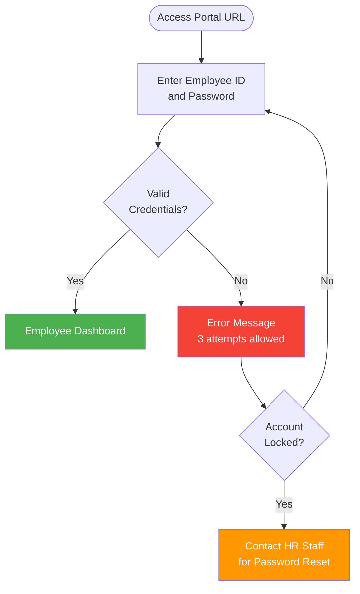
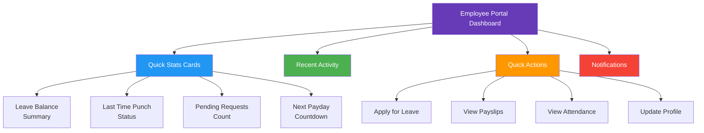
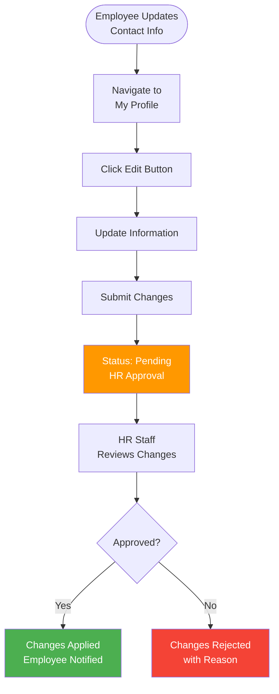
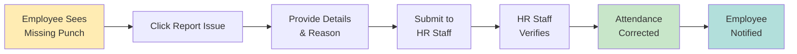
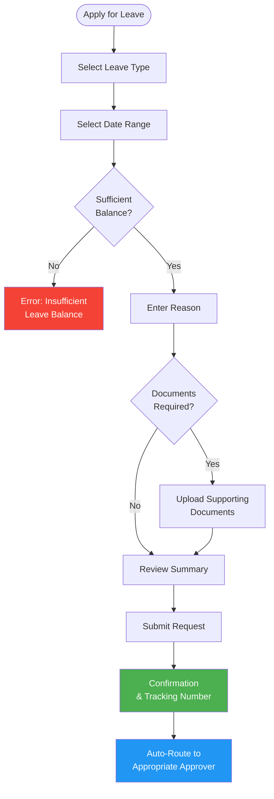

# Employee Portal - Self-Service Guide

## Portal Overview
**Access Type**: On-premise web portal for employee self-service

### Core Features
- 📊 View personal information and employment details
- ⏰ View time logs and attendance records
- 💰 View and download payslips
- 📅 Check leave balances and history
- ✉️ Submit leave requests directly
- 📄 View submitted requests status
- 🔔 Receive notifications and alerts

---

## Portal Access

### Initial Login

**First-Time Access:**
1. Receive welcome email from HR Staff with:
   - Portal URL (internal company network)
   - Temporary username (usually employee ID)
   - Temporary password
   - Activation link
2. Click activation link
3. Login with temporary credentials
4. System prompts password change
5. Create new secure password
6. Complete profile setup

**Password Requirements:**
- Minimum 8 characters
- At least one uppercase letter
- At least one number
- At least one special character
- Cannot reuse last 3 passwords

### Regular Login

**Login URL**: `http://[company-server]/employee-portal`

**Security Features:**
- Session timeout: 30 minutes of inactivity
- Auto-logout after session expires
- Login from company network only (on-premise)
- Failed login tracking (3 attempts = account lock)

---

## Dashboard Overview

### Portal Layout

### Dashboard Sections

**1. Quick Stats (Top Cards)**
- **Leave Balance**: Shows remaining days for each leave type
- **Today's Punch**: Time in, time out, total hours
- **Pending Requests**: Count of leave requests awaiting approval
- **Next Payday**: Countdown to next salary release

**2. Recent Activity (Center)**
- Last 5 transactions/activities
- Leave approvals/rejections
- Payslip releases
- Attendance corrections
- Profile updates

**3. Quick Actions (Right Sidebar)**
- Apply for Leave (button)
- View Payslips (button)
- View Attendance (button)
- View Leave History (button)
- Update Contact Info (button)

**4. Notifications (Bottom)**
- System announcements
- Leave approval/rejection alerts
- Payslip availability notices
- Policy updates
- Birthday greetings

---

## 1. Personal Information

### Purpose
View and update personal details, contact information, and employment records.

### What You Can View

**Personal Details:**
- Full name
- Date of birth
- Gender
- Civil status
- Nationality
- Contact number
- Email address
- Home address

**Employment Information:**
- Employee ID
- Position/Job title
- Department
- Employment status (Regular, Probationary, etc.)
- Hire date
- Regularization date
- Supervisor name
- Work location

**Government IDs:**
- SSS number
- PhilHealth number
- Pag-IBIG number
- TIN (Tax Identification Number)

**Emergency Contact:**
- Contact person name
- Relationship
- Phone number
- Address

### What You Can Update

**Editable Fields (Requires HR Approval):**
- ✏️ Contact number
- ✏️ Email address
- ✏️ Home address
- ✏️ Emergency contact details
- ✏️ Civil status (with supporting documents)

**Non-Editable Fields (Contact HR Staff):**
- ❌ Name (requires legal documents)
- ❌ Date of birth (requires birth certificate)
- ❌ Government IDs (requires official documents)
- ❌ Position/Department (HR-managed)
- ❌ Employment dates (HR-managed)

### Update Process

---

## 2. Time Logs & Attendance

### Purpose
View daily attendance records, time punches, and attendance history.

### Daily Time Log View

**Today's Record:**
- Time In: 08:00 AM
- Time Out: 05:00 PM
- Break Start: 12:00 PM
- Break End: 01:00 PM
- Total Hours Worked: 8 hours
- Status: On Time / Late / Undertime
- Remarks: (if any)

**RFID Punch History:**
- Displays all RFID card taps for the day
- Shows exact timestamp of each tap
- Indicates IN/OUT/BREAK punches
- Highlights missing punches (red alert)

### Attendance Summary

**Weekly View:**
- Calendar showing attendance status
- Color-coded indicators:
  - 🟢 Green: Present, on time
  - 🟡 Yellow: Late arrival
  - 🔵 Blue: On approved leave
  - 🔴 Red: Absent
  - ⚪ Gray: Rest day/Holiday

**Monthly View:**
- Total days present
- Total days absent
- Total days late
- Total hours worked
- Total overtime hours
- Leave days taken

### Filter Options

- Date range selection
- View by: Day, Week, Month, Custom Range
- Export to PDF/Excel

### Common Issues & Resolutions

**Missing Time Punch:**
- Shows alert icon on affected day
- Click to view details
- Option to "Report Issue"
- HR Staff will verify and correct

**Late Arrival:**
- Shows time in vs scheduled time
- Displays late minutes
- Shows deduction (if applicable)
- View late policy details

**Attendance Correction Request:**

---

## 3. Payslips

### Purpose
View, download, and print payslips for current and previous payroll periods.

### Payslip Features

**Available Information:**
- Pay period (e.g., December 1-15, 2025)
- Pay date
- Basic salary
- Allowances breakdown
- Gross pay
- Deductions (SSS, PhilHealth, Pag-IBIG, Tax)
- Other deductions (loans, advances)
- Net pay (take-home salary)
- Year-to-date totals

**Actions Available:**
- 👁️ View payslip details
- 📥 Download as PDF
- 🖨️ Print payslip
- 📧 Email to personal address

### Payslip History

**View Options:**
- Current year payslips
- Previous year payslips (up to 3 years)
- Search by pay period
- Filter by year

**Annual Summary:**
- Total gross income
- Total deductions
- Total net pay
- 13th month pay
- Bonuses received
- Tax withheld

### BIR 2316 (Tax Certificate)

**Annual Tax Document:**
- Available every January-February
- Download previous year's tax certificate
- Required for annual tax filing
- Contains all compensation and tax withheld

**Download Process:**
1. Navigate to Payslips > Tax Certificate
2. Select year
3. Click "Download BIR 2316"
4. PDF automatically downloads
5. Save for tax filing purposes

---

## 4. Leave Management

### Purpose
View leave balances, submit leave requests, and track approval status.

### Leave Balance Dashboard

**Leave Types & Balances:**

| Leave Type | Total Entitled | Used | Pending | Available |
|------------|----------------|------|---------|-----------|
| Vacation Leave | 15 days | 5 days | 2 days | 8 days |
| Sick Leave | 15 days | 3 days | 0 days | 12 days |
| Emergency Leave | 5 days | 1 day | 0 days | 4 days |

**Leave Details:**
- Accrual method (monthly/annual)
- Accrual rate (e.g., 1.25 days/month)
- Carryover policy
- Expiry date (if applicable)
- Conversion to cash option

### Leave Request Submission

**Step-by-Step Process:**

**Form Fields:**
1. **Leave Type**: Dropdown (Vacation, Sick, Emergency, etc.)
2. **Start Date**: Calendar picker
3. **End Date**: Calendar picker
4. **Number of Days**: Auto-calculated
5. **Reason**: Text field (required)
6. **Supporting Documents**: File upload (if applicable)
7. **Contact During Leave**: Optional phone/email

**Document Requirements:**
- **Sick Leave (3+ days)**: Medical certificate
- **Maternity Leave**: OB-GYN certificate
- **Solo Parent Leave**: Solo parent ID
- **Bereavement**: Death certificate
- **Emergency Leave**: Varies by situation

**Submission Rules:**
- Minimum 3 days advance notice (except emergencies)
- Cannot overlap with existing leave
- Cannot exceed available balance
- Must attach required documents
- Maximum 30 days per request (longer requires special approval)

### Leave Request Tracking

**Status Indicators:**
- 🟡 **Pending**: Awaiting approval
- 🟢 **Approved**: Leave granted
- 🔴 **Rejected**: Leave denied (with reason)
- 🔵 **Cancelled**: Employee cancelled request

**Approval Flow:**

| Days Requested | Approver(s) | Typical Response Time |
|----------------|-------------|----------------------|
| 1-2 days | Auto-Approved | Instant (if balance sufficient) |
| 3-5 days | HR Manager | Within 24 hours |
| 6+ days | HR Manager → Office Admin | 2-3 business days |

**Request Details View:**
- Submission date & time
- Current status
- Approver(s) assigned
- Approval/rejection date
- Approver comments
- Tracking number

### Leave History

**Past Requests:**
- View all past leave requests (last 2 years)
- Filter by status (Approved, Rejected, Cancelled)
- Filter by leave type
- Export to PDF/Excel

**Leave Calendar:**
- Visual calendar showing approved leaves
- Company holidays highlighted
- Team leave visibility (optional, if enabled)

### Cancel Leave Request

**Cancellation Rules:**
- Can cancel pending requests (before approval)
- Can request cancellation of approved leave (before leave date)
- Cannot cancel past leave dates
- Cancellation requires HR Staff approval (for approved leaves)

**Cancellation Process:**
1. Navigate to Leave Requests
2. Find pending/approved request
3. Click "Cancel Request"
4. Enter cancellation reason
5. Submit cancellation
6. Receive confirmation

---

## 5. Notifications & Alerts

### Notification Types

**Leave-Related:**
- ✅ Leave request approved
- ❌ Leave request rejected
- ⏳ Leave request pending approval
- 🔔 Leave balance low (< 5 days)
- 📅 Upcoming leave reminder (2 days before)

**Payroll-Related:**
- 💰 Payslip available for download
- 📄 13th month pay released
- 💵 Salary adjustment notification
- 📊 Tax certificate (BIR 2316) available

**Attendance-Related:**
- ⚠️ Missing time punch alert
- ⏰ Late arrival recorded
- 📝 Attendance correction applied
- 🔴 Absent without leave notice

**System Announcements:**
- 🎉 Company events
- 📢 Policy updates
- 🎂 Birthday greetings
- 🏆 Work anniversary congratulations
- 🚨 System maintenance schedules

### Notification Settings

**Preferences:**
- Email notifications (on/off)
- In-portal notifications (always on)
- SMS notifications (future feature)

**Notification History:**
- View all past notifications (last 30 days)
- Mark as read/unread
- Delete notifications
- Filter by type

---

## Common Tasks Guide

### How to Apply for Leave

**Quick Steps:**
1. Login to Employee Portal
2. Click "Apply for Leave" from dashboard
3. Select leave type (Vacation, Sick, etc.)
4. Choose start and end dates
5. Enter reason for leave
6. Upload documents (if required)
7. Review summary
8. Click "Submit Request"
9. Receive confirmation with tracking number
10. Wait for email notification of approval/rejection

**Tips:**
- ✅ Apply at least 3 days in advance
- ✅ Check your leave balance first
- ✅ Attach required documents (medical certificates, etc.)
- ✅ Provide clear reason for leave
- ✅ Double-check dates before submitting

### How to View Payslip

**Quick Steps:**
1. Login to Employee Portal
2. Click "Payslips" from menu
3. Select pay period from list
4. Click "View Details"
5. Review payslip information
6. Click "Download PDF" to save
7. Optionally print payslip

**Payslip Release Schedule:**
- 15th of the month: 1st to 15th pay period
- 30th of the month: 16th to end of month pay period

### How to Check Attendance

**Quick Steps:**
1. Login to Employee Portal
2. Click "Attendance" from menu
3. Select date range (daily, weekly, monthly)
4. View time logs and attendance records
5. Check for any missing punches or issues
6. Report issues to HR Staff if needed

### How to Update Contact Information

**Quick Steps:**
1. Login to Employee Portal
2. Click "My Profile"
3. Click "Edit Profile" button
4. Update contact number, email, or address
5. Click "Save Changes"
6. Submit for HR Staff approval
7. Wait for approval notification
8. Changes reflected after approval

### How to Report Missing Time Punch

**Quick Steps:**
1. Login to Employee Portal
2. Go to "Attendance"
3. Find the day with missing punch
4. Click "Report Issue" icon
5. Provide details (actual time in/out, reason for missing punch)
6. Submit report to HR Staff
7. HR Staff will verify and correct
8. Receive notification when corrected

---

## Troubleshooting

### Login Issues

**Problem: Forgot Password**
- Solution: Click "Forgot Password" on login page
- Enter employee ID
- Click "Send Reset Link"
- Check company email for reset link
- Follow instructions to create new password

**Problem: Account Locked (Too Many Failed Attempts)**
- Solution: Contact HR Staff immediately
- HR Staff will unlock account
- Reset password with HR Staff assistance
- Try logging in again

**Problem: Cannot Access Portal (URL Not Loading)**
- Solution: Verify you are on company network
- Portal is on-premise only (no external access)
- Check with IT if network connection issues
- Contact HR Staff if persistent

### Leave Request Issues

**Problem: "Insufficient Leave Balance" Error**
- Solution: Check your leave balance dashboard
- You may not have enough available days
- Consider applying for unpaid leave (contact HR Staff)
- Check if pending requests are consuming balance

**Problem: Cannot Upload Document**
- Solution: Check file format (PDF only, max 5MB)
- Reduce file size if too large
- Ensure file is not corrupted
- Try different browser if issue persists
- Contact HR Staff for manual submission

**Problem: Leave Request Not Appearing**
- Solution: Check "Pending Requests" section
- Refresh page or logout and login again
- Check submission confirmation email
- Contact HR Staff with tracking number

### Payslip Issues

**Problem: Payslip Not Available on Payday**
- Solution: Wait 1-2 hours after official release time
- Refresh page or logout and login
- Check notification for delayed release notice
- Contact Payroll Officer after 24 hours

**Problem: Incorrect Salary Amount**
- Solution: Review payslip details carefully
- Check deductions (loans, advances, absences)
- Contact Payroll Officer for clarification
- Submit formal inquiry if discrepancy confirmed

### General Portal Issues

**Problem: Slow Loading or Timeouts**
- Solution: Check network connection
- Clear browser cache and cookies
- Try different browser (Chrome, Firefox, Edge)
- Log out and log in again
- Report to IT if persistent

**Problem: Changes Not Saving**
- Solution: Ensure all required fields are filled
- Check for error messages on form
- Try submitting again
- Contact HR Staff if issue continues

---

## Security & Privacy

### Data Protection

**Your Data is Protected:**
- 🔒 Encrypted connections (HTTPS)
- 🔐 Password-protected access
- 👁️ Role-based permissions (you only see your data)
- 📝 Audit logs (all actions tracked)
- 🚫 No data sharing with third parties

**Your Responsibilities:**
- ✅ Keep password confidential
- ✅ Logout when finished
- ✅ Do not share credentials with anyone
- ✅ Report suspicious activity immediately
- ✅ Use only company-provided devices (on-premise)

### Privacy Policy

**What You Can Access:**
- ✅ Your personal information
- ✅ Your attendance records
- ✅ Your payslips and compensation
- ✅ Your leave balances and history
- ✅ Your submitted requests

**What You Cannot Access:**
- ❌ Other employees' personal data
- ❌ Other employees' salaries
- ❌ Company financial information
- ❌ HR administrative functions
- ❌ Payroll processing details

### Session Security

**Auto-Logout:**
- Inactive for 30 minutes → auto-logout
- Browser close → session terminated
- Logout button → immediate session end

**Security Alerts:**
- Multiple failed login attempts → account locked
- Unusual login time/location → HR Staff notified
- Password change → email confirmation sent

## Immutable Ledger & Replay Monitoring

- Attendance/timekeeping data visible in the Employee Portal originates from the PostgreSQL ledger (`rfid_ledger`) managed by the Replayable Event-Log Verification Layer.
- Employees viewing discrepancies should report them to HR Staff, who will validate against the replay layer's alerting/metrics (ledger commit latency, sequence gaps, hash mismatches, replay backlog) before correcting records.

---

## Support & Assistance

### Contact Information

**For Portal Access Issues:**
- Contact: HR Staff
- Email: hr@company.com
- Phone: (123) 456-7890 ext. 101
- Office Hours: 8:00 AM - 5:00 PM, Mon-Fri

**For Leave Request Questions:**
- Contact: HR Manager
- Email: hrmanager@company.com
- Phone: (123) 456-7890 ext. 102

**For Payroll & Payslip Issues:**
- Contact: Payroll Officer
- Email: payroll@company.com
- Phone: (123) 456-7890 ext. 103

**For Technical/IT Issues:**
- Contact: IT Support
- Email: itsupport@company.com
- Phone: (123) 456-7890 ext. 104

### Frequently Asked Questions (FAQ)

**Q: When will my portal account be activated?**
A: Within 1-2 business days after your first day of work. HR Staff will send you activation email.

**Q: Can I access the portal from home?**
A: No, the portal is on-premise only. You must be connected to company network.

**Q: How often is my leave balance updated?**
A: Leave balances update in real-time when leaves are approved or accruals are added.

**Q: Can I download all my payslips at once?**
A: Currently, you must download payslips individually. Annual summary available end of year.

**Q: What if I disagree with my performance appraisal?**
A: Contact your supervisor or HR Manager to discuss and request review meeting.

**Q: Can I view my teammates' leave schedules?**
A: This feature is configurable by company policy. Check with HR Manager.

**Q: How do I change my bank account for salary deposit (future)?**
A: Update via portal > Profile > Payment Details, subject to HR Staff verification.

**Q: What happens to unused leave at year end?**
A: Refer to company leave policy. Typically, limited carryover or cash conversion available.

---

## Related Documentation
- [System Overview](./00-system-overview.md)
- [HR Staff Workflow](./04-hr-staff-workflow.md) - For assistance escalation
- [HR Manager Workflow](./03-hr-manager-workflow.md) - For leave approval process
- [Leave Request Approval Process](./processes/leave-request-approval.md)

---

**Last Updated**: December 3, 2025  
**Portal Version**: 1.0  
**Access Type**: On-Premise Web Portal  
**Support**: HR Department
