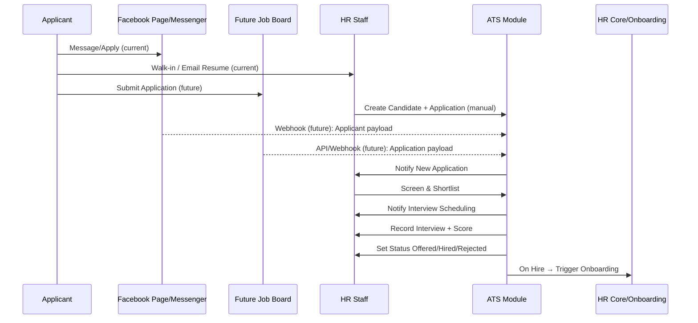

# ATS Integration Guide (Facebook, Manual, Future Job Board)

## Overview
How candidate applications enter the system and flow through the ATS, including current manual sources (Facebook, walk-ins) and future automated sources (Messenger bot, public job board website).

---

## Data Flow

---

## Current State (Manual-First)
- Facebook job posts created manually by HR Staff
- Applicants message/comment; HR contacts and gathers resumes
- Walk-ins apply in person; HR encodes details
- HR Staff creates Candidate and Application in ATS via UI

---

## Future State (Automated)

### Facebook Graph API + Messenger Bot
- One-click publish job posts from ATS to Facebook Page
- Messenger bot collects applicant details (name, contact, resume upload)
- Messenger webhook posts payload to ATS endpoint
- ATS creates Candidate + Application automatically

### Public Job Board Website
- HR-managed job postings automatically visible on public website
- Applicants submit forms with resume upload
- Webhook/API posts payload to ATS
- ATS creates Candidate + Application automatically

---

## Webhooks & Endpoints (Proposed)
- `POST /webhooks/ats/facebook` — Messenger payload (verify signature)
- `POST /webhooks/ats/job-board` — Job board application payload

Payload fields (minimal): name, email, phone, job_id, resume_url, source

Security:
- Verify signatures (X-Hub-Signature for Meta)
- HMAC with shared secret for job board
- Rate limiting and IP allowlist (on-prem firewall)

---

## Statuses & Transitions
- New → Screening → Shortlisted → Interview Scheduled → Interviewed → Offered → Hired/Rejected/Withdrawn
- On Hired → Emit onboarding trigger to HRIS (employee creation workflow)

---

## Roles
- HR Staff: Posting, intake, screening, scheduling, offers
- HR Manager: Approvals for posting (optional), hiring decisions
- Office Admin: Final approval for offers (non-standard packages)

---

## Related Documentation
- [ATS Module](../../ATS_MODULE.md)
- [Hiring & Interview Process](../processes/hiring-interview-process.md)
- [Employee Onboarding](../processes/employee-onboarding.md)

---

**Last Updated**: November 29, 2025  
**Owner**: HR Department
