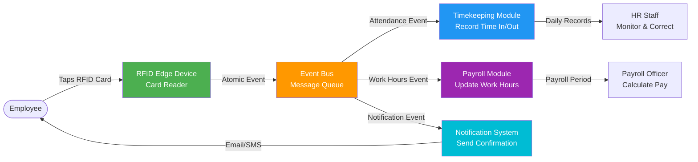
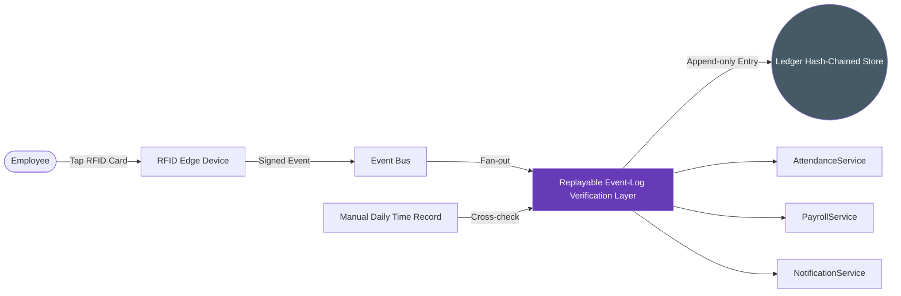
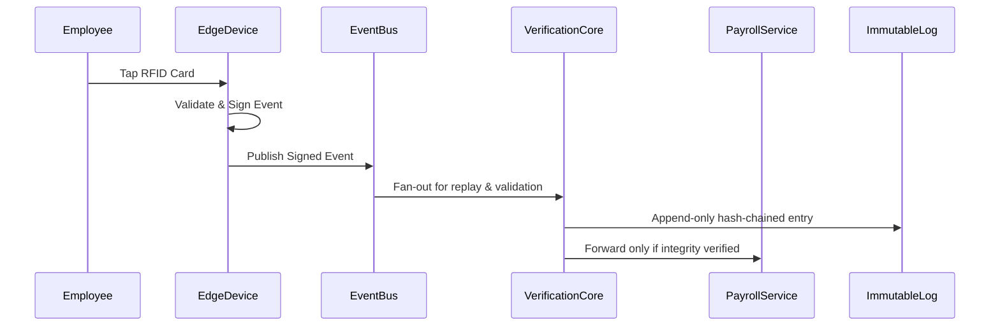

# RFID Replayable Event-Log Verification Layer (Patent-Oriented Proposal)

> This document is the proposal companion to `rfid-integration.md`. It mirrors diagrams, flows, and checklists from the integration guide, but focuses on tamper-resistant, replayable ledger mechanisms with deterministic reconciliation and automated business workflow gating, highlighting potentially patentable innovations.


---

## Purpose

Create a **tamper-resistant, cryptographically verifiable event ledger** that:

1. Sequences, hashes, and stores every RFID event in an append-only PostgreSQL ledger.
2. Enables deterministic replay of past events for MDTR reconciliation and labor audits.
3. Integrates **ledger integrity enforcement with business workflow gating**, ensuring payroll actions cannot proceed on inconsistent or tampered data.

> The novelty lies not in using an event bus or logging events, but in the **ledger-backed replay orchestration** combined with **automatic integrity-driven workflow gating**.

---

## Key Patent-Oriented Innovations

| Innovation | Description | Potential Novelty |
|------------|-------------|-------------------|
| **Tamper-evident Replay Ledger** | Each event receives a sequential ID, cryptographic hash, and optional Ed25519 signature with chained hashes (`curr_hash = hash(prev_hash \|\| payload)`). | Coupling a local hash-chained ledger with **live payroll gating and MDTR reconciliation** is atypical inside HRIS products. |
| **Deterministic Replay Orchestration** | Ledger rows stream in order, handling duplicate events, offline device catch-up, and MDTR cross-verification. | A **deterministic replay engine** that simultaneously enforces integrity and resolves inconsistencies automatically is non-trivial. |
| **Workflow Gating on Ledger Health** | Payroll approvals halt when health metrics show gaps, hash failures, or backlog delays. | Directly binding **ledger health telemetry** to business workflow enforcement creates a defensible, automated control plane. |
| **Audit Snapshot Automation** | Daily hash snapshots exported to on-prem WORM/object-lock storage (MinIO Object Lock, NetApp SnapLock, Dell ECS). | Automating immutable snapshots tied to ledger state strengthens legal defensibility beyond generic backups. |
| **MDTR Cross-Check Engine** | Manual records reconcile against the cryptographic ledger with deterministic, repeatable jobs. | Applying tamper-evident verification to merge manual and electronic logs offers a novel HR compliance workflow. |

---


## System Architecture 
### from `rfid-integration.md`



---

## High-Level Architecture (Patent Focus)



**Focus:**

- `VerificationCore` enforces hash-chain validation, sequence ordering, MDTR reconciliation, and **automated downstream gating**.
- `ImmutableLog` remains append-only and tamper-evident, forming the **core inventive data structure**.

---

## Replay Layer Operations (Patent Focus)

1. **Ledger Schema (Append-Only)**

  ```sql
  CREATE TABLE rfid_events_ledger (
    sequence_id BIGINT PRIMARY KEY,
    event_id UUID,
    payload JSONB,
    prev_hash BYTEA,
    curr_hash BYTEA,
    device_signature BYTEA,
    created_at TIMESTAMPTZ
  );
  ```

2. **Hashing & Signatures**

  - Uses `pgcrypto.digest(prev_hash || payload, 'sha256')` to extend the chain.
  - Optional Ed25519 device signatures prove origin when auditors require end-to-end authenticity.

3. **Deterministic Replay Engine**

  - Streams ledger rows in order and feeds timekeeping, payroll, and notification subscribers **only after integrity checks pass**.
  - Handles duplicates, offline device catch-up, and MDTR cross-verification with deterministic jobs.
  - Automatically blocks payroll approvals if:
    - Hash mismatches or sequence gaps surface.
    - Ledger commit latency exceeds 3 seconds for more than 5 minutes.
    - Replay backlog spans beyond two payroll periods.

4. **Automated Checkpointing**

  - Daily ledger snapshots exported to an on-prem WORM/object-lock target (e.g., MinIO Object Lock, NetApp SnapLock, Dell ECS) for immutable legal evidence.

---

## Event Flow (Patent Focus)



**Key point:** downstream modules receive **only cryptographically validated events**, enforced automatically.

---

## Why This Could Be Patentable

1. Combining a cryptographic replay ledger with **automatic business workflow gating** is not standard practice.
2. Deterministic MDTR reconciliation atop a tamper-evident ledger introduces a non-obvious compliance workflow.
3. Automated anomaly detection that halts payroll actions provides a concrete technical safeguard beyond generic logging.
4. Immutable checkpoints plus replay orchestration deliver a verifiable, enforceable audit mechanism suitable for labor disputes.

---

**Related Documentation**
- [RFID Timekeeping Integration](./../rfid-integration.md)
- [Timekeeping Module Architecture](../../TIMEKEEPING_MODULE_ARCHITECTURE.md)
- [Payroll Module Architecture](../../PAYROLL_MODULE_ARCHITECTURE.md)
