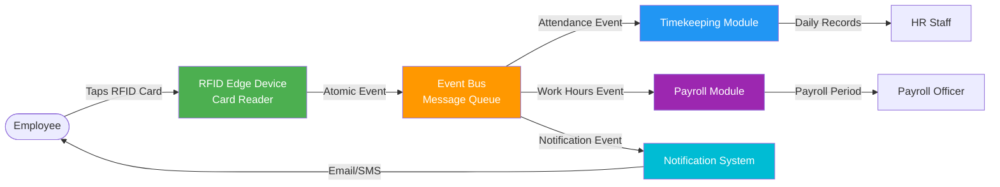
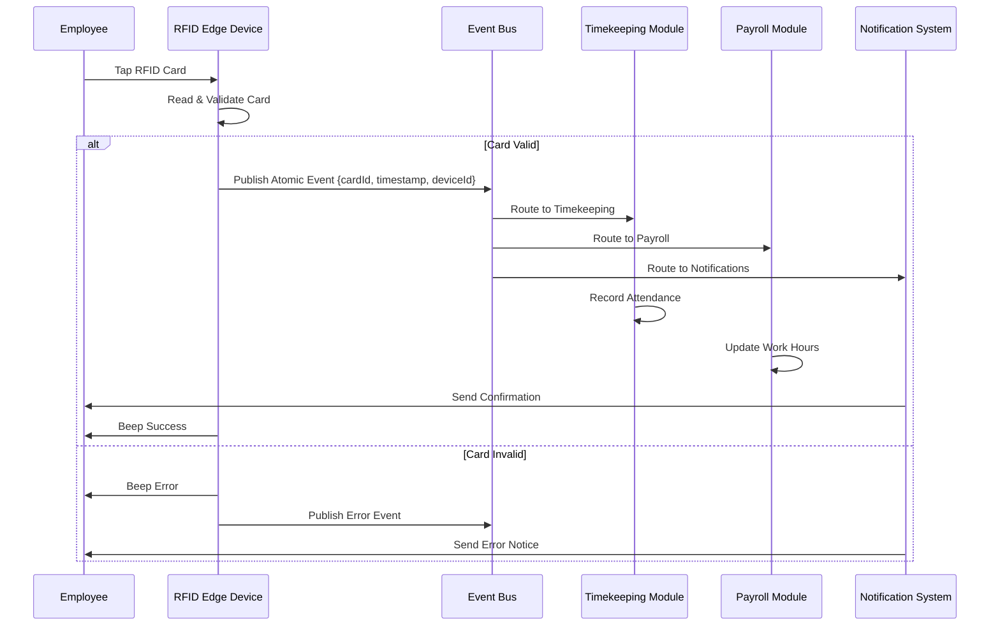

# RFID Replayable Event-Log Verification Layer (Proposed)

> This document is the proposal companion to `rfid-integration.md`. It mirrors every diagram, flow, and checklist from the integration guide, but frames them around the tamper-resistant replay layer that is currently under evaluation as a patentable enhancement.

---

## Purpose
Create a tamper-resistant verification layer that sequences, hashes, and stores every RFID event in an append-only PostgreSQL ledger (`rfid_ledger`) before downstream modules consume them. This lets payroll and investigations deterministically replay past taps, reconcile Manual Daily Time Records (MDTR), and prove data integrity during audits.

## High-Level Architecture

**Architecture Pattern**: Event-Driven Architecture (Event Bus Pattern)



### Replayable Event-Log Extension

```mermaid
graph LR
  Employee([Employee]) -->|Tap| Edge
  Edge -->|Signed Event| EventBus
  EventBus -->|Fan-out| VerificationCore[Replayable Event-Log<br/>Verification Layer]
  VerificationCore -->|Append-only Entry| ImmutableLog[(PostgreSQL Ledger<br/>Hash-Chained Store)]
  VerificationCore --> AttendanceService
  VerificationCore --> PayrollService
  VerificationCore --> NotificationService
  MDTR[Manual Daily Time Record<br/>(Paper Submission)] -->|Cross-check| VerificationCore
  style VerificationCore fill:#673ab7,color:#fff
  style ImmutableLog fill:#455a64,color:#fff
```

Key capabilities:
- Assigns sequential IDs and cryptographic hashes to every RFID event.
- Persists events to an append-only PostgreSQL ledger enforced by row-level security.
- Cross-checks MDTR submissions and supports deterministic replay for investigations.
- Emits observability metrics so downstream payroll approvals halt when integrity issues are detected.

---

## Event Flow



---

## Atomic Event Summary

- Event schema:
  ```json
  {
    "eventId": "uuid-v4",
    "eventType": "rfid.card.tap",
    "timestamp": "2025-11-29T08:00:00.000Z",
    "deviceId": "edge-device-001",
    "cardId": "1234567890",
    "employeeId": "EMP-001",
    "tapType": "time_in"
  }
  ```
- Event types: `rfid.card.tap`, `rfid.card.invalid`, `rfid.device.offline`, `rfid.device.online`, `rfid.card.duplicate`.

---

## Module Touchpoints

- **Timekeeping Module**: Consumes `rfid.card.tap`, handles duplicate/edge cases.
- **Payroll Module**: Derives hours (regular, OT, late, undertime) from the ledger-backed stream.
- **Notification System**: Sends confirmations, invalid alerts, and device offline escalation.

---

## Device & Bus Configuration (Proposal inherits production setup)

- Edge devices: PoE-powered RFID readers with offline cache (1,000 events) and configurable retries.
- Event bus: Redis Pub/Sub or RabbitMQ topics (`rfid.events.timekeeping`, etc.) retaining 7 days for quick replays.
- Publish API mirrors current deployment to avoid firmware changes; the proposal injects the verification layer immediately after the bus fan-out.

---

## Replay Layer Operations

### Ledger Schema (Append-Only)

- `rfid_events_ledger(sequence_id BIGINT PK, event_id UUID, payload JSONB, prev_hash BYTEA, curr_hash BYTEA, device_signature BYTEA, created_at TIMESTAMPTZ)`
- `replay_jobs(job_id UUID, mdtr_reference TEXT, replay_from BIGINT, replay_to BIGINT, discrepancy JSONB, state TEXT, created_at TIMESTAMPTZ)`

### Hashing & Signatures
- Uses `pgcrypto.digest(prev_hash || payload, 'sha256')` to create a tamper-evident chain.
- Optional Ed25519 signatures from edge devices prove message origin.

### Replay Engine
- Deterministic scanner streams ledger rows to downstream modules for investigations or MDTR reconciliation.
- Payroll approvals block automatically when:
  - Ledger commit latency exceeds 3s for >5 minutes.
  - Sequence gaps or hash mismatches are detected.
  - Replay backlog extends beyond two payroll periods.

### Audit Evidence
- Daily checksum snapshots exported to an on-prem WORM/object-lock target (e.g., MinIO Object Lock, NetApp SnapLock, Dell ECS) for legal defensibility.

---

## Monitoring & Alerts

| Layer | Metrics | Alert Threshold |
|-------|---------|-----------------|
| Device Health | publish success, cache usage, battery | failure >10%, cache >80%, battery <20% |
| Event Bus | throughput, latency, subscriber health | latency >5s, subscriber offline, failed deliveries >5% |
| Replay Layer | ledger commit latency, sequence gaps, hash mismatches, replay backlog, checksum export | latency >3s for 5 min, any gap/hash error, backlog >2 payrolls, checksum export failure |

---

## Troubleshooting Snapshot

- Card not reading → test on another device, replace card, or restart reader.
- Duplicate taps → automatically ignored if within 60 seconds.
- Offline devices → cached events replayed once online; verification layer preserves order via sequence IDs.
- Wrong employee tagged → reconcile via replay job referencing MDTR paperwork.

---

## Integration Checklist (Proposal Scope)

1. Hardware & software setup identical to production RFID integration.
2. HRIS modules subscribe to the ledger-backed stream for deterministic state.
3. Replay metrics wired into SigNoz/Grafana so operational teams can gate payroll actions.
4. Training updated to include MDTR replay procedures and patent-related handling.

---

## Novelty (Patent Candidate)

- Embeds a cryptographic ledger inside an HRIS timekeeping pipeline without relying on third-party blockchain services.
- Couples ledger health telemetry directly to payroll approval workflows, ensuring payouts never proceed on questionable data.
- Introduces replay job orchestration tailored for MDTR audits and labor disputes, drastically reducing investigation timelines.

---

## Next Steps

1. Prototype ledger schema & service; validate throughput (>25 events/sec) and hash-chain performance.
2. Instrument metrics to SigNoz (or Prometheus/Grafana) with the thresholds outlined above.
3. Draft MDTR reconciliation workflows that launch replay jobs and surface discrepancies to HR/Payroll dashboards.
4. Complete legal/patent narrative referencing this module once feasibility tests pass.

---

**Related Documentation**
- [RFID Timekeeping Integration](./rfid-integration.md) — production reference.
- [Timekeeping Module Architecture](../../TIMEKEEPING_MODULE_ARCHITECTURE.md)
- [Payroll Module Architecture](../../PAYROLL_MODULE_ARCHITECTURE.md)
