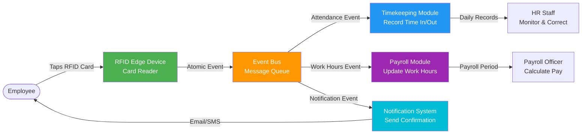
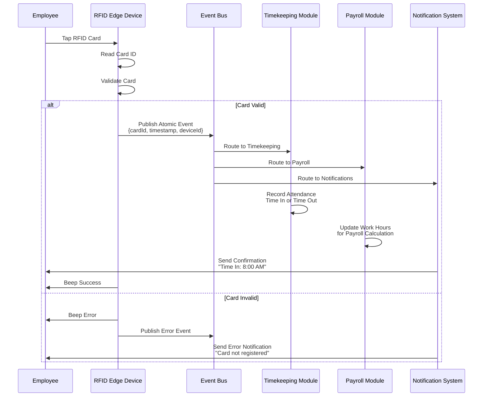
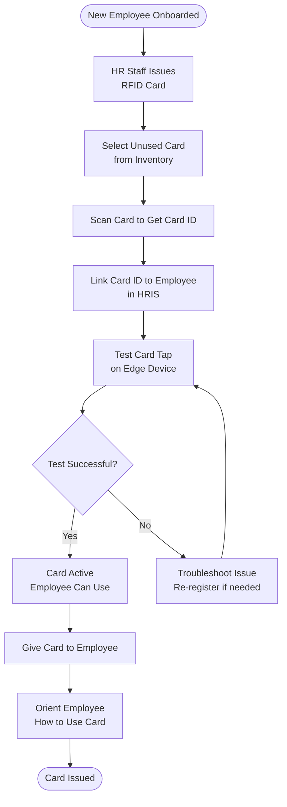

# RFID Timekeeping Integration

## Overview
The RFID integration enables automated employee attendance tracking through card taps on edge devices, with events routed through an event bus to multiple modules.

### [Patentable Proposal: RFID Replayable Event-Log Verification Layer](./patentable-proposal/rfid-replayable-event-log-proposal.md)


**Architecture Pattern**: Event-Driven Architecture (Event Bus Pattern)

---

## System Architecture



---

## Event Flow

### 1. Card Tap Event



---

## Atomic Event Structure

### Event Schema

```json
{
  "eventId": "uuid-v4",
  "eventType": "rfid.card.tap",
  "timestamp": "2025-11-29T08:00:00.000Z",
  "deviceId": "edge-device-001",
  "deviceLocation": "Main Entrance",
  "cardId": "1234567890",
  "employeeId": "EMP-001",
  "tapType": "time_in",
  "metadata": {
    "signalStrength": "strong",
    "deviceStatus": "online",
    "batteryLevel": 95
  }
}
```

### Event Types
- `rfid.card.tap` - Successful card tap
- `rfid.card.invalid` - Invalid or unregistered card
- `rfid.device.offline` - Edge device offline
- `rfid.device.online` - Edge device back online
- `rfid.card.duplicate` - Duplicate tap within 1 minute (ignored)

---

## Module Subscriptions

### Timekeeping Module

**Subscribes to**: `rfid.card.tap`

**Processing Logic:**
1. Receive event from event bus
2. Lookup employee by cardId
3. Check if employee already has time-in today
4. If no time-in → Record as **Time In**
5. If has time-in → Record as **Time Out**
6. If has time-out and taps again → Record as **Time In (Overtime)**
7. Store in database with timestamp
8. Publish confirmation event

**Edge Cases:**
- **Duplicate Tap**: Ignore if within 1 minute of previous tap
- **Multiple Time-Outs**: Only last time-out counts
- **Forgot to Tap Out**: HR Staff can create manual entry next day

---

### Payroll Module

**Subscribes to**: `rfid.card.tap`

**Processing Logic:**
1. Receive event from event bus
2. Calculate work hours based on time-in and time-out
3. Apply business rules:
   - Regular hours (8 hours/day)
   - Overtime (beyond 8 hours)
   - Late arrival (after 8:15 AM with 15-min grace)
   - Undertime (left before 5:00 PM)
4. Store in payroll calculation cache
5. Used during payroll period processing

**Calculations:**
```
Regular Hours = min(8, Time Out - Time In)
Overtime Hours = max(0, (Time Out - Time In) - 8)
Late Minutes = max(0, Time In - 8:15 AM)
Undertime Minutes = max(0, 5:00 PM - Time Out)
```

---

### Notification System

**Subscribes to**: `rfid.card.tap`, `rfid.card.invalid`, `rfid.device.offline`

**Processing Logic:**

**For `rfid.card.tap`:**
1. Receive successful tap event
2. Lookup employee email/phone
3. Send confirmation notification:
   - Email: "Time In recorded at 8:00 AM"
   - SMS (future): "Time In: 8:00 AM"
4. Log notification sent

**For `rfid.card.invalid`:**
1. Receive invalid card event
2. Send error notification (if employee identified)
3. Alert HR Staff of invalid card attempt

**For `rfid.device.offline`:**
1. Receive device offline event
2. Alert Superadmin and HR Manager
3. Send critical notification (device needs attention)

---

## Edge Device Configuration

### Hardware Specifications
- **Type**: RFID card reader (125 kHz or 13.56 MHz)
- **Interface**: Ethernet or Wi-Fi
- **Power**: PoE (Power over Ethernet) or AC adapter
- **Storage**: Local cache for offline mode
- **LED Indicators**: Status, success, error
- **Audio**: Beep for feedback

### Software Configuration

**Device Settings:**
```yaml
device:
  id: "edge-device-001"
  location: "Main Entrance"
  timezone: "Asia/Manila"
  network:
    type: "ethernet"
    ip: "192.168.1.100"
    gateway: "192.168.1.1"
    dns: "8.8.8.8"
  event_bus:
    url: "http://company-server:3000/api/event-bus"
    auth_token: "secure-token-here"
    retry_attempts: 3
    retry_delay: 5000
  offline_cache:
    enabled: true
    max_events: 1000
    sync_interval: 60000
```

**Card Reader Settings:**
```yaml
reader:
  frequency: 125  # kHz
  read_range: 10  # cm
  read_timeout: 3000  # ms
  duplicate_threshold: 60000  # ms (1 minute)
  validation:
    enabled: true
    card_format: "numeric"
    card_length: 10
```

---

## Event Bus Configuration

### Message Queue Setup

**Technology**: Redis Pub/Sub or RabbitMQ

**Topics:**
- `rfid.events.timekeeping`
- `rfid.events.payroll`
- `rfid.events.notifications`

**Publisher**: RFID Edge Device
**Subscribers**: Timekeeping Module, Payroll Module, Notification System

**Message Retention**: 7 days (for replay/debugging)

### Event Bus API

**Publish Event:**
```http
POST /api/event-bus/publish
Authorization: Bearer {device-token}
Content-Type: application/json

{
  "topic": "rfid.events.timekeeping",
  "event": {
    "eventId": "uuid",
    "eventType": "rfid.card.tap",
    "timestamp": "2025-11-29T08:00:00.000Z",
    "deviceId": "edge-device-001",
    "cardId": "1234567890",
    "employeeId": "EMP-001",
    "tapType": "time_in"
  }
}
```

**Response:**
```json
{
  "success": true,
  "eventId": "uuid",
  "publishedAt": "2025-11-29T08:00:00.123Z",
  "subscribersNotified": 3
}
```

---

## Card Registration Process

### Issuing RFID Cards



**Steps:**
1. HR Staff navigates to Employee Management
2. Select employee record
3. Click "Issue RFID Card"
4. Scan card on edge device (or enter Card ID manually)
5. System links Card ID to Employee ID
6. Test card tap (should show "Time In" notification)
7. If successful, hand card to employee
8. Provide orientation on proper card usage

---

## Offline Mode & Sync

### Offline Caching

**When Edge Device Loses Network:**
1. Device detects network failure
2. Switches to offline mode
3. Caches card taps locally (up to 1,000 events)
4. Continues to read cards and provide feedback
5. LED shows "offline" status (yellow/orange)

**When Network Restored:**
1. Device detects network connection
2. Publishes all cached events to event bus
3. Event bus processes events in chronological order
4. Modules update records retroactively
5. Device clears cache after successful sync
6. LED shows "online" status (green)

### Conflict Resolution

**If employee tapped card while device offline:**
- System accepts offline taps as valid
- Backdates attendance records to actual tap time
- Payroll calculations adjusted retroactively (if not yet processed)
- HR Staff notified of backdated entries for review

---

## Security & Access Control

### Card Authentication
- Each RFID card has unique ID
- Card ID must be registered in system (linked to employee)
- Unregistered cards rejected with error beep
- Lost/stolen cards can be deactivated immediately

### Device Authentication
- Edge devices authenticate with event bus using secure tokens
- Tokens rotated quarterly
- Invalid tokens rejected by event bus
- Device logs all authentication attempts

### Data Encryption
- Event data encrypted in transit (HTTPS/TLS)
- Card IDs hashed in logs (for privacy)
- Employee PII not transmitted in events (only IDs)

---

## Monitoring & Alerts

### Device Health Monitoring

**Monitored Metrics:**
- Device online/offline status
- Network connectivity
- Event publish success rate
- Card read success rate
- Battery level (if battery-powered)
- Local cache usage

**Alerts Triggered:**
- Device offline for > 5 minutes → Alert Superadmin
- Event publish failure > 10% → Alert Superadmin
- Cache > 80% full → Alert HR Manager (device may lose sync)
- Battery < 20% → Alert Superadmin

### Event Processing Monitoring

**Monitored Metrics:**
- Event bus throughput (events/second)
- Event processing latency
- Failed event deliveries
- Subscriber health

**Alerts Triggered:**
- Event latency > 5 seconds → Alert Superadmin
- Subscriber offline → Alert Superadmin
- Failed event delivery > 5% → Alert Superadmin

---

## Troubleshooting

### Common Issues

**Issue: Card not reading**
- **Cause**: Card damaged, reader malfunction, card not registered
- **Solution**: 
  1. Test card on another device
  2. If card faulty, issue replacement card
  3. If reader issue, restart device or contact Superadmin

**Issue: Duplicate time-in records**
- **Cause**: Employee tapped twice within short time
- **Solution**: System automatically ignores taps within 1 minute

**Issue: Missing time-out**
- **Cause**: Employee forgot to tap out
- **Solution**: HR Staff creates manual time-out entry next day

**Issue: Device offline during shift**
- **Cause**: Network outage, device power loss
- **Solution**: 
  1. Superadmin checks device and network
  2. Device syncs cached events when back online
  3. HR Staff verifies backdated entries

**Issue: Wrong employee tagged**
- **Cause**: Employee used another employee's card
- **Solution**: 
  1. HR Manager investigates
  2. Corrects attendance record
  3. Disciplinary action per company policy

---

## Integration Setup Checklist

**Hardware Setup:**
- ✅ Install RFID edge devices at entry/exit points
- ✅ Connect devices to company network (Ethernet/Wi-Fi)
- ✅ Test network connectivity from devices
- ✅ Mount devices at accessible height

**Software Setup:**
- ✅ Configure event bus (Redis/RabbitMQ)
- ✅ Setup event topics and subscriptions
- ✅ Configure device authentication tokens
- ✅ Deploy edge device firmware
- ✅ Configure device settings (IP, gateway, event bus URL)

**HRIS Integration:**
- ✅ Timekeeping module subscribes to RFID events
- ✅ Payroll module subscribes to RFID events
- ✅ Notification system subscribes to RFID events
- ✅ Test event flow end-to-end

**Card Registration:**
- ✅ Order RFID cards (125 kHz or 13.56 MHz)
- ✅ Create card inventory in HRIS
- ✅ Assign cards to employees
- ✅ Test each card on edge devices

**Testing:**
- ✅ Test time-in event flow
- ✅ Test time-out event flow
- ✅ Test offline mode and sync
- ✅ Test invalid card handling
- ✅ Test duplicate tap handling
- ✅ Test device offline alerts

**Training:**
- ✅ Train HR Staff on card issuance process
- ✅ Train employees on proper card usage
- ✅ Train Superadmin on device troubleshooting
- ✅ Document all procedures

---

## Related Documentation
- [Timekeeping Module Architecture](../../TIMEKEEPING_MODULE_ARCHITECTURE.md)
- [Payroll Module Architecture](../../PAYROLL_MODULE_ARCHITECTURE.md)
- [System Overview](../00-system-overview.md)
- [HR Staff Workflow](../04-hr-staff-workflow.md) - Timekeeping monitoring

---

**Last Updated**: November 29, 2025  
**Integration Owner**: Superadmin  
**Technology**: RFID (125 kHz or 13.56 MHz) + Event Bus (Redis Pub/Sub or RabbitMQ)


