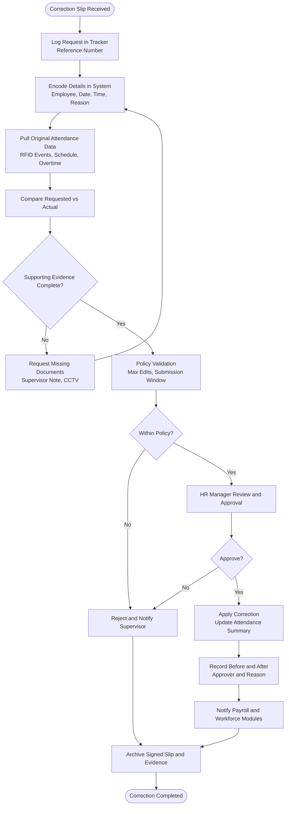

# Attendance Corrections Process

## Overview
Procedure for receiving paper-based attendance corrections (missed RFID taps, wrong shift logs), validating against workforce schedules, updating timekeeping records, and ensuring payroll reflects accurate hours.

**Participants**: Employee/Supervisor (paper correction slip) → HR Staff (encoder) → HR Manager (approver) → Payroll Officer (consumer)

**Sources**: RFID event bus, manual correction slips, supervisor logs.

---

## Complete Correction Flow

---

## Correction Types
- **Missed Time-in/Time-out**: employee forgot to tap (requires supervisor confirmation)
- **Wrong Shift Assignment**: schedule swap not encoded ahead of time
- **Overtime Adjustment**: actual OT different from planned
- **Leave / On-duty Mis-tag**: leave filed but employee actually worked or vice versa

---

## Validation Rules
- Submission window: within 3 working days from incident (configurable)
- Required artifacts:
  - Signed correction slip (employee + supervisor)
  - CCTV or security log (if applicable)
  - Manufacturing supervisor logbook entry
- Maximum corrections per employee per month (configurable, default 3)
- Automatic red flag if employee repeatedly misses taps (>5/month)

---

## System Updates
1. Update `attendance_events` (mark original event corrected, store original timestamp)
2. Recalculate `daily_attendance_summary` (hours, late/undertime flags)
3. Sync with `shift_assignments` if shift change required
4. If OT impacted, update `overtime_requests` actual hours
5. Push change notification to Payroll period adjustments list

---

## Roles & Responsibilities
- **HR Staff**: intake, encoding, evidence gathering, communication with supervisors
- **HR Manager**: approve/deny corrections, enforce policy limits, escalate suspicious patterns
- **Payroll Officer**: review correction impact before payroll calculation
- **Office Admin**: configure correction policy (limits, windows)

---

## KPIs & Monitoring
- Average processing time: < 2 business days
- Rejected corrections: < 5% (aim for proper education)
- Repeat offenders flagged: 100% tracked
- Difference between corrected vs original hours audited monthly

---

## Common Issues & Mitigations
- **No evidence** → request CCTV or supervisor affidavit; if none, reject
- **Late submission** → escalate to HR Manager for exemption approval
- **Multiple corrections same day** → verify with security logs; possible discipline
- **Payroll already processed** → apply adjustment in next cut-off; release memo to employee

---

## Related Documentation
- [Timekeeping Module Architecture](../../TIMEKEEPING_MODULE_ARCHITECTURE.md)
- [Workforce Scheduling Process](./workforce-scheduling.md)
- [Overtime Approval Process](./overtime-approval.md)
- [Payroll Processing Workflow](./payroll-processing.md)
- [HR Staff Workflow](../04-hr-staff-workflow.md#timekeeping)

---

**Last Updated**: November 29, 2025  
**Process Owner**: HR Department  
**Submission Window**: 3 working days (configurable)

