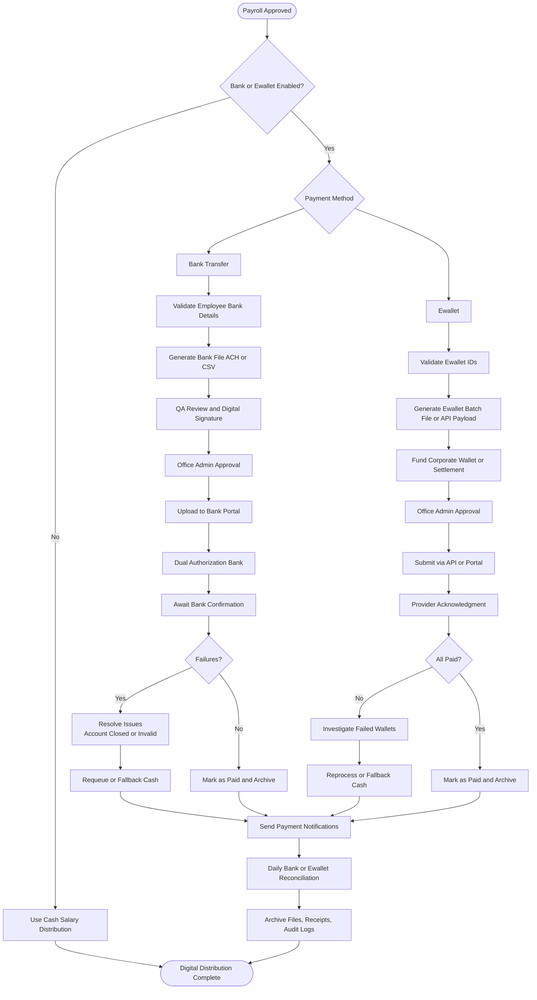

# Digital Salary Distribution Process (Bank Transfer & E-wallet)

## Overview
Future-ready workflow for non-cash salary disbursement once Office Admin enables digital payment methods. Covers bank ACH/file uploads and e-wallet bulk payouts while keeping cash as fallback.

**Participants**: Office Admin (config + approvals), Payroll Officer (owner), HR Manager (review), Accounting (fund availability), Bank/E-wallet provider.

**Prerequisites**: Office Admin enables payment method in System Configuration (bank accounts, partner credentials, approval matrix). Employees must have validated bank or e-wallet details on file.

---

## End-to-End Flow

---

## Phase Details

### 1. Configuration (Office Admin)
- Enable payment method (bank, e-wallet, or both).
- Register corporate settlement account / wallet with provider.
- Define approval matrix (e.g., Payroll Officer prepares, HR Manager reviews, Office Admin approves, Accounting releases funds).
- Upload bank templates (CSV layout, ACH spec) and API credentials.
- Set validation rules (required fields, account number formats, duplicate detection).

### 2. Employee Enrollment (HR Staff)
- Capture bank account or e-wallet ID from employee onboarding form.
- Verify supporting documents (voided check, ID screenshot).
- Store in employee profile with `status = verified` and audit log.
- Enable fallback preference (cash backup) per employee.

### 3. Batch Preparation (Payroll Officer)
- After payroll approval, filter employees by payment method.
- For banks: generate file (CSV, XML, NACHA-like) containing account details, amounts, references.
- For e-wallets: call internal service to build batch payload with wallet IDs, amounts, and metadata.
- Hash/sign files for tamper detection; store in secure folder.

### 4. Validation & Approval
- Automated checks:
  - Duplicate account numbers
  - Negative/zero net pay
  - Employees missing bank/wallet data
  - Limits per provider (daily amount cap)
- HR Manager reviews exception list.
- Office Admin approves release via digital signature or portal login.

### 5. Submission & Funding
- **Bank**: Upload file to portal, confirm totals, route to dual authorizers (Office Admin + Accounting).
- **E-wallet**: Fund corporate wallet (if needed), then execute payout via API/portal.
- Capture transaction reference numbers, timestamps, and statuses.

### 6. Monitoring & Reconciliation
- Track statuses (pending, accepted, failed) via provider portal or webhook.
- Update payroll payment tracker in system, marking each employee’s payment status.
- Perform bank statement reconciliation (matching debit amount to payroll total) within 1 business day.
- Generate exception report for failures; attempt reprocessing or convert to cash payout.

### 7. Archival
- Store bank/e-wallet files, approvals, and confirmation receipts in secure document storage (linked to payroll period).
- Maintain audit log referencing user IDs, timestamps, IP addresses for file uploads and approvals.

---

## Failure Handling
- **Invalid account / closed wallet**: mark as failed, notify employee, fallback to cash after verification.
- **Partial provider outage**: pause new uploads, escalate to Office Admin/Superadmin, document incident.
- **Duplicate payout detected**: freeze account, contact bank/e-wallet provider, create recovery plan, notify Accounting.
- **Bank rejection due to insufficient funds**: escalate to Accounting for immediate funding; rerun file once cleared.

---

## Controls & Compliance
- Segregation of duties: Payroll prepares, HR Manager reviews, Office Admin approves, Accounting funds.
- Dual authentication on provider portals; OTP/2FA required.
- Encryption at rest for generated files.
- Daily reconciliation signed by Payroll Officer + Accounting.
- Audit log retention per payroll policy (minimum 5 years).

---

## KPIs & Targets
- Digital adoption rate: target > 90% once enabled.
- Failed transfers per period: < 1%.
- Reconciliation completion: within 1 business day.
- Incident response time: < 4 hours for provider failures.

---

## Integration Points
- **Office Admin Configuration**: payment methods toggled in `SystemConfigService`.
- **Payroll Module**: `BankFilesController`, `PaymentTrackingController`, future e-wallet services.
- **Notifications**: email/SMS to employees upon successful payout or failure.
- **Accounting**: ledger entries for bank debits, wallet funding, and reversals.

---

## Related Documentation
- [Payroll Processing Workflow](./payroll-processing.md)
- [Cash Salary Distribution Process](./cash-salary-distribution.md)
- [Payroll Officer Workflow](../05-payroll-officer-workflow.md)
- [System Workflow Flowchart](../../SYSTEM_WORKFLOW_FLOWCHART.md#payment-methods)
- [Payroll Module Architecture](../../PAYROLL_MODULE_ARCHITECTURE.md#payments)

---

**Last Updated**: November 29, 2025  
**Process Owner**: Payroll Department  
**Status**: Future feature (configuration-ready)

