# Employee Onboarding Process

## Overview
Complete post-hire workflow that transitions a successfully hired candidate from the ATS to an active, productive employee in the HRIS.

**Participants**: HR Staff → HR Manager → Office Admin → New Employee (via HR Staff)

**Trigger**: Candidate accepts job offer in ATS

---

## Process Flow

```mermaid
graph TD
    Start([Candidate Accepts<br/>Job Offer]) --> ATSHandoff[ATS Updates Status<br/>to 'Hired']
    
    ATSHandoff --> CreateEmployee[HR Staff Creates<br/>Employee Record]
    CreateEmployee --> AssignID[Assign Employee ID<br/>Auto-generated]
    AssignID --> SetBasicInfo[Set Basic Information<br/>Name, Position, Department]
    
    SetBasicInfo --> SelectChecklist[HR Staff Selects<br/>Onboarding Checklist]
    SelectChecklist --> GenerateTasks[System Generates<br/>Onboarding Tasks]
    
    GenerateTasks --> DocumentCollection[Document Collection Phase]
    
    DocumentCollection --> PreEmploymentDocs[Collect Pre-Employment<br/>Documents]
    PreEmploymentDocs --> ValidateDocs[HR Staff Validates<br/>Documents]
    ValidateDocs --> DocsComplete{All Documents<br/>Complete?}
    
    DocsComplete -->|No| RequestMissing[Request Missing<br/>Documents from Employee]
    RequestMissing --> PreEmploymentDocs
    DocsComplete -->|Yes| Create201[Create 201 File<br/>Physical & Digital]
    
    Create201 --> AccountSetup[Account Setup Phase]
    
    AccountSetup --> CreateUser[Create User Account<br/>in HRIS]
    CreateUser --> AssignRole[Assign User Role<br/>Based on Position]
    AssignRole --> SetupEmail{Setup Company Email?}
    SetupEmail -->|Yes| NotifyIT[Notify IT Department<br/>Email Account Creation]
    SetupEmail -->|No| IssueRFID[Issue RFID Card]
    NotifyIT --> IssueRFID
    
    IssueRFID --> RegisterCard[Register Card in<br/>Timekeeping System]
    RegisterCard --> TestCard[Test Card Tap<br/>on Edge Device]
    TestCard --> CardWorks{Card Works?}
    CardWorks -->|No| TroubleshootCard[Troubleshoot<br/>Re-register if Needed]
    TroubleshootCard --> TestCard
    CardWorks -->|Yes| PayrollSetup[Payroll Setup Phase]
    
    PayrollSetup --> EnterSalary[Enter Salary Information<br/>Basic Pay, Allowances]
    EnterSalary --> SetupDeductions[Setup Mandatory Deductions<br/>SSS, PhilHealth, Pag-IBIG]
    SetupDeductions --> EnterGovtIDs[Enter Government IDs<br/>SSS, TIN, PhilHealth, Pag-IBIG]
    EnterGovtIDs --> SetupBankAccount{Setup Bank Account?}
    SetupBankAccount -->|Yes| EnterBankDetails[Enter Bank Account<br/>for Future Use]
    SetupBankAccount -->|No| SetPaymentMethod[Set Payment Method<br/>Cash Currently]
    EnterBankDetails --> SetPaymentMethod
    
    SetPaymentMethod --> InitializeLeave[Initialize Leave Balances<br/>Based on Hire Date]
    InitializeLeave --> OrientationSchedule[Orientation Scheduling]
    
    OrientationSchedule --> ScheduleOrientation[HR Staff Schedules<br/>Day 1 Orientation]
    ScheduleOrientation --> PrepareWelcomePack[Prepare Welcome Pack<br/>ID, Handbook, Policies]
    PrepareWelcomePack --> NotifyEmployee[Notify Employee<br/>Start Date & Requirements]
    NotifyEmployee --> NotifyDepartment[Notify Department<br/>Supervisor & Team]
    
    NotifyDepartment --> StartDate{Is it Start Date?}
    StartDate -->|No| WaitStartDate[Wait for Start Date]
    WaitStartDate --> StartDate
    StartDate -->|Yes| Day1Orientation[Day 1: Orientation]
    
    Day1Orientation --> CompanyOrientation[Morning:<br/>Company Orientation<br/>by HR Staff]
    CompanyOrientation --> PoliciesReview[Review Company Policies<br/>Handbook, Leave, Timekeeping]
    PoliciesReview --> SystemTraining[System Training<br/>RFID Usage, Basic Navigation]
    SystemTraining --> FacilityTour[Facility Tour<br/>Departments, Facilities]
    
    FacilityTour --> DeptHandoff[Afternoon:<br/>Department Handoff]
    DeptHandoff --> MeetSupervisor[Meet Supervisor<br/>& Team Members]
    MeetSupervisor --> WorkstationSetup[Workstation Setup<br/>Desk, Tools, Access]
    WorkstationSetup --> FirstWeekSchedule[First Week Schedule<br/>Training & Tasks]
    
    FirstWeekSchedule --> FollowUp[Follow-up Phase]
    
    FollowUp --> Week1CheckIn[Week 1: HR Staff<br/>Check-in Call]
    Week1CheckIn --> IssuesWeek1{Issues Reported?}
    IssuesWeek1 -->|Yes| ResolveIssues[Resolve Issues<br/>with Department/IT]
    IssuesWeek1 -->|No| Month1CheckIn[Month 1: HR Manager<br/>Performance Check]
    ResolveIssues --> Month1CheckIn
    
    Month1CheckIn --> PerformanceOK{Performance<br/>Satisfactory?}
    PerformanceOK -->|No| CreatePIP[Create Performance<br/>Improvement Plan]
    PerformanceOK -->|Yes| CompleteChecklist[Mark Onboarding<br/>Checklist Complete]
    CreatePIP --> MonitorPIP[Monitor PIP Progress]
    MonitorPIP --> PIPResult{PIP Successful?}
    PIPResult -->|Yes| CompleteChecklist
    PIPResult -->|No| ConsiderTermination[Consider Termination<br/>During Probation]
    
    CompleteChecklist --> ActivateEmployee[Activate Employee<br/>Status: Active]
    ActivateEmployee --> ArchiveOnboarding[Archive Onboarding<br/>Records]
    ArchiveOnboarding --> Complete([Onboarding Complete])
    
    ConsiderTermination --> Complete
```

---

## Onboarding Checklist

### Phase 1: Pre-Employment Documentation (Days -7 to -1)

**Required Documents:**
- ✅ Birth Certificate (PSA copy)
- ✅ Valid Government IDs (2 IDs)
- ✅ TIN (Tax Identification Number)
- ✅ SSS number
- ✅ PhilHealth number
- ✅ Pag-IBIG number
- ✅ Educational Credentials (Diploma, Transcript)
- ✅ NBI Clearance (valid)
- ✅ Medical Certificate (fit to work)
- ✅ Previous Employment Certificate (if applicable)
- ✅ 2x2 ID Photos (4 copies)
- ✅ Bank Account Details (optional, for future payroll)

**HR Staff Tasks:**
- ✅ Validate all documents for completeness and authenticity
- ✅ Create 201 file (physical folder)
- ✅ Scan and upload documents to HRIS
- ✅ Tag documents by category in system

### Phase 2: System & Account Setup (Days -3 to -1)

**HRIS Setup:**
- ✅ Create employee record in system
- ✅ Assign employee ID
- ✅ Enter personal information
- ✅ Enter employment details (position, department, start date, employment type)
- ✅ Upload photo
- ✅ Create user account (if employee needs system access)
- ✅ Assign user role based on position

**RFID Card Setup:**
- ✅ Select RFID card from inventory
- ✅ Encode employee ID on card
- ✅ Register card in timekeeping system
- ✅ Test card tap on edge device
- ✅ Verify time-in event captured

**Payroll Setup:**
- ✅ Enter basic salary
- ✅ Setup allowances (if applicable)
- ✅ Configure mandatory deductions (SSS, PhilHealth, Pag-IBIG)
- ✅ Calculate withholding tax
- ✅ Enter government ID numbers
- ✅ Enter bank account details (if provided)
- ✅ Set payment method (cash currently)

**Leave Setup:**
- ✅ Initialize leave balances (prorated based on hire date)
- ✅ Set leave accrual method
- ✅ Configure leave types eligible for

**IT Notifications (if applicable):**
- ✅ Request email account creation
- ✅ Request system access (for specific roles)
- ✅ Request workstation setup

### Phase 3: Orientation Preparation (Days -2 to -1)

**Welcome Pack:**
- ✅ Print employee ID card
- ✅ Prepare employee handbook
- ✅ Print company policies
- ✅ Prepare welcome letter
- ✅ Prepare RFID card
- ✅ Organize in folder/envelope

**Notifications:**
- ✅ Email/call employee with start date confirmation
- ✅ Provide reporting time and location
- ✅ List documents to bring on Day 1
- ✅ Notify department supervisor
- ✅ Notify team members (optional)

**Logistics:**
- ✅ Reserve orientation room (if applicable)
- ✅ Prepare orientation materials
- ✅ Coordinate with department for afternoon handoff
- ✅ Setup workstation (desk, chair, computer if applicable)

### Phase 4: Day 1 Orientation

**Morning Session (HR Orientation):**
- ✅ Welcome and introductions
- ✅ Company overview and history
- ✅ Mission, vision, and values
- ✅ Organizational structure
- ✅ Employee handbook review
- ✅ HR policies (leave, attendance, dress code, etc.)
- ✅ Benefits and compensation overview
- ✅ Leave policies and procedures
- ✅ Timekeeping and RFID card usage
- ✅ System login and basic navigation demo (if applicable)
- ✅ Q&A session

**Afternoon Session (Department Orientation):**
- ✅ Facility tour
- ✅ Meet supervisor and team members
- ✅ Workstation familiarization
- ✅ Department processes and workflows
- ✅ Role and responsibilities overview
- ✅ Performance expectations
- ✅ First week schedule and training plan
- ✅ Assign mentor/buddy (optional)

### Phase 5: Follow-up & Probation (Weeks 1-12)

**Week 1 Check-in (HR Staff):**
- ✅ Call or visit employee
- ✅ Check if settling in well
- ✅ Address any concerns or issues
- ✅ Verify RFID card working
- ✅ Verify workstation setup complete

**Month 1 Check-in (HR Manager):**
- ✅ Meet with employee (via supervisor report or direct)
- ✅ Review initial performance
- ✅ Provide feedback and guidance
- ✅ Address any performance concerns
- ✅ Document check-in in system

**Month 3 Probation Review (HR Manager + Supervisor):**
- ✅ Supervisor submits performance evaluation
- ✅ HR Manager reviews evaluation
- ✅ Decision: Pass probation or extend/terminate
- ✅ If pass: Regularize employee status
- ✅ If concerns: Create PIP or recommend termination

---

## Timeline

| Day | Phase | Activities | Responsible |
|-----|-------|------------|-------------|
| **D-7 to D-1** | Pre-employment | Document collection and validation | HR Staff + Employee |
| **D-3 to D-1** | System setup | HRIS, payroll, RFID, leave setup | HR Staff |
| **D-2 to D-1** | Orientation prep | Welcome pack, notifications, logistics | HR Staff |
| **D1 Morning** | Orientation | Company and HR orientation | HR Staff |
| **D1 Afternoon** | Department handoff | Meet team, workstation setup | Supervisor |
| **Week 1** | Follow-up | Check-in call, address issues | HR Staff |
| **Month 1** | Performance check | Initial performance review | HR Manager |
| **Month 3** | Probation review | Final evaluation, regularization decision | HR Manager + Supervisor |

---

## System Integration

### ATS → Onboarding Trigger

**When candidate status changes to "Hired":**
1. ATS system triggers onboarding workflow
2. HR Staff receives notification
3. Employee record is pre-populated with candidate data:
   - Name
   - Contact information
   - Position applied for
   - Department
   - Resume/CV

**HR Staff Actions:**
1. Review pre-populated data
2. Complete missing information
3. Assign employee ID
4. Select onboarding checklist template
5. Generate onboarding tasks

### Onboarding → Payroll Integration

**When onboarding reaches payroll setup phase:**
1. Employee data syncs to Payroll module
2. Payroll Officer receives notification
3. Basic salary and deductions configured
4. Employee included in next payroll period
5. Prorated salary calculated for first partial month

### Onboarding → Timekeeping Integration

**When RFID card is issued:**
1. Card registered in timekeeping system
2. Employee can start tapping for attendance
3. Time records captured starting from Day 1
4. Grace period settings applied

### Onboarding → Leave Management Integration

**When employee record is created:**
1. Leave balances initialized (prorated based on hire date)
2. Leave accrual starts immediately or after probation (configurable)
3. Employee can file leave requests (via HR Staff)

---

## Roles & Responsibilities

### HR Staff
- Create employee record from ATS candidate
- Collect and validate pre-employment documents
- Create 201 file (physical and digital)
- Setup HRIS, payroll, RFID, and leave accounts
- Prepare welcome pack and orientation materials
- Conduct Day 1 company orientation
- Week 1 check-in with new employee
- Address onboarding issues and concerns

### HR Manager
- Review and approve employee creation
- Month 1 performance check-in
- Month 3 probation review and decision
- Approve regularization or termination
- Oversee onboarding completion

### Office Admin
- Approve salary structure (if non-standard)
- Final approval for regularization (if required)

### Payroll Officer
- Setup payroll account based on HR data
- Configure salary, allowances, and deductions
- Include employee in payroll period
- Generate first payslip

### Department Supervisor
- Conduct department orientation (Day 1 afternoon)
- Assign mentor/buddy
- Provide on-the-job training
- Submit probation evaluation
- Recommend regularization or termination

### IT Department (if applicable)
- Create email account
- Setup system access
- Configure workstation
- Provide IT orientation

---

## Probation Period Management

### Standard Probation: 3 Months

**Evaluation Points:**
- **Month 1**: Initial performance check (informal)
- **Month 3**: Formal probation evaluation (decision point)

**Evaluation Criteria:**
- Job performance and output quality
- Attendance and punctuality
- Work attitude and behavior
- Adherence to company policies
- Teamwork and collaboration
- Learning aptitude and improvement

### Possible Outcomes

**1. Pass Probation (Regularize):**
- HR Manager approves regularization
- Employee status changed to "Regular"
- Full benefits activated
- Notify employee of regularization
- Update records in HRIS

**2. Extend Probation (1-2 months):**
- Performance concerns identified
- Create Performance Improvement Plan (PIP)
- Define specific goals and timeline
- Monitor progress closely
- Re-evaluate at end of extension

**3. Fail Probation (Terminate):**
- Performance below standards
- No improvement despite support
- Violates company policies
- HR Manager recommends termination
- Process final pay and clearance
- Update records in HRIS

---

## Common Issues & Resolutions

### Issue: Missing or Invalid Documents
- **Resolution**: HR Staff contacts employee immediately, provides deadline for submission
- **Impact**: Delays onboarding start date if critical documents missing

### Issue: RFID Card Not Working
- **Resolution**: HR Staff re-registers card or issues replacement
- **Impact**: Employee uses manual time entry until card fixed

### Issue: Payroll Setup Error
- **Resolution**: HR Staff coordinates with Payroll Officer to correct
- **Impact**: May delay first payslip if not resolved before cutoff

### Issue: Employee No-Show on Day 1
- **Resolution**: HR Staff attempts to contact, reschedules if legitimate reason
- **Impact**: Onboarding timeline reset; may reconsider hire if no contact

### Issue: Poor Performance During Probation
- **Resolution**: Create PIP with specific goals, provide support and feedback
- **Impact**: Extended probation or termination if no improvement

---

## Metrics & Reporting

**Onboarding Metrics:**
- Time to onboard (days from hire to active status)
- Document collection completion rate
- Day 1 orientation attendance
- Probation pass rate
- Onboarding satisfaction score

**Target KPIs:**
- Time to onboard: < 7 days (excluding start date wait)
- Document completion: 100% by Day 1
- Probation pass rate: > 90%
- Onboarding satisfaction: > 4.0/5.0

---

## Related Documentation
- [HR Staff Workflow](../04-hr-staff-workflow.md) - Onboarding execution
- [HR Manager Workflow](../03-hr-manager-workflow.md) - Probation review
- [Hiring & Interview Process](./hiring-interview-process.md) - ATS to onboarding handoff
- [ATS Integration](../integrations/ats-integration.md) - Candidate to employee transition
- [Onboarding Module](../../ONBOARDING_MODULE.md) - Technical implementation

---

**Last Updated**: November 29, 2025  
**Process Owner**: HR Department  
**Duration**: 3-6 months (including probation)
