# Hiring & Interview Process (ATS Workflow)

## Overview
Complete recruitment workflow from job posting creation to candidate hire, managed through the Applicant Tracking System (ATS).

**Participants**: HR Staff → HR Manager → Office Admin

**Duration**: 2-8 weeks (depending on position)

---

## Complete Hiring Process Flow

```mermaid
graph TD
    Start([Hiring Need Identified]) --> CreateJobPosting[HR Staff Creates<br/>Job Posting]
    
    CreateJobPosting --> PostDetails[Enter Job Details<br/>Title, Description<br/>Requirements, Salary Range]
    PostDetails --> SelectDept[Select Department<br/>& Position Level]
    SelectDept --> SetDeadline[Set Application Deadline]
    SetDeadline --> SaveDraft[Save as Draft]
    
    SaveDraft --> ReviewPosting[HR Manager Reviews<br/>Job Posting]
    ReviewPosting --> PostingOK{Posting Approved?}
    PostingOK -->|No| RevisePosting[Revise Job Posting]
    RevisePosting --> ReviewPosting
    PostingOK -->|Yes| PublishJob[Publish Job Posting]
    
    PublishJob --> Distribution{Distribution Channels}
    Distribution --> Facebook[Post to Facebook<br/>Company Page]
    Distribution --> WalkIn[Accept Walk-in<br/>Applications]
    Distribution --> JobBoard[Future: Public Website<br/>Job Board]
    
    Facebook --> ReceiveApplications[Receive Applications]
    WalkIn --> ReceiveApplications
    JobBoard --> ReceiveApplications
    
    ReceiveApplications --> ApplicationSource{Application Source}
    
    ApplicationSource -->|Facebook/Online| AutoCapture[Future: Auto-capture<br/>via Messenger Bot/Form]
    ApplicationSource -->|Walk-in| ManualEntry[HR Staff Manually<br/>Enters Application]
    ApplicationSource -->|Referral| ManualEntry
    
    AutoCapture --> CreateCandidate[Create Candidate<br/>& Application Record]
    ManualEntry --> CreateCandidate
    
    CreateCandidate --> InitialScreen[HR Staff<br/>Initial Screening]
    InitialScreen --> ScreenResume[Review Resume<br/>Check Requirements]
    ScreenResume --> MeetsMin{Meets Minimum<br/>Requirements?}
    
    MeetsMin -->|No| RejectEarly[Reject Application<br/>Send Notification]
    MeetsMin -->|Yes| PhoneScreen{Conduct Phone<br/>Screening?}
    
    PhoneScreen -->|Yes| CallApplicant[Call Applicant<br/>Brief Interview]
    CallApplicant --> PhonePass{Passed Phone Screen?}
    PhonePass -->|No| RejectPhone[Reject After Phone Screen]
    PhonePass -->|Yes| Shortlist[Add to Shortlist]
    PhoneScreen -->|No| Shortlist
    
    Shortlist --> UpdateATS[Update ATS Status<br/>to 'Shortlisted']
    UpdateATS --> NotifyManager[Notify HR Manager<br/>of Shortlisted Candidates]
    
    NotifyManager --> ManagerReview[HR Manager Reviews<br/>Shortlist]
    ManagerReview --> SelectInterviewees[Select Candidates<br/>for Interview]
    SelectInterviewees --> ScheduleInterview[Schedule Interview<br/>Date, Time, Location]
    
    ScheduleInterview --> NotifyCandidate[Notify Candidate<br/>Interview Details]
    NotifyCandidate --> PrepareInterview[Prepare Interview<br/>Questions & Materials]
    
    PrepareInterview --> InterviewDay{Is it Interview Day?}
    InterviewDay -->|No| WaitInterview[Wait for Interview Day]
    WaitInterview --> InterviewDay
    InterviewDay -->|Yes| ConductInterview[HR Manager Conducts<br/>Interview]
    
    ConductInterview --> CandidateShows{Candidate Shows Up?}
    CandidateShows -->|No| MarkNoShow[Mark as No-Show<br/>Reject Application]
    CandidateShows -->|Yes| Interview[Interview Session]
    
    Interview --> AssessTechnical[Assess Technical Skills<br/>& Experience]
    AssessTechnical --> AssessCultural[Assess Cultural Fit<br/>& Attitude]
    AssessCultural --> AssessCommunication[Assess Communication<br/>Skills]
    AssessCommunication --> CandidateQuestions[Candidate Q&A Session]
    
    CandidateQuestions --> ScoreCandidate[Score Candidate<br/>Based on Criteria]
    ScoreCandidate --> RecordFeedback[Record Interview<br/>Feedback & Notes]
    RecordFeedback --> InterviewScore{Interview Score}
    
    InterviewScore -->|Below 70%| RejectInterview[Reject After Interview<br/>Send Notification]
    InterviewScore -->|70-79%| ConditionalPass[Conditional Pass<br/>May Need 2nd Interview]
    InterviewScore -->|80%+| StrongPass[Strong Pass<br/>Recommend for Hire]
    
    ConditionalPass --> SecondInterview{Schedule 2nd<br/>Interview?}
    SecondInterview -->|Yes| ScheduleInterview
    SecondInterview -->|No| RejectInterview
    
    StrongPass --> CreateRecommendation[HR Manager Creates<br/>Hiring Recommendation]
    CreateRecommendation --> ForwardOfficeAdmin[Forward to Office Admin<br/>for Final Approval]
    
    ForwardOfficeAdmin --> AdminReview[Office Admin Reviews<br/>Candidate & Recommendation]
    AdminReview --> AdminDecision{Office Admin Decision}
    
    AdminDecision -->|Rejected| HiringRejected[Hiring Rejected<br/>Return to Pipeline]
    AdminDecision -->|Approved| HiringApproved[Hiring Approved]
    
    HiringApproved --> SendOffer[HR Staff Sends<br/>Job Offer]
    SendOffer --> OfferDetails[Job Offer Details<br/>Position, Salary, Benefits<br/>Start Date]
    OfferDetails --> WaitResponse[Wait for Candidate<br/>Response]
    
    WaitResponse --> CandidateResponse{Candidate Response}
    CandidateResponse -->|Accepted| OfferAccepted[Offer Accepted]
    CandidateResponse -->|Declined| OfferDeclined[Offer Declined<br/>Consider Next Candidate]
    CandidateResponse -->|No Response| FollowUp{Follow-up<br/>After 3 Days?}
    FollowUp -->|Yes| ContactCandidate[Contact Candidate<br/>Request Response]
    FollowUp -->|No| OfferExpired[Offer Expired<br/>Consider Next Candidate]
    ContactCandidate --> WaitResponse
    
    OfferAccepted --> UpdateStatus[Update ATS Status<br/>to 'Hired']
    UpdateStatus --> TriggerOnboarding[Trigger Onboarding<br/>Process]
    TriggerOnboarding --> NotifyHRStaff[Notify HR Staff<br/>to Begin Onboarding]
    
    RejectEarly --> LogATS[Log in ATS<br/>Update Status]
    RejectPhone --> LogATS
    RejectInterview --> LogATS
    MarkNoShow --> LogATS
    HiringRejected --> LogATS
    OfferDeclined --> LogATS
    OfferExpired --> LogATS
    NotifyHRStaff --> LogATS
    
    LogATS --> Complete([Process Complete])
```

---

## Job Posting Creation

### Job Posting Form

**Required Fields:**
- Job Title (e.g., "Production Supervisor")
- Department
- Position Level (Entry, Junior, Mid, Senior, Manager)
- Employment Type (Regular, Contractual, Project-based)
- Job Description (responsibilities and duties)
- Requirements (education, experience, skills)
- Salary Range (optional, can be "Negotiable")
- Number of Openings
- Application Deadline
- Status (Draft, Open, Closed)

**Optional Fields:**
- Benefits overview
- Work schedule (shift, regular hours)
- Location (if multiple sites)
- Special requirements (certifications, licenses)

### Publishing Channels

**Current: Manual Distribution**
1. HR Staff copies job posting details
2. Posts to Facebook Company Page manually
3. Accepts walk-in applications at office
4. Updates ATS with applicant information

**Future: Automated Distribution**
1. Facebook Integration:
   - One-click posting to Facebook via Meta Graph API
   - Job details auto-formatted for social media
   - Link to Messenger bot or web form for applications
2. Public Website Job Board:
   - Job postings auto-published to company website
   - Online application form integrated with ATS
   - Direct candidate data capture

---

## Application Screening

### Initial Screening Criteria

**Minimum Requirements Check:**
- ✅ Educational attainment matches requirement
- ✅ Years of experience meets minimum
- ✅ Required skills present in resume
- ✅ Location/availability suitable
- ✅ Salary expectation within budget

**Resume Quality Assessment:**
- Clear and well-organized format
- Relevant work experience highlighted
- Skills match job description
- Contact information complete
- Professional presentation

### Screening Decisions

| Decision | Criteria | Next Step |
|----------|----------|-----------|
| **Reject Immediately** | Does not meet minimum requirements | Send rejection email, update ATS |
| **Phone Screen** | Meets minimum but needs clarification | Schedule phone call, assess further |
| **Shortlist Directly** | Strong resume, clearly qualified | Add to shortlist, notify HR Manager |

---

## Phone Screening (Optional)

### When to Conduct

**Use phone screening for:**
- High volume of applications (initial filter)
- Remote/OFW applicants (verify availability)
- Clarify resume details or gaps
- Assess communication skills
- Verify salary expectations and availability

### Phone Screen Questions

**Standard Questions:**
1. Are you currently employed? What is your notice period?
2. What is your salary expectation for this role?
3. Are you available for an in-person interview?
4. Can you describe your most relevant experience?
5. Why are you interested in this position?
6. Are you comfortable with [shift work/location/requirement]?

**Assessment Focus:**
- Communication clarity
- Enthusiasm and interest
- Availability and commitment
- Salary alignment
- Red flags (job-hopping, unrealistic expectations)

---

## Interview Process

### Interview Preparation

**HR Manager Tasks:**
1. Review candidate resume and application
2. Review HR Staff screening notes
3. Prepare interview questions (technical + behavioral)
4. Prepare interview scorecard
5. Schedule interview (30-60 minutes)
6. Confirm with candidate (email/call)

**Logistics:**
1. Reserve interview room or prepare office
2. Print candidate resume
3. Prepare company overview materials
4. Notify reception of expected visitor

### Interview Structure (60 minutes)

**1. Introduction (5 minutes)**
- Welcome and build rapport
- Explain interview process
- Brief company overview

**2. Resume Review (10 minutes)**
- Walk through work history
- Clarify gaps or transitions
- Discuss key achievements

**3. Technical Assessment (20 minutes)**
- Job-specific technical questions
- Problem-solving scenarios
- Skill demonstrations (if applicable)

**4. Behavioral Questions (15 minutes)**
- Teamwork and collaboration
- Handling pressure and deadlines
- Conflict resolution
- Learning and adaptability

**5. Company & Role Overview (5 minutes)**
- Detailed job responsibilities
- Team structure and reporting
- Work schedule and expectations
- Compensation and benefits overview

**6. Candidate Questions (5 minutes)**
- Allow candidate to ask questions
- Assess their level of interest and preparation

### Interview Scoring Matrix

| Criteria | Weight | Score (1-5) | Notes |
|----------|--------|-------------|-------|
| **Technical Skills** | 30% | ___ | Job-specific competencies |
| **Experience** | 25% | ___ | Relevant years + depth |
| **Cultural Fit** | 20% | ___ | Values alignment, attitude |
| **Communication** | 15% | ___ | Clarity, professionalism |
| **Problem Solving** | 10% | ___ | Analytical thinking |
| **Total** | 100% | ___ | Weighted average |

**Scoring Scale:**
- **5** - Exceptional (far exceeds requirements)
- **4** - Above Average (exceeds expectations)
- **3** - Satisfactory (meets requirements)
- **2** - Below Average (some concerns)
- **1** - Unsatisfactory (does not meet requirements)

**Pass Threshold:** 70% (3.5 average)

**Decision Bands:**
- **80%+** (4.0+): Strong recommendation for hire
- **70-79%** (3.5-3.9): Conditional recommendation (may need 2nd interview)
- **Below 70%** (<3.5): Reject

---

## Hiring Decision Workflow

### HR Manager Recommendation

**After Interview:**
1. Complete interview scorecard
2. Document detailed feedback
3. Calculate overall score
4. Make hiring recommendation:
   - **Strong Yes**: Score 80%+, no concerns
   - **Yes with Conditions**: Score 70-79%, minor concerns addressable
   - **No**: Score below 70% or major concerns

### Office Admin Final Approval

**Approval Considerations:**
- Review HR Manager recommendation
- Check salary alignment with budget
- Verify position headcount approval
- Consider business needs and timing
- Review candidate background

**Decision:**
- **Approve**: Authorize job offer
- **Reject**: Return to candidate pipeline, consider alternatives
- **Request More Info**: Ask for clarification or additional interviews

---

## Job Offer Management

### Job Offer Letter

**Contents:**
- Position title and department
- Basic salary and allowances
- Employment type (Regular, Contractual)
- Start date
- Probation period (3 months standard)
- Benefits overview
- Reporting structure
- Acceptance deadline (3-5 days)

**Delivery Method:**
- Email (PDF attachment)
- Physical letter (for formal positions)
- Follow-up phone call to discuss

### Candidate Response Tracking

**Possible Responses:**
1. **Accepts**: Proceed to onboarding
2. **Negotiates**: Discuss with HR Manager/Office Admin, may revise offer
3. **Declines**: Update ATS, consider next candidate
4. **No Response**: Follow up after 3 days, expire after 7 days

---

## Application Source Management

### Current Sources

**1. Facebook Applications**
- HR Staff posts job details on Facebook Company Page
- Applicants send messages or comment on post
- HR Staff manually contacts applicants
- Collect resume via email or in-person
- Enter data into ATS manually

**2. Walk-in Applications**
- Applicants visit office in-person
- HR Staff receives resume and application form
- Brief initial interview (5-10 minutes)
- Enter data into ATS immediately
- Schedule formal interview if qualified

**3. Employee Referrals**
- Current employees refer candidates
- Referred candidates follow walk-in or online process
- Application tagged as "Referral" in ATS
- Referral bonus paid if hired (per policy)

### Future: Automated Sources

**Facebook Messenger Bot:**
- Job post includes "Apply via Messenger" button
- Bot collects applicant details via conversation
- Resume upload via chat attachment
- Data sent to ATS via webhook/API
- Automatic candidate record creation

**Public Website Job Board:**
- Company website features job listings page
- Online application form integrated with ATS
- Direct resume upload
- Auto-creates candidate and application records
- Email confirmation to applicant

---

## ATS Status Flow

| Status | Definition | Triggered By | Next Status |
|--------|-----------|--------------|-------------|
| **New** | Application received | HR Staff entry or API | Screening |
| **Screening** | Under initial review | HR Staff starts review | Shortlisted/Rejected |
| **Shortlisted** | Passed initial screening | HR Staff approval | Interview Scheduled |
| **Interview Scheduled** | Interview date set | HR Manager schedules | Interviewed |
| **Interviewed** | Interview completed | After interview session | Offered/Rejected |
| **Offered** | Job offer sent | HR Staff sends offer | Hired/Offer Declined |
| **Hired** | Offer accepted | Candidate acceptance | Onboarding triggered |
| **Rejected** | Not selected | Any stage rejection | (Terminal state) |
| **Withdrawn** | Candidate withdrew | Candidate action | (Terminal state) |

---

## Timeline & Metrics

### Target Timeline

| Stage | Duration | Owner |
|-------|----------|-------|
| Job posting creation & approval | 1-2 days | HR Staff → HR Manager |
| Application collection | 7-14 days | HR Staff |
| Initial screening | 2-3 days | HR Staff |
| Phone screening (if applicable) | 1-2 days | HR Staff |
| Shortlist review | 1 day | HR Manager |
| Interview scheduling | 2-3 days | HR Manager |
| Interview conduct | 1 day | HR Manager |
| Hiring decision | 1-2 days | HR Manager → Office Admin |
| Job offer | 1 day | HR Staff |
| Candidate response | 3-7 days | Candidate |
| **Total** | **2-6 weeks** | - |

### Key Performance Indicators

| KPI | Target | Measurement |
|-----|--------|-------------|
| Time to Fill | < 30 days | Days from job posting to offer acceptance |
| Applicant Quality | > 60% | % of applicants meeting minimum requirements |
| Interview-to-Hire Ratio | 3:1 | Interviews conducted per hire |
| Offer Acceptance Rate | > 80% | % of offers accepted |
| No-Show Rate | < 10% | % of scheduled interviews with no-shows |

---

## Roles & Responsibilities

### HR Staff
- Create and publish job postings
- Receive and enter applications into ATS
- Conduct initial screening and phone screening
- Shortlist qualified candidates
- Schedule interviews
- Send job offers
- Trigger onboarding process

### HR Manager
- Review and approve job postings
- Review shortlisted candidates
- Conduct interviews
- Score and evaluate candidates
- Make hiring recommendations
- Final interview decision

### Office Admin
- Approve job posting (for new positions)
- Final approval for hiring decisions
- Approve salary offers (if non-standard)
- Budget and headcount oversight

---

## Related Documentation
- [HR Staff Workflow](../04-hr-staff-workflow.md) - ATS management
- [HR Manager Workflow](../03-hr-manager-workflow.md) - Interview and approval
- [Employee Onboarding Process](./employee-onboarding.md) - Post-hire workflow
- [ATS Integration](../integrations/ats-integration.md) - Technical integration
- [ATS Module](../../ATS_MODULE.md) - Module architecture

---

**Last Updated**: November 29, 2025  
**Process Owner**: HR Department  
**Average Duration**: 2-6 weeks per hire
