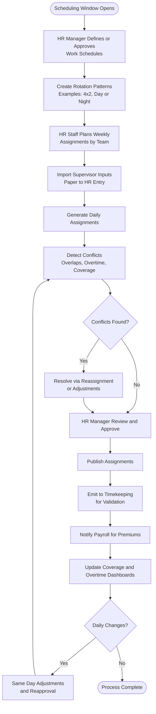

# Workforce Scheduling Process

## Overview
Operational workflow for defining schedules, planning rotations, creating daily assignments, and resolving conflicts; feeds Timekeeping validation and Payroll premiums.

**Participants**: HR Manager (approver), HR Staff (encoder), Department Supervisor (source via paper), Payroll Officer (consumer)

**Cadence**: Weekly planning + daily updates

---

## Complete Scheduling Flow

---

## Data Model Alignment
- Work Schedules (weekly patterns) → `work_schedules`, `employee_schedules`
- Rotations (patterns) → `employee_rotations`, `rotation_assignments`
- Daily Assignments (dated) → `shift_assignments`

---

## Phases & Checklists

### Phase 1: Schedules & Rotations (HR Manager)
- Define standard schedules (e.g., 8:00–17:00)
- Define special schedules (night, weekend)
- Create rotation patterns (pattern JSON)
- Approve templates for use

### Phase 2: Weekly Planning (HR Staff)
- Gather supervisor inputs (paper)
- Assign employees to rotations/schedules
- Generate daily assignments for the week
- Spot-check coverage per department/location

### Phase 3: Conflict Detection & Resolution
- Automated checks:
  - Overlapping assignments for same employee/date
  - Exceeding max hours or OT rules
  - Missing coverage for required posts
  - Rotation rule violations
- Resolution actions: reassign staff, adjust shift time, split assignment, flag OT

### Phase 4: Approval & Publish
- HR Manager reviews coverage, exceptions, OT projections
- Approve weekly plan and daily assignments
- Publish to Timekeeping and notify Payroll

### Phase 5: Same-Day Changes
- Accept urgent updates (absences, emergencies)
- Apply minimal-change adjustments
- Re-run conflict detection and seek quick approval

---

## Integration Points
- Timekeeping: Uses assignments to validate attendance and compute OT
- Payroll: Uses OT flags, premiums, night differential
- Appraisal: Provides schedule adherence and assignment history

---

## Roles & Responsibilities
- HR Manager: Creates/approves schedules, resolves escalations
- HR Staff: Encodes supervisor inputs, generates assignments, resolves conflicts
- Payroll Officer: Consumes assignment data for pay rules

---

## KPIs & Targets
- Coverage Compliance: ≥ 98% posts covered
- Conflict Resolution Lead Time: < 4 hours
- Same-Day Change Turnaround: < 1 hour
- Overtime Accuracy: ≥ 99%

---

## Common Issues & Resolutions
- Overlaps after emergency changes → Re-run conflict checks; split shifts
- Missing posts due to absence → Pull from floaters; mark OT if needed
- Rotation drift → Reset rotation anchor date; realign assignments

---

## Related Documentation
- [Workforce Management Module](../../WORKFORCE_MANAGEMENT_MODULE.md)
- [HR Staff Workflow](../04-hr-staff-workflow.md)
- [HR Manager Workflow](../03-hr-manager-workflow.md)
- [Timekeeping Architecture](../../TIMEKEEPING_MODULE_ARCHITECTURE.md)
- [Payroll Processing](./payroll-processing.md)

---

**Last Updated**: November 29, 2025  
**Process Owner**: HR Department  
**Cadence**: Weekly + daily adjustments

